# 15. Seguridad del sistema y del usuario

## 15.1 Introducción
Las cuentas de usuario están diseñadas para brindar seguridad en un sistema operativo Linux. Cada persona en el sistema debe iniciar sesión con una cuenta de usuario que le permita acceder a archivos y directorios específicos o que no le permita dicho acceso, lo que se logra mediante permisos de archivo, que son permisos de archivo y directorio que el sistema otorga a los usuarios, grupos y a todos los demás que inician sesión. El usuario raíz puede editar estos permisos.

Las cuentas de usuario también pertenecen a grupos, que también se pueden usar para brindar acceso a archivos y directorios. Cada usuario pertenece al menos a un grupo (a menudo muchos) para permitir que los usuarios compartan más fácilmente los datos almacenados en archivos con otros usuarios.

Los datos de las cuentas de usuario y grupo se almacenan en archivos de base de datos. Conocer el contenido de estos archivos le permite comprender mejor qué usuarios tienen acceso a los archivos y directorios del sistema. Estos archivos de base de datos también contienen información de seguridad vital que puede afectar la capacidad de un usuario para iniciar sesión y acceder al sistema.

Varios comandos brindan la posibilidad de ver información de cuentas de usuarios y grupos, así como de cambiar de una cuenta de usuario a otra (siempre que tenga la autoridad adecuada para hacerlo). Estos comandos son útiles para investigar el uso del sistema, solucionar problemas del sistema y monitorear el acceso no autorizado al sistema.


## 15.2 Cuentas administrativas
Existen muchas formas diferentes de ejecutar un comando que requiere privilegios administrativos o de root. Iniciar sesión en el sistema como usuario root le permite ejecutar comandos como administrador. Este acceso es potencialmente peligroso porque puede olvidar que ha iniciado sesión como root y ejecutar un comando que podría causar problemas en el sistema. Como resultado, no se recomienda iniciar sesión como usuario root directamente.

Debido a que el uso de la cuenta root es potencialmente peligroso, solo debe ejecutar comandos como root si se necesitan privilegios administrativos. Si la cuenta root está deshabilitada, como en la distribución Ubuntu, los comandos administrativos se pueden ejecutar utilizando el comando sudo. Si la cuenta root está habilitada, un usuario normal puede ejecutar el comando su para cambiar de cuenta a la cuenta root.

Cuando inicia sesión en el sistema directamente como root para ejecutar comandos, todo lo relacionado con su sesión se ejecuta como usuario root. Si utiliza el entorno gráfico, esto es especialmente peligroso ya que el proceso de inicio de sesión gráfico se compone de muchos ejecutables diferentes (programas que se ejecutan durante el inicio de sesión). Cada programa que se ejecuta como usuario root representa una amenaza mayor que un proceso que se ejecuta como usuario estándar, ya que a esos programas se les permitiría hacer casi cualquier cosa, mientras que los programas de usuario estándar tienen muchas restricciones en lo que pueden hacer.

El otro peligro potencial de iniciar sesión en el sistema como root es que una persona que lo haga puede olvidar cerrar sesión para realizar su trabajo no administrativo, lo que permite que programas como navegadores y clientes de correo electrónico se ejecuten como usuario root sin restricciones sobre lo que pueden hacer. El hecho de que varias distribuciones de Linux, en particular Ubuntu, no permitan a los usuarios iniciar sesión como usuario root debería ser suficiente indicación de que esta no es la forma preferida de realizar tareas administrativas.
### 15.2.1 Cambio de usuarios
El comando su le permite ejecutar un shell como un usuario diferente. Si bien el cambio al usuario root es para lo que se usa el comando su con mayor frecuencia, también puede cambiar a otros usuarios.

```
su [options] [username]
```

Al cambiar de usuario, se recomienda utilizar la opción de _shell de inicio_ de sesión, ya que el shell de inicio de sesión configura completamente el nuevo shell con la configuración del nuevo usuario, lo que garantiza que los comandos ejecutados se ejecuten correctamente. Si se omite esta opción, el nuevo shell cambia el UID, pero no inicia sesión completamente en el usuario. La opción de shell de inicio de sesión se puede especificar de tres maneras:

```
su -
su -l
su --login
```

De forma predeterminada, si no se especifica un nombre de usuario, el comando su abre un nuevo shell como usuario root. Los dos comandos siguientes son formas equivalentes de iniciar un shell como usuario root:

```
su - root
su -
```

Después de presionar **Enter** para ejecutar cualquiera de estos comandos, el usuario debe proporcionar la contraseña del usuario root para iniciar el nuevo shell. Si no conoce la contraseña de la cuenta a la que está cambiando, el comando su fallará.

> Observe que en el ejemplo siguiente, y en nuestras máquinas virtuales, el símbolo del sistema cambia para reflejar al usuario actual.

```
sysadmin@localhost:~$ su -
Password: netlab123
root@localhost:~# id
uid=0(root) gid=0(root) groups=0(root)
```

Después de usar el shell iniciado por el comando su para realizar las tareas administrativas necesarias, regrese a su shell original (y a su cuenta de usuario original) usando el comando exit.

```
root@localhost:~# exit
logout
sysadmin@localhost:~$ id
uid=1001(sysadmin) gid=1001(sysadmin) groups=1001(sysadmin),4(adm),27(sudo)
```
### 15.2.2 Ejecución de comandos privilegiados
El comando sudo permite a los usuarios ejecutar comandos como otro usuario. Al igual que el comando su, se asume el usuario root de forma predeterminada.

```
sudo [options] command
```

En las distribuciones que no permiten que el usuario root inicie sesión directamente o a través del comando su, el proceso de instalación configura automáticamente una cuenta de usuario para poder usar el comando sudo para ejecutar comandos como si el usuario root los ejecutara. Por ejemplo, los privilegios administrativos son necesarios para ver el archivo /etc/shadow:

```
sysadmin@localhost:~$ head /etc/shadow
head: cannot open '/etc/shadow' for reading: Permission denied
```

Cuando se utiliza el comando sudo para ejecutar un comando como usuario root, el comando solicita la contraseña del usuario, no la del usuario root. Esta característica de seguridad podría evitar el acceso administrativo no autorizado si el usuario dejara su equipo desatendido. La solicitud de la contraseña no volverá a aparecer mientras el usuario continúe ejecutando comandos sudo con menos de cinco minutos de diferencia.

El siguiente comando sudo ejecutaría el comando head del ejemplo anterior como usuario root. Solicita la contraseña del usuario administrador del sistema:

```
sysadmin@localhost:~$ sudo head /etc/shadow
[sudo] password for sysadmin: netlab123
root:$6$4Yga95H9$8HbxqsMEIBTZ0YomlMffYCV9VE1SQ4T2H3SHXw41M02SQtfAdDVE9mqGp2hr20q.ZuncJpLyWkYwQdKlSJyS8.:16464:0:99999:7:::
daemon:*:16463:0:99999:7:::
bin:*:16463:0:99999:7:::
sys:*:16463:0:99999:7:::
sync:*:16463:0:99999:7:::
games:*:16463:0:99999:7:::
man:*:16463:0:99999:7:::
lp:*:16463:0:99999:7:::
mail:*:16463:0:99999:7:::
news:*:16463:0:99999:7:::
```

El uso del comando sudo para ejecutar un comando administrativo da como resultado una entrada colocada en un archivo de registro. Cada entrada incluye el nombre del usuario que ejecutó el comando, el comando que se ejecutó y la fecha y hora de ejecución. Esto permite una mayor responsabilidad, en comparación con un sistema en el que muchos usuarios pueden conocer la contraseña de root y pueden iniciar sesión directamente como root o usar el comando su para ejecutar comandos como usuario root.

Una gran ventaja de usar sudo para ejecutar comandos administrativos es que reduce el riesgo de que un usuario ejecute accidentalmente un comando como root. La intención de ejecutar un comando es clara; El comando se ejecuta como root si tiene el prefijo sudo. De lo contrario, el comando se ejecuta como un usuario normal.
## 15.3 Cuentas de usuario
Hay varios archivos de texto en el directorio /etc que contienen los datos de la cuenta de los usuarios y grupos definidos en el sistema. Por ejemplo, para ver si se ha definido una cuenta de usuario específica en el sistema, entonces el lugar para verificar es el archivo /etc/passwd.

El archivo /etc/passwd define parte de la información de la cuenta para las cuentas de usuario. En el siguiente ejemplo se muestran las últimas cinco líneas de un archivo /etc/passwd típico:

```
sysadmin@localhost:~$ tail -5 /etc/passwd
syslog:x:101:103::/home/syslog:/bin/false
bind:x:102:105::/var/cache/bind:/bin/false
sshd:x:103:65534::/var/run/sshd:/usr/sbin/nologin
operator:x:1000:37::/root:/bin/sh
sysadmin:x:1001:1001:System Administrator,,,,:/home/sysadmin:/bin/bash
```

Cada línea contiene información relativa a un solo usuario. Los datos se separan en campos mediante dos puntos. A continuación se describe en detalle cada uno de los campos, de izquierda a derecha, utilizando la última línea de la salida del gráfico anterior:

- **Nombre**

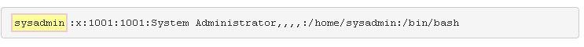

El primer campo contiene el nombre del usuario o el nombre de _usuario_. Este nombre se utiliza cuando se inicia sesión en el sistema y cuando se visualiza la propiedad del archivo con el comando ls -l. Se proporciona para facilitar que los usuarios habituales consulten la cuenta, mientras que el sistema suele utilizar el ID de _usuario_ internamente.

- **Marcador de posición de contraseña**

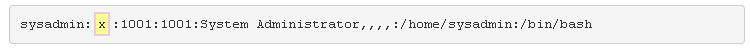

En un momento, la contraseña del usuario se almacenaba en esta ubicación, sin embargo, ahora la x en este campo indica al sistema que la contraseña está en el archivo /etc/shadow.

- **ID de usuario**

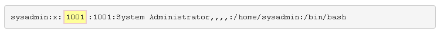

A cada cuenta se le asigna un _ID de usuario (UID)._ Los nombres de usuario no son utilizados directamente por el sistema, que normalmente define la cuenta por el UID. Por ejemplo, los archivos son propiedad de los UID, no de los nombres de usuario.

- **ID de grupo principal**

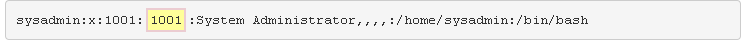

Este campo indica que el usuario es miembro de ese grupo, lo que significa que el usuario tiene permisos especiales en cualquier archivo que sea propiedad de este grupo.

- **Comentario**

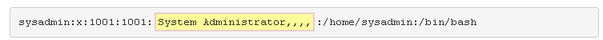

Este campo puede contener cualquier información sobre el usuario, incluido su nombre real u otra información útil.

- **Directorio de inicio**

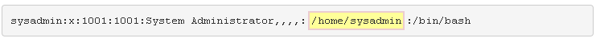

Este campo define la ubicación del directorio principal del usuario. Para los usuarios normales, normalmente sería /home/_username_. Por ejemplo, un nombre de usuario de bob tendría un directorio de inicio de /home/bob.

El usuario root suele tener un lugar diferente para el directorio principal, el directorio /root.

- Shell

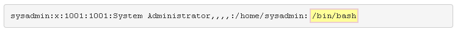

Este campo indica la ubicación del shell de inicio de sesión del usuario. De forma predeterminada, el usuario se coloca en este shell cada vez que inicia sesión en un entorno de línea de comandos o abre una ventana de terminal. El shell bash /bin/bash es el shell más común para los usuarios de Linux.

Una forma eficiente de verificar si se ha definido un usuario específico en un sistema es buscar en el archivo /etc/passwd usando el comando grep. Por ejemplo, para ver la información de la cuenta del usuario denominado sysadmin, utilice el siguiente comando:

```
sysadmin@localhost:~$ grep sysadmin /etc/passwd
sysadmin:x:1001:1001:System Administrator,,,,:/home/sysadmin:/bin/bash
```
### 15.3.1 Contraseñas
Como se mencionó anteriormente, el archivo /etc/shadow contiene información de la cuenta relacionada con la contraseña del usuario. Sin embargo, los usuarios normales no pueden ver el contenido del archivo /etc/shadow por razones de seguridad. Para ver el contenido de este archivo, inicie sesión como administrador (la cuenta raíz):

```
sysadmin@localhost:~$ su -
Password: netlab123
root@localhost:~#
```

Un archivo /etc/shadow típico se vería similar al siguiente:

```
root@localhost:~# tail -5 /etc/shadow
syslog:*:16874:0:99999:7:::
bind:*:16874:0:99999:7:::
sshd:*:16874:0:99999:7:::
operator:!:16874:0:99999:7:::
sysadmin:$6$c75ekQWF$.GpiZpFnIXLzkALjDpZXmjxZcIll14OvL2mFSIfnc1aU2cQ/221QL5AX5RjKXpXPJRQ0uVN35TY3/..c7v0.n0:16874:5:30:7:60:15050:
```

De nuevo, cada línea está separada en campos por dos puntos. A continuación se describe en detalle cada uno de los campos, de izquierda a derecha, utilizando la última línea de la salida del gráfico anterior:

- **Nombre de usuario**
Este campo contiene el _nombre de usuario_ de la cuenta, que coincide con el nombre de la cuenta en el archivo /etc/passwd.

- **Contraseña**
El  campo _password_ contiene la contraseña cifrada de la cuenta. Esta cadena muy larga es un cifrado unidireccional, lo que significa que no se puede "revertir" para determinar la contraseña original.

Mientras que los usuarios normales tienen contraseñas cifradas en este campo, las cuentas del sistema tienen un asterisco * en este campo.

- **Último cambio**
Este campo contiene un número que representa la última vez que se cambió la contraseña. El número 16874 es el número de días transcurridos desde el 1 de enero de 1970 (llamado la Época).

Este valor se genera automáticamente cuando se modifica la contraseña del usuario. Es utilizado por las  características de envejecimiento de contraseñas proporcionadas por el resto de los campos de este archivo.

- **Mínimo**
Este campo indica el  número _mínimo_ de días entre cambios de contraseña. Es uno de los campos de _caducidad de la contraseña_  ; un valor distinto de cero en este campo indica que después de que un usuario cambie su contraseña, la contraseña no se puede volver a cambiar durante el número de días especificado, 5 días en este ejemplo. Este campo es importante cuando  _se utiliza el campo_ máximo.

Un valor de cero en este campo significa que el usuario siempre puede cambiar su contraseña.

- **Máximo**
Este campo indica el  número _máximo_ de días que la contraseña es válida. Se utiliza para obligar a los usuarios a cambiar sus contraseñas de forma regular. Un valor de 30 en este campo significa que el usuario debe cambiar su contraseña al menos cada 30 días para evitar que se bloquee su cuenta.

Tenga en cuenta que si el  _campo mínimo_ se establece en 0, es posible que el usuario pueda volver a establecer inmediatamente su contraseña en el valor original, lo que anula el propósito de obligar al usuario a cambiar su contraseña cada 30 días. Por lo tanto, si se establece el  _campo máximo_,  _normalmente también se establece el campo_ mínimo.

Por ejemplo, un _mínimo_:_máximo_ de 5:30 significa que el usuario debe cambiar su contraseña cada 30 días y, después de cambiarla, el usuario debe esperar 5 días antes de poder volver a cambiar su contraseña.

Si el campo max se establece en 99999, el valor máximo posible, el usuario básicamente nunca tiene que cambiar su contraseña (porque 99999 días es aproximadamente 274 años).

- **Advertir**
Si se establece el  _campo máximo_, el  campo _de advertencia_ indica el número de días antes de la caducidad de la contraseña que el sistema advierte al usuario. Por ejemplo, si el  campo _de advertencia_ se establece en 7, en cualquier momento durante los 7 días antes de  _que se alcance el período de tiempo máximo, se advertirá al usuario que cambie su contraseña durante los procesos de inicio de sesión._

El usuario solo recibe una advertencia al iniciar sesión, por lo que algunos administradores han adoptado el enfoque de establecer el campo de _advertencia_ en un valor más alto para proporcionar una mayor probabilidad de que se emita una advertencia.

Si el  marco de tiempo máximo se establece en 99999, entonces el campo de advertencia es básicamente inútil.

- **Inactivo**
Si el usuario ignora las advertencias y supera el plazo de la contraseña, su cuenta se bloqueará. En ese caso, el  campo _inactivo_ proporciona al usuario un período de "gracia" en el que se puede cambiar su contraseña, pero solo durante el proceso de inicio de sesión.

Si el  campo _inactivo_ se establece en 60, el usuario tiene 60 días para cambiar a una nueva contraseña. Si no lo hacen, el administrador deberá restablecer la contraseña del usuario.

- **Expirar**
Este campo indica el día en que caducará la cuenta, representado por el número de días a partir del 1 de enero de 1970. Una cuenta caducada se bloquea, no se elimina, lo que significa que el administrador puede restablecer la contraseña para desbloquear la cuenta.

Las cuentas con fechas de vencimiento se proporcionan comúnmente a empleados temporales o contratistas. La cuenta caduca automáticamente después del último día de trabajo del usuario.

Cuando un administrador establece este campo, se utiliza una herramienta para convertir de una fecha real a una fecha de época. También hay varios convertidores gratuitos disponibles en Internet.

- **Reservado**
Actualmente no se utiliza, este campo está reservado para uso futuro.

> Además del comando grep, otra técnica para recuperar la información del usuario contenida en los archivos /etc/passwd y /etc/shadow es utilizar el comando getent. Una ventaja de este comando es que puede recuperar información de la cuenta definida localmente, en archivos como /etc/passwd y /etc/shadow, o en un servidor de directorio de red.

> La sintaxis general de un comando getent es:

```
getent database record 
```

> Por ejemplo, el siguiente comando recuperaría la información de la cuenta del usuario administrador del sistema del archivo /etc/passwd:

```
sysadmin@localhost:~$ getent passwd sysadmin
sysadmin:x:1001:1001:System Administrator,,,,:/home/sysadmin:/bin/bash
```
## 15.4 Cuentas del sistema
Los usuarios inician sesión en el sistema utilizando cuentas de usuario normales. Normalmente, estas cuentas tienen valores de UID superiores a 500 (en algunos sistemas 1.000). El  _usuario root_ tiene acceso especial al sistema. Este acceso se proporciona a la cuenta con un UID de 0.

Hay cuentas adicionales que no están diseñadas para que los usuarios inicien sesión. Estas cuentas, normalmente desde el UID 1 hasta el UID 499, se denominan _cuentas del sistema_ y están diseñadas para proporcionar cuentas de los servicios que se ejecutan en el sistema.

Las cuentas del sistema tienen algunos campos en los archivos /etc/passwd y /etc/shadow que son diferentes a los de otras cuentas. Por ejemplo, las cuentas del sistema rara vez tienen directorios de inicio, ya que normalmente no se utilizan para crear o almacenar archivos. En el archivo /etc/passwd, las cuentas del sistema tienen un programa que no es de inicio de sesión en el campo de _shell_:

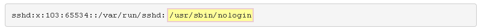

En el archivo /etc/shadow, las cuentas del sistema suelen tener un asterisco _*_ en lugar del campo de contraseña:

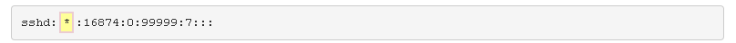

La mayoría de las cuentas del sistema son necesarias para que el sistema funcione correctamente. No debe eliminar una cuenta del sistema a menos que esté seguro de que eliminar la cuenta no causará problemas. Tómese el tiempo para aprender lo que hace cada cuenta del sistema; Los administradores del sistema tienen la tarea de garantizar la seguridad del sistema, y eso incluye proteger adecuadamente las cuentas del sistema.
## 15.5 Cuentas de grupo
Su nivel de acceso a un sistema no está determinado únicamente por su cuenta de usuario. Cada usuario puede ser miembro de uno o más _grupos_, lo que también puede afectar el nivel de acceso al sistema.

Tradicionalmente, los sistemas UNIX limitaban a los usuarios a pertenecer a no más de un total de dieciséis grupos, pero los recientes kernels de Linux admiten usuarios con más de sesenta y cinco mil membresías de grupos.

El archivo /etc/passwd define la pertenencia al grupo principal de un usuario. La pertenencia a grupos suplementarios (o la pertenencia a grupos secundarios) y los propios grupos se definen en el archivo /etc/group.

El archivo /etc/group es otro archivo delimitado por dos puntos. A continuación se describen los campos con más detalle, utilizando una línea que describe una cuenta de grupo típica.

- **Nombre del grupo**

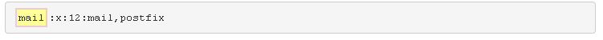
Este campo contiene el _nombre del grupo_. Al igual que con los nombres de usuario, los nombres son más naturales de recordar para las personas que los números. Normalmente, el sistema utiliza ID de grupo en lugar de nombres de grupo.

- **Marcador de posición de contraseña**


Si bien hay contraseñas para grupos, rara vez se usan en Linux. Si el administrador crea una contraseña de grupo, se almacenará en el archivo /etc/gshadow. La x en este campo se utiliza para indicar que la contraseña no está almacenada en este archivo.

- **GID**

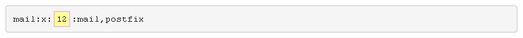

Cada grupo está asociado a un ID de grupo único _(GID)_ que se coloca en este campo.

- **Lista de usuarios**

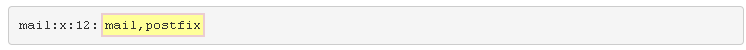

Este último campo se utiliza para indicar quién es miembro del grupo. Mientras que la pertenencia al grupo principal se define en el archivo /etc/passwd, los usuarios asignados a grupos adicionales tendrán su nombre de usuario colocado en este campo del archivo /etc/group. En este caso, los usuarios de correo y sufijo son miembros secundarios del grupo de correo.

Es muy común que un nombre de usuario también aparezca como nombre de grupo. También es común que un usuario pertenezca a un grupo con el mismo nombre.

Para ver información sobre un grupo específico, se pueden utilizar los comandos grep o getent. Por ejemplo, los siguientes comandos muestran la información de la cuenta del grupo de correo:

```
sysadmin@localhost:~$ grep mail /etc/group
mail:x:12:mail,postfix
sysadmin@localhost:~$ getent group mail
mail:x:12:mail,postfix
```
## 15.6 Visualización de la información del usuario
El comando id se utiliza para imprimir información de usuario y grupo para un usuario especificado.

```
id [options] username
```

Al cambiar entre diferentes cuentas de usuario, puede resultar confuso saber qué cuenta está iniciada actualmente. Cuando se ejecuta sin un argumento, el comando id genera información sobre el usuario actual, lo que le permite confirmar su identidad en el sistema.

```
sysadmin@localhost:~$ id
uid=1001(sysadmin) gid=1001(sysadmin) groups=1001(sysadmin),4(adm),27(sudo)
```

La salida del comando id siempre enumera primero la información de la cuenta de usuario, utilizando primero el ID de usuario y el nombre de usuario:

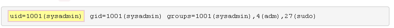

Después del nombre de usuario aparece el grupo principal, indicado tanto por el ID del grupo como por el nombre del grupo:

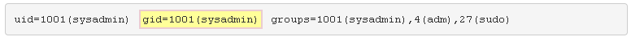

Otra información enumerada incluye los grupos a los que pertenece el usuario, denotados nuevamente por ID de grupo seguidos de los nombres de grupo. El usuario que se muestra pertenece a tres grupos:

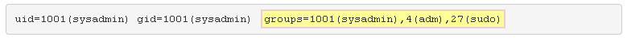

Si al comando se le asigna un nombre de usuario como argumento, como root, muestra información sobre la cuenta especificada:

```
sysadmin@localhost:~$ id root
uid=0(root) gid=0(root) groups=0(root)
```

Para imprimir solo el grupo principal del usuario, use la opción -g:  

```
sysadmin@localhost:~$ id -g
1001
```

El comando id también se puede utilizar para verificar las pertenencias a grupos secundarios del usuario mediante la opción -G. Esto imprimirá todos los grupos a los que pertenece un usuario, tanto primarios como secundarios.

```
sysadmin@localhost:~$ id -G
1001 4 27
```

La salida del ejemplo anterior se alinea con el contenido del archivo /etc/group, como revela una búsqueda de sysadmin:

```
sysadmin@localhost:~$ cat /etc/group | grep sysadmin
adm:x:4:syslog,sysadmin
sudo:x:27:sysadmin
sysadmin:x:1001:
```
## 15.7 Visualización de usuarios actuales
El comando who muestra una lista de los usuarios que han iniciado sesión en el sistema, desde dónde lo han hecho y cuándo lo han hecho. Mediante el uso de opciones, este comando también puede mostrar información como el nivel de _ejecución actual_  (un estado funcional de la computadora) y la hora en que se inició el sistema.

Por ejemplo:

```
sysadmin@localhost:~$ who
root     	tty2        2013-10-11 10:00
sysadmin	tty1        2013-10-11 09:58 (:0)
sysadmin 	pts/0       2013-10-11 09:59 (:0.0)
sysadmin 	pts/1       2013-10-11 10:00 (example.com)
```

A continuación se describe el resultado del comando who:

- **Nombre de usuario**

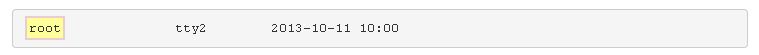

Esta columna indica el nombre del usuario que ha iniciado sesión. Tenga en cuenta que por "conectado " nos referimos a "cualquier proceso de inicio de sesión y abrir la ventana del terminal".

- **Terminal**

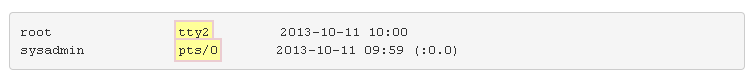

Esta columna indica en qué ventana de terminal está trabajando el usuario.

Si el nombre del terminal comienza con tty, entonces esto es una indicación de un inicio de  _sesión local_, ya que este es un terminal de línea de comandos regular. Si el nombre del terminal comienza con pts, esto indica que el usuario está utilizando un _pseudo terminal_ o ejecutando un proceso que actúa como terminal.

- **Fecha**

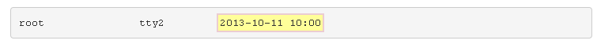

Esta columna indica cuándo inició sesión el usuario.

- **Host**

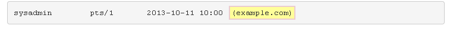

Después de la fecha y la hora, puede aparecer información sobre la ubicación. Si la información de ubicación contiene un nombre de host, un nombre de dominio o una dirección IP, entonces el usuario ha iniciado sesión de _forma remota_:

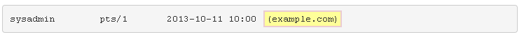

Si hay dos puntos y un número, esto indica que han realizado un  inicio de sesión _gráfico local_:

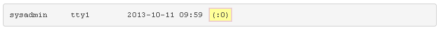

Si no se muestra información de ubicación en la última columna, significa que el usuario inició sesión a través de un proceso de _línea de comandos local_:

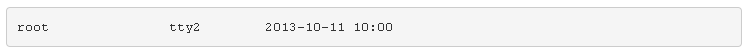

> El comando who tiene varias opciones para mostrar información de estado del sistema. Por ejemplo, la opción -b muestra la última vez que se inició el sistema (arrancó), y la opción -r muestra la hora en que el sistema alcanzó el nivel de ejecución actual:

```
sysadmin@localhost:~$ who -b -r
         system boot  	2013-10-11 09:54
         run-level 5    2013-10-11 09:54
```

Puede haber casos en los que se necesite más información sobre los usuarios y lo que están haciendo en el sistema. El comando w proporciona una lista más detallada sobre los usuarios que se encuentran actualmente en el sistema que el comando who. También proporciona un resumen del estado del sistema. Por ejemplo:

```
sysadmin@localhost:~$ w
 10:44:03 up 50 min,  4 users,  load average: 0.78, 0.44, 0.19
USER     	TTY     FROM	    LOGIN@   IDLE  	JCPU   	PCPU    WHAT
root     	tty2    -           10:00    43:44 	0.01s  	0.01s   -bash
sysadmin 	tty1    :0          09:58    50:02	5.68s 	0.16s   pam: gdm-password
sysadmin	pts/0   :0.0        09:59    0.00s      0.14s  	0.13s   ssh 192.168.1.2
sysadmin 	pts/1   example.com 10:00    0.00s  	0.03s  	0.01s   w
```

La primera línea de salida del comando w es idéntica a la del comando uptime. Muestra la hora actual, cuánto tiempo ha estado funcionando el sistema, el número total de usuarios conectados actualmente y la carga en el sistema promediada durante los últimos períodos de tiempo de 1, 5 y 15 minutos. _El promedio de carga_ es el uso de la CPU donde, para un sistema de un solo núcleo, un valor de 1 significaría un uso del 100% de la CPU durante ese período de tiempo. Para un sistema de doble núcleo, significaría un 50% de uso de la CPU, y para un sistema de cuatro núcleos, significaría un 25% de uso de la CPU.

A continuación se describe el resto de la salida del comando w:

|**Columna**|**Ejemplo**|**Descripción**|
|---|---|---|
|USUARIO|raíz|El nombre del usuario que ha iniciado sesión.|
|TTY|tty2|En qué ventana de terminal está trabajando el usuario.|
|DE|example.com|Desde dónde inició sesión el usuario.|
|INICIAR SESIÓN@|10:00|Cuando el usuario inició sesión.|
|OCIOSO|43:44|Cuánto tiempo ha estado inactivo el usuario desde que se ejecutó el último comando.|
|JCPU|0.01s|El tiempo total de CPU utilizado por todos los procesos ejecutados desde el inicio de sesión.|
|PCPU (Unidad de Polipulación)|0.01s|El tiempo total de CPU para el proceso actual.|
|QUÉ|-juerga|El proceso actual que está ejecutando el usuario.|

> El carácter s representa _los segundos_.
## 15.8 Visualización del historial de inicio de sesión
El último comando lee todo el historial de inicio de sesión del archivo /var/log/wtmp y muestra todos los inicios de sesión y registros de reinicio de sesión de forma predeterminada. Un detalle interesante de los registros de reinicio es que muestra la versión del kernel de Linux que se inició en lugar de la ubicación de inicio de sesión. El archivo /var/log/wtmp mantiene un registro de todos los usuarios que han iniciado y cerrado sesión en el sistema.

```
sysadmin@localhost:~$ last
sysadmin console Tue Sep 18 02:31   still logged in
sysadmin console                    Tue Sep 18 02:31 - 02:31  (00:00)
wtmp begins Tue Sep 18 02:31:57 2018  
```

El último comando es ligeramente diferente de los comandos who y w. De forma predeterminada, también muestra el nombre de usuario, el terminal y la ubicación de inicio de sesión, no solo de las sesiones de inicio de sesión actuales, sino también de las sesiones anteriores. A diferencia de los comandos who y w, muestra la fecha y la hora en que el usuario inició sesión en el sistema. Si el usuario ha cerrado la sesión del sistema, se mostrará el tiempo total que el usuario pasó conectado, de lo contrario, se mostrará que aún está conectado.

> mEl comando who lee del archivo /var/log/utmp que registra los usuarios actuales, mientras que el último comando lee del archivo /var/log/wtmp, que mantiene un historial de todos los inicios de sesión de los usuarios.