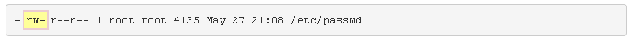

# 17. Propiedad y permiso
## 17.1 Introducción
La propiedad de los archivos es fundamental para su seguridad. Cada archivo tiene un propietario de usuario y un propietario de grupo.

Este capítulo se centra en cómo especificar la propiedad de un archivo por parte del usuario y del grupo. Además, se explora el concepto de permisos de archivos y directorios, incluida la forma de cambiar los permisos de archivos y directorios. Los permisos predeterminados son los permisos que se otorgan a los archivos y directorios cuando se crean inicialmente.
## 17.2 Propiedad del archivo
De forma predeterminada, los usuarios son propietarios de los archivos que crean. Si bien esta propiedad se puede cambiar, esta función requiere privilegios administrativos. Aunque la mayoría de los comandos suelen mostrar el propietario del usuario como un nombre, el sistema operativo asocia la propiedad del usuario con el UID de ese nombre de usuario.

Cada archivo también tiene un propietario de grupo. De forma predeterminada, el grupo principal del usuario que crea el archivo es el propietario del grupo de los archivos nuevos. Los usuarios pueden cambiar el propietario del grupo de archivos que poseen a cualquier grupo al que pertenezcan. De manera similar a la propiedad del usuario, la asociación de un archivo con un grupo no se realiza internamente por el sistema operativo por nombre, sino por el GID del grupo.

Dado que la propiedad está determinada por el UID y el GID asociados con un archivo, cambiar el UID de un usuario (o eliminar el usuario) tiene el efecto de hacer que un archivo que originalmente era propiedad de ese usuario no tenga un propietario de usuario real. Cuando no hay ningún UID en el archivo /etc/passwd que coincida con el UID del propietario del archivo, el UID (el número) se muestra como el usuario propietario del archivo en lugar del nombre de usuario (que ya no existe). Lo mismo ocurre con los grupos.

El comando id puede ser útil para verificar qué cuenta de usuario está utilizando y qué grupos tiene disponibles para usar. Al ver el resultado de este comando, puede ver la información de identidad del usuario expresada como un número y como un nombre.

La salida del comando id muestra el UID y el nombre de la cuenta de usuario del usuario actual, seguidos del GID y el nombre del grupo principal y los GID y los nombres de grupo de todas las membresías de grupo:

```
sysadmin@localhost:~$ id
uid=1001(sysadmin) gid=1001(sysadmin) groups=1001(sysadmin),4(adm),27(sudo),1005(research),1006(development)
```

En el ejemplo anterior se muestra que el usuario tiene un UID de 1001 para la cuenta de usuario sysadmin. También muestra que el grupo principal de este usuario tiene un GID de 1001 para el administrador del sistema del grupo.

Dado que la cuenta de usuario y la cuenta del grupo principal tienen el mismo identificador numérico y nombre, esto indica que este usuario está en un grupo privado de usuario (UPG). Además, el usuario de este ejemplo pertenece a cuatro grupos complementarios: el grupo adm con un GID de 4, el grupo sudo con un GID de 27, el grupo de investigación con un GID de 1005 y el grupo de desarrollo con un GID de 1006.

Cuando se crea un archivo, pertenece al usuario actual y a su grupo principal actual. Si el usuario del ejemplo anterior ejecuta el comando touch para crear un archivo, el usuario propietario del archivo es el usuario administrador del sistema y el propietario del grupo es el grupo administrador del sistema:

```
sysadmin@localhost:~$ touch /tmp/filetest1
```

La propiedad del archivo se puede confirmar utilizando la opción long listing -l del comando ls.

```
sysadmin@localhost:~$ ls -l /tmp/filetest1
-rw-rw-r--. 1 sysadmin sysadmin 0 Oct 21 10:18 /tmp/filetest1
```

La propiedad de los archivos también se aplica a los archivos ocultos en el sistema. Archivos ocultos, que comienzan con el punto . se enumeran utilizando la opción -a del comando ls. Los dos primeros archivos ocultos enumerados son los archivos . y padre .. directorios respectivamente. La propiedad de todos los archivos y subdirectorios dentro del directorio actual se puede enumerar mediante el comando ls -la.

```
sysadmin@localhost:~$ ls -la                                                    
total 60                                                                        
drwxr-xr-x 1 sysadmin sysadmin 4096 Nov  3 22:29 .                              
drwxr-xr-x 1 root     root     4096 Mar 14  2016 ..                             
-rw-r--r-- 1 sysadmin sysadmin  220 Apr  3  2012 .bash_logout                   
-rw-r--r-- 1 sysadmin sysadmin 3768 Mar 14  2016 .bashrc                        
drwx------ 2 sysadmin sysadmin 4096 Nov  3 22:29 .cache                         
-rw-r--r-- 1 sysadmin sysadmin  675 Apr  3  2012 .profile                       
-rw-r--r-- 1 sysadmin sysadmin   74 Mar 14  2016 .selected_editor               
drwxr-xr-x 2 sysadmin sysadmin 4096 Mar 14  2016 Desktop                        
drwxr-xr-x 2 sysadmin sysadmin 4096 Mar 14  2016 Documents                      
drwxr-xr-x 2 sysadmin sysadmin 4096 Mar 14  2016 Downloads                      
drwxr-xr-x 2 sysadmin sysadmin 4096 Mar 14  2016 Music                          
drwxr-xr-x 2 sysadmin sysadmin 4096 Mar 14  2016 Pictures                       
drwxr-xr-x 2 sysadmin sysadmin 4096 Mar 14  2016 Public                         
drwxr-xr-x 2 sysadmin sysadmin 4096 Mar 14  2016 Templates                      
drwxr-xr-x 2 sysadmin sysadmin 4096 Mar 14  2016 Videos  
```

> La salida del comando ls -l incluye múltiples piezas de información que son relevantes para este capítulo, incluyendo:

- **Permisos**


- **Usuario propietario**


- **Propietario del grupo**

## 17.3 Cambio de grupos
Si sabe que el archivo que está a punto de crear debe pertenecer a un grupo diferente del grupo principal actual, puede utilizar el  comando `newgrp` para cambiar el grupo principal actual.

```bash
newgrp group_name
```

El  comando `id` enumera la información de identidad, incluidas las pertenencias a grupos. Si solo te interesa saber a qué grupos perteneces, entonces puedes ejecutar el  comando `groups`:

```bash
sysadmin@localhost:~$ groups
sysadmin adm sudo research development 
```

Es posible que la salida del  `comando groups` no sea tan detallada como la salida del  comando `id`, pero si todo lo que necesita saber es a qué grupos puede cambiar mediante el  comando `newgrp`, entonces el  comando `groups` proporciona la información que necesita. El  resultado del comando id muestra el grupo primario actual, por lo que es útil para verificar que el  `comando newgrp` se haya realizado correctamente.

Por ejemplo, si el  usuario `administrador del sistema` planeaba tener un archivo propiedad del grupo  de `investigación`, pero ese no era el grupo principal del usuario, entonces el usuario podría usar el  `comando newgrp` y luego verificar el grupo primario correcto con el  comando `id` antes de crear el nuevo archivo:

```shell
sysadmin@localhost:~$ id
uid=1001(sysadmin) gid=1001(sysadmin) groups=1001(sysadmin),4(adm),27(sudo),1005(research),1006(development)
sysadmin@localhost:~$ newgrp research
sysadmin@localhost:~$ id
uid=1001(sysadmin) gid=1005(research) groups=1005(research),4(adm),27(sudo),1001(sysadmin),1006(development)
```

De acuerdo con la salida de los comandos anteriores, inicialmente el GID del usuario es `1001` para el usuario administrador del sistema, luego  `se ejecuta el comando newgrp` y el GID principal del usuario se convierte en `1005`, el  grupo de `investigación`. Una vez ejecutados estos comandos, si el usuario creara otro archivo y viera sus detalles, el nuevo archivo sería propiedad del grupo de `investigación`:

```shell
sysadmin@localhost:~$ touch /tmp/filetest2
sysadmin@localhost:~$ ls -l /tmp/filetest2
-rw-r--r--. 1 sysadmin research 0 Oct 21 10:53 /tmp/filetest2
```

El  comando `newgrp` abre un nuevo shell; mientras el usuario permanezca en ese shell, el grupo primario no cambiará. Para volver a cambiar el grupo principal al original, el usuario puede abandonar el nuevo shell ejecutando el  `comando exit`. Por ejemplo:

> Los privilegios administrativos son necesarios para cambiar el grupo principal del usuario de forma permanente. El usuario root ejecutaría el siguiente comando:

```
usermod -g groupname username
```

## 17.4 Cambiar la propiedad del grupo
Para cambiar el propietario del grupo de un archivo existente, se puede utilizar el comando chgrp.

```bash
chgrp group_name file
```

Como usuario root, el comando chgrp se puede utilizar para cambiar el propietario del grupo de cualquier archivo a cualquier grupo. Como usuario sin privilegios administrativos, el comando chgrp solo se puede utilizar para cambiar el propietario del grupo de un archivo a un grupo del que el usuario ya es miembro:

```bash
sysadmin@localhost:~$ touch sample                                            
sysadmin@localhost:~$ ls -l sample                                            
-rw-rw-r-- 1 sysadmin sysadmin 0 Oct 23 22:12 sample‌⁠​​⁠​                           
sysadmin@localhost:~$ chgrp research sample
sysadmin@localhost:~$ ls -l sample 
-rw-rw-r--. 1 sysadmin research 0 Oct 23 22:12 sample‌⁠​​⁠​ 
```

Si un usuario intenta modificar la propiedad del grupo de un archivo que no es de su propiedad, recibirá un mensaje de error:

```bash
sysadmin@localhost:~$ chgrp development /etc/passwd
chgrp: changing group of '/etc/passwd': Operation not permitted
```

Para cambiar la propiedad del grupo de todos los archivos de una estructura de directorios, utilice la opción -R recursiva en el comando chgrp. Por ejemplo, el comando del ejemplo siguiente cambiaría la propiedad del grupo del directorio test_dir y de todos los archivos y subdirectorios del directorio test_dir.

```bash
sysadmin@localhost:~$ chgrp -R development test_dir
```

> Si bien puede ver la propiedad de un archivo con la opción -l del comando ls, el sistema proporciona otro comando que es útil cuando se ven la propiedad y los permisos de archivo: el comando stat. El comando stat muestra información más detallada sobre un archivo, incluyendo el suministro de la propiedad del grupo tanto por nombre de grupo como por número GID:

```bash
sysadmin@localhost:~$ stat /tmp/filetest1
  File: '/tmp/filetest1'
  Size: 0         	Blocks: 0          IO Block: 4096   regular empty file
Device: fd00h/64768d	Inode: 31477       Links: 1
Access: (0664/-rw-rw-r--)  Uid: ( 1001/sysadmin)   Gid: ( 1001/sysadmin) 
Access: 2013-10-21 10:18:02.809118163 -0700
Modify: 2013-10-21 10:18:02.809118163 -0700
Change: 2013-10-21 10:18:02.809118163 -0700
```

## 17.5 Cambiar la propiedad del usuario
El comando chown permite al usuario root cambiar la propiedad del usuario de archivos y directorios. Un usuario normal no puede usar este comando para cambiar el usuario propietario de un archivo, ni siquiera para dar la propiedad de uno de sus propios archivos a otro usuario. Sin embargo, el comando chown también permite cambiar la propiedad del grupo, lo que puede ser realizado por root o por el propietario del archivo.

Hay tres formas diferentes en que se puede ejecutar el comando chown. El primer método se utiliza para cambiar solo el usuario propietario del archivo.

```
chown user /path/to/file
```

Por ejemplo, si el usuario root quisiera cambiar la propiedad del archivo filetest1 al usuario jane, se podría ejecutar el siguiente comando:

```
root@localhost:~# chown jane /tmp/filetest1
root@localhost:~# ls -l /tmp/filetest1
-rw-rw-r-- 1 jane sysadmin 0 Dec 19 18:44 /tmp/filetest1
```

El segundo método es cambiar tanto el usuario como el grupo; Esto también requiere privilegios de root. Para ello, separe el usuario y el grupo mediante dos puntos o un carácter de punto. Por ejemplo:

```
chown user:group /path/to/file
chown user.group /path/to/file
```

```
root@localhost:~# chown jane:users /tmp/filetest2
root@localhost:~# ls -l /tmp/filetest2
-rw-r--r-- 1 jane users 0 Dec 19 18:53 /tmp/filetest2
```

Si un usuario no tiene privilegios de root, puede usar el tercer método para cambiar el propietario del grupo de un archivo, al igual que el comando chgrp. Para usar chown solo para cambiar la propiedad del grupo del archivo, use dos puntos o un punto como prefijo para el nombre del grupo:

```
chown :group /path/to/file
chown .group /path/to/file
```

```
jane@localhost:~$ chown .users /tmp/filetest1
jane@localhost:~$ ls -l /tmp/filetest1
-rw-rw-r-- 1 jane users 0 Dec 19 18:44 /tmp/filetest1
```

## 17.6 Permisos
La salida del comando ls -l muestra diez caracteres al principio de cada línea. Estos caracteres indican el _tipo de archivo_ y los _permisos_ del archivo. Por ejemplo, considere la salida del siguiente comando:

```
root@localhost:~# ls -l /etc/passwd
-rw-r--r--. 1 root root 4135 May 27 21:08 /etc/passwd
```

Tipo de archivo
El primer carácter de cada línea indica el tipo de archivo:

```
-rw-r--r-- 1 root root 4135 May 27 21:08 /etc/passwd 
```

En la tabla siguiente se describen los valores posibles para el tipo de archivo:

|**Carácter**|**Tipo de archivo**|
|---|---|
|-|Un _archivo normal_, que puede estar vacío o contener texto o datos binarios.|
|d|Un _archivo de directorio_, que contiene los nombres de otros archivos y enlaces a ellos.|
|l|Un _enlace simbólico_ es un nombre de archivo que hace referencia (señala) a otro archivo.|
|b|Un _archivo_ de bloque es aquel que se relaciona con un dispositivo de hardware de bloque donde los datos se leen en bloques de datos.|
|c|Un archivo de _caracteres_ es aquel que se relaciona con un dispositivo de hardware de caracteres donde los datos se leen un byte a la vez.|
|p|Un _archivo de tubería_ funciona de manera similar al símbolo de tubería, lo que permite que la salida de un proceso se comunique con otro proceso a través del archivo de tubería, donde la salida de un proceso se utiliza como entrada para el otro proceso.|
|s|Un _archivo socket_ permite que dos procesos se comuniquen, donde ambos procesos pueden enviar o recibir datos.|

> Aunque todos los tipos de archivos se enumeran en la tabla anterior, normalmente no encontrará nada más que archivos normales, de directorio y de enlace, a menos que explore el directorio /dev.

Grupos de permisos
Los siguientes nueve caracteres muestran los permisos del archivo.


Los permisos establecidos en estos archivos determinan el nivel de acceso que un usuario tiene en el archivo. Cuando un usuario ejecuta un programa y el programa accede a un archivo, se comprueban los permisos para determinar si el usuario tiene los derechos de acceso correctos al archivo.

Los permisos se agrupan en tres roles diferentes, que representan a los diferentes usuarios que pueden intentar acceder al archivo.

Si no eres el propietario y no eres miembro del grupo de archivos/directorios, entonces tus permisos serían _otros_.

**Usuario propietario**
Los caracteres 2-4 indican los permisos para el usuario propietario del archivo. Si usted es el propietario del archivo, solo se utilizan los permisos del propietario del usuario para determinar el acceso a ese archivo.



**Propietario del grupo**
Los caracteres 5-7 indican los permisos para el grupo propietario del archivo. Si no es el propietario, pero es miembro del grupo propietario del archivo, solo se utilizan los permisos del propietario del grupo para determinar el acceso a ese archivo.


**Otros permisos**
Los caracteres 8-10 indican los permisos para _otros_ o lo que a veces se conoce como los _permisos del mundo_. Este grupo incluye a todos los usuarios que no son el propietario del archivo o miembros del grupo del archivo.


Tipos de permisos

A cada grupo se le atribuyen tres tipos básicos de permisos: _lectura_, _escritura_ y _ejecución_.

   **Usuario propietario**                  **Propietario del grupo**                     **Otro**

| Leer | Escribir | Ejecutar | Leer | Escribir | Ejecutar | Leer | Escribir | Ejecutar |
| :--: | :------: | :------: | :--: | :------: | :------: | :--: | :------: | :------: |
|  r   |    w     |    x     |  r   |    w     |    x     |  r   |    w     |    x     |

Los permisos en sí mismos son engañosamente simples y tienen un significado diferente dependiendo de si se aplican a un _archivo_ o a un _directorio_.

**Leer**
El primer carácter de cada grupo representa el permiso de _lectura_. Hay un carácter r si el grupo tiene el permiso de lectura, o un carácter - si el grupo no lo tiene.

- En un _archivo_, esto permite que los procesos lean el contenido del archivo, lo que significa que el contenido se puede ver y copiar.
- En un _directorio_, se pueden enumerar los nombres de archivo del directorio, pero no hay otros detalles disponibles.

**Escribir**
El segundo carácter de cada grupo representa el permiso de _escritura_. Hay un carácter w si el grupo tiene el permiso de escritura, o un carácter - si el grupo no lo tiene.

- El  proceso puede escribir en un archivo, por lo que los cambios en un archivo se pueden guardar. Tenga en cuenta que el permiso w realmente requiere el permiso r en el archivo para funcionar correctamente.
- En un _directorio_, los archivos se pueden agregar o eliminar del directorio. Tenga en cuenta que el permiso w requiere el permiso x en el directorio para funcionar correctamente.

**Ejecutar**
El tercer carácter de cada grupo representa el permiso de _ejecución_. Hay un carácter x si el grupo tiene el permiso de ejecución, o un carácter - si el grupo no lo tiene.

- Un _archivo_ puede ser ejecutado o ejecutado como un proceso.
- En un _directorio_, el usuario puede usar el comando cd para "entrar" en el directorio y usar el directorio en un nombre de ruta para acceder a los archivos y, potencialmente, a los subdirectorios bajo este directorio.
## 17.7 Descripción de los permisos
Las descripciones de los tipos de permisos pueden ser útiles, pero por sí solas no proporcionan una descripción clara de cómo funcionan los permisos. Para comprender mejor cómo funcionan los permisos, considere los siguientes escenarios.

Para comprender estos escenarios, primero debe comprender el siguiente diagrama:


Se resalta la información relevante. La primera línea representa el  directorio `/`, con un usuario propietario de `root`, un propietario de grupo de `root` y permisos de `rwxr-xr-x.` La segunda línea representa el  directorio `/data`, un directorio que se encuentra debajo del  `directorio /`. La tercera línea representa el  archivo `abc.txt`, que se almacena en el  directorio `/data`.
### 17.7.1 Escenario #1 - Acceso al directorio
**Pregunta:** Sobre la base de la siguiente información, ¿Qué acceso tendría el usuario Bob en el archivo abc.txt?

```
drwxr-xr-x. 17 root root 4096 23:38 /
drwxr-xr--. 10 root root 128  03:38 /data
-rwxr-xr--.  1 bob  bob  100  21:08 /data/abc.txt
```
#### 17.7.1.1 Escenario #1 - Respuesta
**Pregunta:** Sobre la base de la siguiente información, ¿qué acceso tendría el usuario bob en el archivo abc.txt?

```
drwxr-xr-x. 17 root root 4096 23:38 /
drwxr-xr--. 10 root root 128  03:38 /data
-rwxr-xr--.  1 bob  bob  100  21:08 /data/abc.txt
```

**Respuesta: Ninguno**.

**Explicación:** Inicialmente parecería que el usuario bob puede ver el contenido del archivo abc.txt, así como copiar el archivo, modificar su contenido y ejecutarlo como un programa. Esta conclusión errónea sería el resultado de mirar únicamente los permisos del archivo (rwx para el usuario bob en este caso).

Sin embargo, para hacer cualquier cosa con el archivo, el usuario primero debe "entrar" en el directorio /data. Los permisos para bob para el directorio /data son los permisos para "otros" (r--), lo que significa que bob ni siquiera puede usar el comando cd para ingresar al directorio. Si se estableciera el permiso de ejecución (--x) para el directorio, entonces el usuario bob podría "entrar" en el directorio, lo que significa que se aplicarían los permisos del propio archivo.

**Lección aprendida:** Se deben considerar los permisos de todos los directorios principales antes de considerar los permisos de un archivo específico.
### 17.7.2 Escenario #2 - Visualización del contenido del directorio
**Pregunta:** Sobre la base de la siguiente información, ¿quién puede utilizar el comando ls para mostrar el contenido del directorio /data (ls /data)?
#### 17.7.2.1 Escenario #2 - Respuesta
**Pregunta:** Sobre la base de la siguiente información, ¿quién puede utilizar el comando ls para mostrar el contenido del directorio /data (ls /data)?

```bash
drwxr-xr-x. 17 root root 4096 23:38 /
drwxr-xr--. 10 root root 128  03:38 /data
-rwxr-xr--.  1 bob  bob  100  21:08 /data/abc.txt
```

**Respuesta:** Todos los usuarios.

**Explicación:** Todo lo que se requiere para poder ver el contenido de un directorio es el permiso r en el directorio (y la capacidad de acceder a los directorios principales). El permiso x para todos los usuarios en el directorio / significa que todos los usuarios pueden usar / como parte de una ruta, por lo que todos pueden atravesar el directorio / para llegar al directorio /data. El permiso r para todos los usuarios en el directorio /data significa que todos los usuarios pueden usar el comando ls para ver el contenido. Esto incluye archivos ocultos, por lo que el comando ls -a también funciona en este directorio.

Sin embargo, tenga en cuenta que para ver los detalles del archivo (ls -l), el directorio también requeriría el permiso x. Por lo tanto, mientras el usuario root y los miembros del grupo raíz tengan este acceso en el directorio /data, ningún otro usuario podrá ejecutar ls -l /data.

**Lección aprendida:** El permiso r permite a un usuario ver una lista del directorio.
### 17.7.3 Escenario #3 - Eliminación del contenido del directorio
**Pregunta:** Sobre la base de la siguiente información, ¿quién puede eliminar el archivo /data/abc.txt?

```bash
drwxr-xr-x. 17 root root 4096 23:38 /
drwxrw-rw-. 10 root root 128  03:38 /data
-rwxr-xr--.  1 bob  bob  100  21:08 /data/abc.txt
```
#### 17.7.3.1 Escenario #3 - Respuesta
**Pregunta:** Sobre la base de la siguiente información, ¿quién puede eliminar el archivo /data/abc.txt?

```bash
drwxr-xr-x. 17 root root 4096 23:38 /
drwxrw-rw-. 10 root root 128  03:38 /data
-rwxr-xr--.  1 bob  bob  100  21:08 /data/abc.txt
```

**Respuesta:** Solo el usuario root.

**Explicación:** Un usuario no necesita ningún permiso en el archivo en sí para eliminar un archivo. El permiso w en el directorio en el que se almacena el archivo es necesario para eliminar un archivo en un directorio. En base a eso, parecería que todos los usuarios podrían eliminar el archivo /data/abc.txt, ya que todos tienen permiso w en el directorio.

Sin embargo, para eliminar un archivo, también debe poder "entrar" en el directorio. Dado que solo el usuario root tiene permiso x en el directorio /data, solo root puede "entrar" en ese directorio para eliminar archivos en este directorio.

**Lección aprendida:** El permiso w permite a un usuario eliminar archivos de un directorio, pero solo si el usuario también tiene permiso x en el directorio.
### 17.7.4 Escenario #4 - Acceso al contenido de un directorio
**Pregunta:** Verdadero o falso: Sobre la base de la siguiente información, el usuario bob puede ejecutar con éxito el siguiente comando: more /data/abc.txt?

```bash
drwxr-xr-x. 17 root root 4096 23:38 /
dr-xr-x--x. 10 root root 128  03:38 /data
-rwxr-xr--.  1 bob  bob  100  21:08 /data/abc.txt
```
#### 17.7.4.1 Escenario #4 - Respuesta
**Pregunta:** Verdadero o falso: Sobre la base de la siguiente información, el usuario bob puede ejecutar con éxito el siguiente comando: more /data/abc.txt?

```bash
drwxr-xr-x. 17 root root 4096 23:38 /
dr-xr-x--x. 10 root root 128  03:38 /data
-rwxr-xr--.  1 bob  bob  100  21:08 /data/abc.txt
```

**Respuesta:** Cierto.

**Explicación:** Como se mencionó anteriormente, para acceder a un archivo, el usuario debe tener acceso al directorio. El acceso al directorio solo requiere x permiso; Aunque el permiso R sería útil para enumerar archivos en un directorio, no es necesario "entrar" en el directorio y acceder a los archivos dentro del directorio.

Cuando se ejecuta el comando more /data/abc.txt, se comprueban los siguientes permisos: permiso x en el directorio /, permiso x en el directorio de datos y permiso r en el archivo abc.txt. Dado que el usuario bob tiene todos estos permisos, el comando se ejecuta correctamente.

**Lección aprendida:** El permiso x es necesario para "entrar" en un directorio, pero el permiso r en el directorio no es necesario a menos que desee enumerar el contenido del directorio.
### 17.7.5 Escenario #5 - La complejidad de los usuarios y grupos
**Pregunta:** Verdadero o falso: Sobre la base de la siguiente información, el usuario bob puede ejecutar con éxito el siguiente comando: more /data/abc.txt?

> Tenga en cuenta que el directorio /data tiene propietarios de usuarios y grupos diferentes a los de los ejemplos anteriores

```
drwxr-xr-x. 17 root root    4096 23:38 /
dr-xr-x---. 10 sue  payroll 128  03:38 /data
-rwxr-xr--.  1 bob  bob     100  21:08 /data/abc.txt
```
#### 17.7.5.1 Escenario #5 - Respuesta
**Pregunta:** Verdadero o falso: Sobre la base de la siguiente información, el usuario bob puede ejecutar con éxito el siguiente comando: more /data/abc.txt?

> Tenga en cuenta que el directorio /data tiene propietarios de usuarios y grupos diferentes a los de los ejemplos anteriores

```
drwxr-xr-x. 17 root root    4096 23:38 /
dr-xr-x---. 10 sue  payroll 128  03:38 /data
-rwxr-xr--.  1 bob  bob     100  21:08 /data/abc.txt
```

**Respuesta:** No hay suficiente información para determinarlo.

**Explicación:** Para acceder al archivo /data/abc.txt, el usuario bob debe poder "entrar" en el directorio /data. Esto requiere x permiso, que bob puede tener o no, dependiendo de si es miembro del grupo de nómina.

Si bob es miembro del grupo de nómina, entonces sus permisos en el directorio /data son r-x, y el comando more se ejecutará con éxito (bob también necesita x en / y r en abc.txt, que ya tiene).

Si no es miembro del grupo de nómina, sus permisos en el directorio /data son ---, y se producirá un error en el comando more.

**Lección aprendida: Debe** mirar cada archivo y los permisos del directorio por separado y ser consciente de a qué grupos pertenece la cuenta de usuario.
### 17.7.6 Escenario #6 - Prioridad de permisos
**Pregunta:** Verdadero o falso: Sobre la base de la siguiente información, el usuario bob puede ejecutar con éxito el siguiente comando: more /data/abc.txt?

> Tenga en cuenta que el directorio /data tiene propietarios de usuarios y grupos diferentes a los del ejemplo anterior

```
drwxr-xr-x. 17 root root 4096 23:38 /
dr-xr-x---. 10 bob  bob  128  03:38 /data
----rw-rwx.  1 bob  bob  100  21:08 /data/abc.txt
```
#### 17.7.6.1 Escenario #6 - Respuesta
**Pregunta:** Verdadero o falso: Sobre la base de la siguiente información, el usuario bob puede ejecutar con éxito el siguiente comando: more /data/abc.txt?

> Tenga en cuenta que el directorio /data tiene propietarios de usuarios y grupos diferentes a los del ejemplo anterior

```
drwxr-xr-x. 17 root root 4096 23:38 /
dr-xr-x---. 10 bob  bob  128  03:38 /data
----rw-rwx.  1 bob  bob  100  21:08 /data/abc.txt
```

**Respuesta:** Falso.

**Explicación:** Recuerde que si usted es el propietario de un archivo, los únicos permisos que se marcan son los permisos del propietario del usuario. En este caso, sería --- para bob en el archivo /data/abc.txt.

En este caso, los miembros del grupo bob y "otros" tienen más permisos en el archivo que bob.

**Lección aprendida:** No proporcione permisos al propietario del grupo y a "otros" sin aplicar al menos el mismo nivel de acceso al propietario del archivo.
## 17.8 Cambio de permisos
El comando chmod (modo de cambio) se utiliza para cambiar los permisos en archivos y directorios. Hay dos técnicas que se pueden utilizar con este comando: _simbólica_ y _numérica_. Ambas técnicas utilizan la siguiente sintaxis básica:

```
chmod new_permission file_name
```

> Para cambiar los permisos de un archivo, debe ser el propietario del archivo o iniciar sesión como usuario raíz.

En los siguientes ejemplos se utilizará un archivo de ejemplo:

```
root@localhost:~# touch abc.txt
root@localhost:~# ls -l abc.txt                                                 
-rw-r--r-- 1 root root 0 Dec 19 18:58 abc.txt
```
### 17.8.1 Método simbólico
Si desea modificar algunos de los permisos actuales, el _método simbólico_ suele ser más fácil de usar. Con este método, se especifican los permisos que se quieren cambiar en el archivo y los demás permisos permanecen como están.

Al especificar el  argumento _new_permission_ del comando chmod utilizando el método simbólico, se requieren tres tipos de información.

Comience por utilizar uno o varios de los siguientes caracteres para indicar a qué grupos de _permisos_ se van a aplicar los cambios:

| u   | Propietario del usuario                                        |
| --- | -------------------------------------------------------------- |
| g   | Propietario del grupo                                          |
| o   | otros                                                          |
| un  | Todos (propietario del usuario, propietario del grupo y otros) |

 A continuación, elija uno de los siguientes operadores para indicar _cómo modificar_ los permisos:

| +   | agregar  |
| --- | -------- |
| -   | eliminar |
| =   | Iguales  |

Por último, utilice los siguientes caracteres para especificar los _tipos de permisos_ que desea cambiar:

| r   | leer     |
| --- | -------- |
| w   | escribir |
| x   | ejecutar |

Por ejemplo, para conceder al propietario del grupo permiso de escritura en un archivo denominado abc.txt, puede utilizar el siguiente comando:

```
root@localhost:~# chmod g+w abc.txt
root@localhost:~# ls -l abc.txt                                                 
-rw-rw-r-- 1 root root 0 Dec 19 18:58 abc.txt
```

> Solo se cambió el permiso del propietario del grupo. Todos los demás permisos permanecieron como estaban antes de la ejecución del comando chmod.

Puede combinar valores para realizar varios cambios en los permisos del archivo. Por ejemplo, considere el siguiente comando que agrega el permiso de ejecución al propietario del usuario y al propietario del grupo y quita el permiso de lectura para los demás:

```
root@localhost:~# chmod ug+x,o-r abc.txt
root@localhost:~# ls -l abc.txt                                                 
-rwxrwx--- 1 root root 0 Dec 19 18:58 abc.txt
```

Por último, puede usar el carácter =, que agrega permisos especificados y hace que se eliminen los no mencionados. Por ejemplo, para conceder al usuario propietario solo permisos de lectura y ejecución, eliminando el permiso de escritura:

```
root@localhost:~# chmod u=rx abc.txt
root@localhost:~# ls -l abc.txt                                                 
-r-xrwx--- 1 root root 0 Dec 19 18:58 abc.txt
```
### 17.8.2 Método numérico
El _método numérico_ (también llamado _método octal_) es útil cuando se cambian muchos permisos en un archivo. Se basa en el sistema de numeración octal en el que a cada tipo de permiso se le asigna un valor numérico:

| 4   | Leer     |
| --- | -------- |
| 2   | Escribir |
| 1   | Ejecutar |

Mediante el uso de una combinación de números del 0 al 7, se puede especificar cualquier combinación posible de permisos de lectura, escritura y ejecución para un único conjunto de grupos de permisos. Por ejemplo:

| 7   | rwx |
| --- | --- |
| 6   | Rw- |
| 5   | R-X |
| 4   | r-- |
| 3   | -wx |
| 2   | -w- |
| 1   | --x |
| 0   | --- |

El  argumento _new_permission_ se especifica como tres números, un número para cada grupo de permisos. Cuando se utiliza el método numérico para cambiar los permisos, se deben especificar los nueve permisos. Debido a esto, el método simbólico es generalmente más fácil para cambiar algunos permisos, mientras que el método numérico es mejor para los cambios que son más drásticos.

Por ejemplo, para establecer los permisos de un archivo llamado abc.txt para que sea rwxr-xr, puede usar el siguiente comando:

```
root@localhost:~# chmod 754 abc.txt
root@localhost:~# ls -l abc.txt                                                 
-rwxr-xr-- 1 root root 0 Dec 19 18:58 abc.txt
```

> Recuerde que el comando stat proporciona información más detallada que el comando ls -l. Debido a esto, puede considerar usar el comando stat en lugar del comando ls -l al ver los permisos en un archivo. Una gran ventaja del comando stat es que muestra los permisos utilizando tanto el método simbólico como el numérico, como se destaca a continuación:

```
sysadmin@localhost:~$ stat /tmp/filetest1
  File: `/tmp/filetest1'
  Size: 0         	Blocks: 0          IO Block: 4096   regular empty file
Device: fd00h/64768d	Inode: 31477       Links: 1
Access: (0664/-rw-rw-r--)  Uid: (  502/sysadmin)   Gid: (  503/sysadmin)
Access: 2013-10-21 10:18:02.809118163 -0700
Modify: 2013-10-21 10:18:02.809118163 -0700
Change: 2013-10-21 10:18:02.809118163 -0700
```
## 17.9 Permisos predeterminados
El comando umask es una función que se utiliza para determinar los permisos predeterminados que se establecen cuando se crea un archivo o directorio. Los permisos predeterminados se determinan cuando el _valor umask_ se resta de los permisos predeterminados máximos permitidos. Los permisos predeterminados máximos son diferentes para archivos y directorios:

| archivo     | rw-rw-rw- |
| ----------- | --------- |
| Directorios | rwxrwxrwx |

Los permisos que se establecen inicialmente en un archivo cuando se crea no pueden exceder rw-rw-rw-. Para tener el permiso de ejecución establecido en un archivo, primero debe crear el archivo y, a continuación, cambiar los permisos.

El comando umask se puede utilizar para mostrar el valor actual de umask:

```
sysadmin@localhost:~$ umask
0002
```

Un desglose de la salida:

- El primer 0 indica que la máscara umask se da como un número octal.
- El segundo 0 indica qué permisos restar de los permisos del propietario del usuario predeterminado.
- El tercer 0 indica qué permisos se deben restar de los permisos del propietario del grupo predeterminado.
- El último número 2 indica qué permisos restar de los permisos predeterminados de los demás.

Tenga en cuenta que diferentes usuarios pueden tener diferentes umasks. Normalmente, el usuario root tiene una máscara de usuario más restrictiva que las cuentas de usuario normales:

```
root@localhost:~# umask
0022
```

Para comprender cómo funciona la máscara de llamada, suponga que la máscara de un archivo se establece en 027 y tenga en cuenta lo siguiente:

| Archivo predeterminado | 666  |
| ---------------------- | ---- |
| Máscara                | -027 |
| Resultado              | 640  |

La umask 027 significa que los nuevos archivos recibirían permisos 640 o rw-r----- de forma predeterminada, como se muestra a continuación:

```
sysadmin@localhost:~$ umask 027
sysadmin@localhost:~$ touch sample
sysadmin@localhost:~$ ls -l sample
-rw-r-----. 1 sysadmin sysadmin 0 Oct 28 20:14 sample
```

Dado que los permisos predeterminados para los directorios son diferentes a los de los archivos, una máscara de usuario de 027 daría lugar a permisos iniciales diferentes en los nuevos directorios:


| Directorio predeterminado | 777  |
| ------------------------- | ---- |
| Máscara                   | -027 |
| Resultado                 | 750  |

La umask 027 significa que los archivos de directorios recibirían permisos 750 o rwxr-x--- de forma predeterminada, como se muestra a continuación:

```
sysadmin@localhost:~$ umask 027
sysadmin@localhost:~$ mkdir test-dir
sysadmin@localhost:~$ ls -ld test-dir
drwxr-x---. 1 sysadmin sysadmin 4096 Oct 28 20:25 test-dir
```

La nueva umask solo se aplica a los archivos y directorios creados durante esa sesión. Cuando se inicia un nuevo shell, la máscara de usuario predeterminada volverá a estar en efecto.

Cambiar permanentemente la umask de un usuario requiere modificar el archivo .bashrc ubicado en el directorio principal de ese usuario.