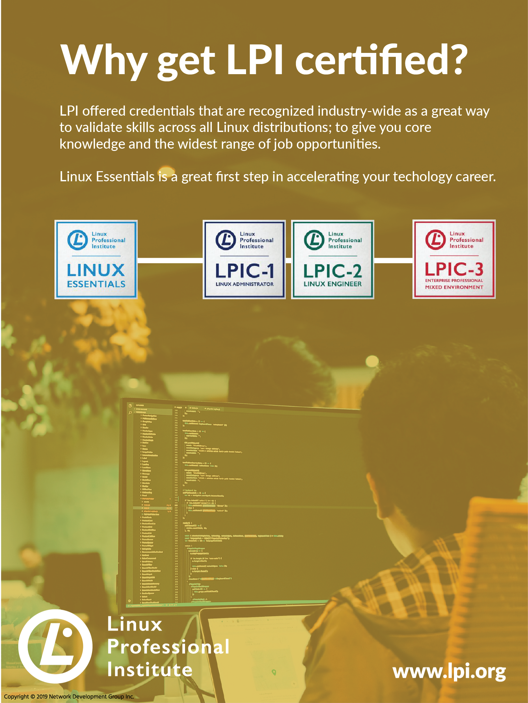

# 18. Directorios y Archivos especiales
## 18.1 Introducción
En la mayoría de los casos, los permisos básicos de Linux (lectura, escritura y ejecución) son suficientes para satisfacer las necesidades de seguridad de usuarios individuales u organizaciones.

Sin embargo, cuando varios usuarios necesitan trabajar de forma rutinaria en los mismos directorios y archivos, estos permisos pueden no ser suficientes. Los permisos especiales setuid, setgid y sticky bit están diseñados para abordar estas preocupaciones.

