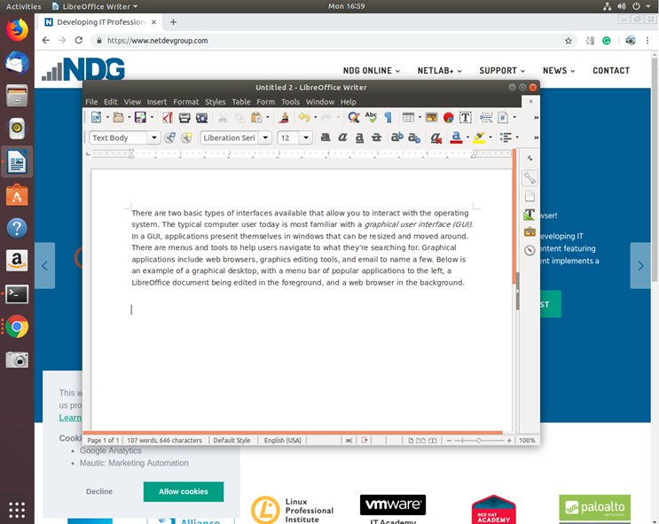
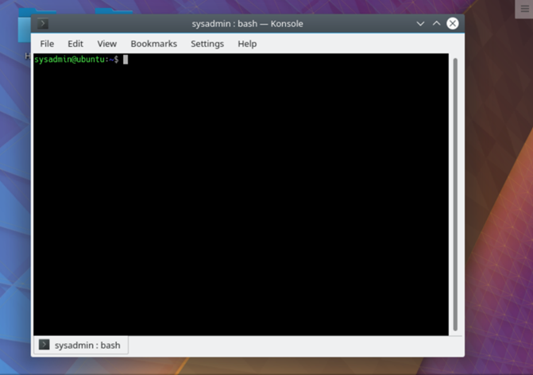

# Introducción a Linux

## 1.1 Linux está en todas partes

Los trabajos de Linux están en todas partes. Existe una demanda de habilidades de Linux en casi todas las industrias y categorías de trabajo en el planeta, y no hay suficiente talento de Linux para satisfacer esta creciente demanda. También es divertido y gratificante trabajar con algo que es una parte tan importante de nuestras vidas modernas, pero que tan pocas personas entienden.

Si alguien dice que tiene experiencia en Linux, puede referirse a la configuración de sistemas, la ejecución de servidores web o cualquier otro número de servicios y programas que operan sobre Linux. Con el tiempo, la administración de Linux ha evolucionado para abarcar casi todas las tareas que una empresa moderna, una institución educativa o una organización gubernamental podría utilizar en sus operaciones diarias.

El viaje de aprendizaje que están comenzando hoy no tiene un punto final. Puede llevarlo en una miríada de direcciones diferentes, desde la ciberseguridad hasta el desarrollo de aplicaciones y juegos, la administración de sistemas, las redes, los grandes datos y la inteligencia artificial; todos estos campos están enraizados en Linux.

Cada vez que realizas una búsqueda en Internet, ves un video en tu teléfono o pides algo en línea, es probable que estés trabajando con Linux. Personifica un todo que es más grande que la suma de sus partes, una vasta empresa, realizada voluntariamente, por algunas de las personas más inteligentes del planeta.

Si bien su viaje continuará, siéntase reconfortado de saber que está aprendiendo un conjunto de tecnologías, comandos y métodos que han resistido la prueba del tiempo. Linux utiliza y expande muchos de los comandos y formas de realizar computación que UNIX comenzó, con una tasa de cambio por año que es muy manejable. Ahora, unos 30+ años después, muchos de esos comandos aprendidos todavía están activos y son utilizados todos los días por administradores de sistemas, devops y arquitectos. Linux es una revolución de la evolución, lo que le permite aprender la mayoría una vez y mantenerse al día con el pequeño porcentaje de cambios en un proceso de aprendizaje continuo.
## 1.2 Linux es un Kernel

La definición de la palabra Linux depende del contexto en el que se utilice. Linux significa el _kernel_ del sistema, que es el controlador central de todo lo que sucede en la computadora.

Cuando la mayoría de la gente se refiere a Linux, en realidad se está refiriendo a una combinación de software llamada **GNU/Linux**, que define el _sistema operativo_. **GNU** es el _software libre_ que proporciona equivalentes de código abierto de muchos comandos comunes de UNIX. La parte de Linux de esta combinación es el _kernel de Linux_, que es el núcleo del sistema operativo. El kernel se carga en el momento del arranque y permanece en ejecución para administrar todos los aspectos del funcionamiento del sistema.

La historia de Linux comienza con **UNIX**, un sistema operativo desarrollado en AT&T Bell Labs en la década de 1970. UNIX está escrito en el  **lenguaje C,**  lo que lo hace único portátil entre los sistemas operativos de la competencia, que generalmente estaban estrechamente vinculados al hardware para el que fueron escritos. Rápidamente ganó popularidad en entornos académicos y de investigación, así como entre los programadores que se sintieron atraídos por su modularidad. Con el tiempo fue modificado y bifurcado (es decir, la gente lo modificó, y esas modificaciones sirvieron de base para otros sistemas) de tal manera que en la actualidad existen muchas variantes diferentes de UNIX. Sin embargo, UNIX es ahora tanto una marca registrada como una especificación, propiedad de un consorcio industrial llamado **Open Group**. Solo el software que ha sido certificado por el Open Group puede llamarse a sí mismo UNIX.

Linux comenzó en 1991 como un proyecto de pasatiempo de **Linus Torvalds**, un científico informático nacido en Finlandia que estudiaba en la Universidad de Helsinki. Frustrado por la licencia de MINIX, un sistema operativo similar a UNIX diseñado para uso educativo, y el deseo de su creador de no convertirlo en un sistema operativo completo, Linus decidió crear su propio kernel de sistema operativo.

Desde este humilde comienzo, Linux se ha convertido en el sistema operativo dominante en Internet, y posiblemente el programa informático más importante de cualquier tipo. A pesar de adoptar todos los requisitos de la especificación UNIX, Linux no ha sido certificado, por lo que Linux realmente no es UNIX. Es solo... Similar a UNIX.

Antes y junto a este desarrollo se encontraba el **Proyecto GNU**, creado por **Richard Stallman** en 1983. Aunque GNU se centró inicialmente en la construcción de su propio sistema operativo, al final fueron mucho más eficaces en la creación de herramientas que van junto con un sistema operativo similar a UNIX, como los editores, compiladores e interfaces de usuario que hacen que un núcleo sea utilizable. Dado que el código fuente estaba disponible libremente, los programadores de Linux pudieron incorporar las herramientas GNU para proporcionar un sistema operativo completo. Como tal, muchas de las herramientas y utilidades que forman parte del sistema Linux evolucionaron a partir de estas primeras herramientas GNU.

```
Linus originalmente llamó al proyecto Freax, sin embargo, un administrador del servidor donde se cargaron los archivos de desarrollo lo renombró Linux, un acrónimo del nombre de Linus y UNIX. El nombre se quedó.
```

GNU es un acrónimo recursivo de "GNU's Not Unix", y se pronuncia igual que el antílope africano que lleva su nombre.
## 1.3 Linux es de código abierto

Históricamente, la mayoría del software se ha emitido bajo una licencia de código cerrado, lo que significa que tiene derecho a usar el código máquina, pero no puede ver el código fuente. A menudo, la licencia dice explícitamente que no puede intentar aplicar ingeniería inversa al código de máquina para volver al código fuente para averiguar qué hace.

El desarrollo de Linux es muy similar al auge del _software de código abierto_. El código abierto adopta una visión del software centrada en la fuente. La filosofía del código abierto es que usted tiene derecho a obtener el código fuente del software y a modificarlo para su propio uso.

Linux adoptó esta filosofía con gran éxito. Linus hizo que el código fuente de programación (las instrucciones que usa una computadora para operar) estuviera disponible libremente, lo que permitió que otros se unieran y dieran forma a este incipiente sistema operativo. No fue el primer sistema desarrollado por un grupo de voluntarios, pero dado que se construyó desde cero, los primeros usuarios pudieron influir en la dirección del proyecto. Las personas tomaron el código fuente, hicieron cambios y los compartieron con el resto del grupo, lo que aceleró enormemente el ritmo de desarrollo y garantizó que no se repitieran los errores de otros sistemas operativos.

```
El código fuente puede estar escrito en cualquiera de los cientos de idiomas diferentes. Linux está escrito en **C**, un lenguaje versátil y relativamente fácil de aprender, que comparte historia con el UNIX original. Esta decisión, tomada mucho antes de que se demostrara su utilidad, resultó ser crucial en su adopción casi universal como el principal sistema operativo para los servidores de Internet.
```
## 1.4 Linux tiene distribuciones

Las personas que dicen que su computadora ejecuta Linux generalmente se refieren al kernel, las herramientas y el conjunto de aplicaciones que vienen agrupadas en lo que se conoce como una _distribución_.

Tome Linux y las herramientas GNU, agregue algunas aplicaciones orientadas al usuario como un navegador web y un cliente de correo electrónico, y tendrá un sistema Linux completo. Los individuos e incluso las empresas comenzaron a agrupar todo este software en distribuciones casi tan pronto como Linux se volvió utilizable. La distribución incluye herramientas que se encargan de configurar el almacenamiento, instalar el kernel e instalar el resto del software. Las distribuciones con todas las funciones también incluyen herramientas para administrar el sistema y un _administrador de paquetes_ para ayudarlo a agregar y eliminar software una vez completada la instalación.

Al igual que UNIX, existen distribuciones adecuadas para todos los propósitos imaginables. Hay distribuciones que se centran en la ejecución de servidores, ordenadores de sobremesa o incluso herramientas específicas del sector, como el diseño electrónico o la informática estadística. Los principales actores del mercado se remontan a Red Hat, Debian o Slackware. La diferencia más visible entre los derivados de Red Hat y Debian es el administrador de paquetes, aunque hay otras diferencias en todo, desde la ubicación de los archivos hasta las filosofías políticas.
## 1.5 Linux adopta la CLI

Hay dos tipos básicos de interfaces disponibles que le permiten interactuar con el sistema operativo. El usuario típico de computadoras hoy en día está más familiarizado con una _interfaz gráfica de usuario (GUI)._ En una GUI, las aplicaciones se presentan en ventanas que se pueden cambiar de tamaño y mover. Hay menús y herramientas para ayudar a los usuarios a navegar. Las aplicaciones gráficas incluyen navegadores web, herramientas de edición de gráficos y correo electrónico, por nombrar algunas.

A continuación, se muestra un ejemplo de un escritorio gráfico, con una barra de menú de aplicaciones populares a la izquierda, un documento de LibreOffice que se está editando en primer plano y un navegador web en segundo plano.



El segundo tipo de interfaz es la _interfaz de línea de comandos (CLI),_ una interfaz basada en texto para la computadora. La CLI se basa principalmente en la entrada del teclado. Todo lo que el usuario quiere que haga la computadora se transmite escribiendo comandos en lugar de hacer clic en iconos. Se puede decir que cuando un usuario hace clic en un icono, la computadora le está diciendo al usuario qué hacer, pero, cuando el usuario escribe un comando, le está diciendo a la computadora qué hacer.



Por lo general, los sistemas operativos ofrecen interfaces GUI y CLI. Sin embargo, la mayoría de los sistemas operativos de consumo (Windows, macOS) están diseñados para proteger al usuario de la complejidad de la CLI. La comunidad de Linux es diferente en el sentido de que celebra positivamente a la CLI por su potencia, velocidad y capacidad para realizar una amplia gama de tareas con una sola instrucción de línea de comandos. Las máquinas virtuales utilizadas para los capítulos y laboratorios de este curso proporcionan una CLI para que practique sin temor a dañar nada.

Cuando un usuario se encuentra por primera vez con la CLI, puede resultarle difícil porque requiere memorizar una cantidad vertiginosa de comandos y sus opciones. Sin embargo, una vez que un usuario ha aprendido la estructura de cómo se usan los comandos, dónde se encuentran los archivos y directorios necesarios y cómo navegar por la jerarquía de un sistema de archivos, pueden ser inmensamente productivos. Esta capacidad proporciona un control más preciso, mayor velocidad y la capacidad de automatizar fácilmente las tareas a través de secuencias de comandos.

Además, al aprender la CLI, un usuario puede ser productivo fácilmente casi instantáneamente en CUALQUIER distribución de Linux, reduciendo la cantidad de tiempo necesario para familiarizarse con un sistema debido a las variaciones en una GUI.

