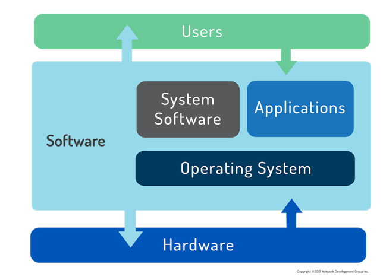
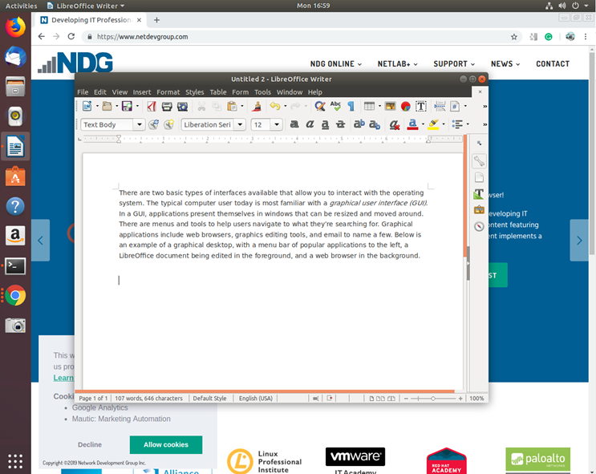
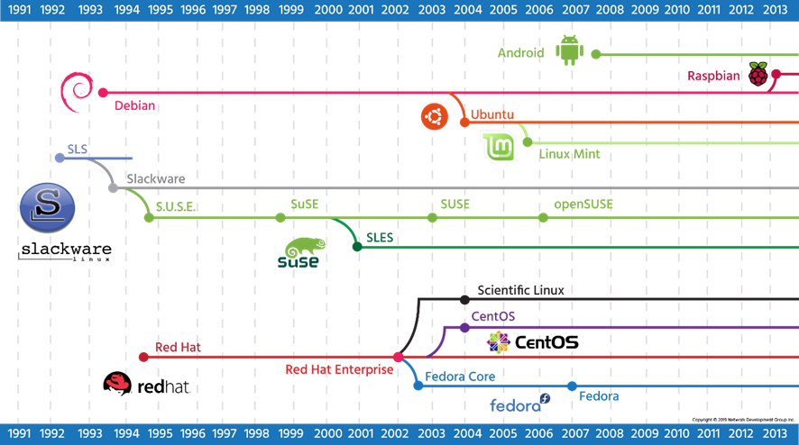

# 2. Sistemas Operativos

## 2.1 Sistemas Operativos

Un _sistema operativo_ es un software que se ejecuta en un dispositivo informático y gestiona los componentes de hardware y software que componen un sistema informático funcional.

Los sistemas operativos modernos no solo administran los recursos de hardware y software, sino que programan programas para que se ejecuten de manera multitarea (compartiendo el procesador para que múltiples tareas puedan ocurrir aparentemente simultáneamente), proporcionan servicios estándar que permiten a los usuarios y programas solicitar que suceda algo (por ejemplo, un trabajo de impresión) del sistema operativo, y siempre que se solicite correctamente.  El sistema operativo aceptará la solicitud y realizará la función necesaria.

Los sistemas operativos de escritorio y servidor son, por naturaleza, más complejos que un sistema operativo que se ejecuta en un dispositivo de un solo propósito, como un firewall o un teléfono móvil. Desde un simple decodificador que proporciona una interfaz de menú para un proveedor de cable, hasta supercomputadoras y clústeres de computación paralelos masivos, el término genérico _sistema operativo_ se usa para describir cualquier software que se inicie y ejecute en ese dispositivo.



Hoy en día, los usuarios de ordenadores pueden elegir entre tres sistemas operativos principales: **Microsoft Windows**, **Apple macOS** y **Linux**.

De los tres principales sistemas operativos enumerados, solo Microsoft Windows es único en su código subyacente. macOS de Apple es una distribución UNIX totalmente cualificada basada en BSD Unix (un sistema operativo distribuido hasta 1995), complementada con una gran cantidad de código propietario. Se ejecuta en hardware específicamente optimizado para funcionar con el software de Apple. Linux puede ser cualquiera de los cientos de paquetes de distribución diseñados u optimizados para cualquier tarea que se requiera. Solo Microsoft Windows se basa en una base de código propietaria que no está basada en UNIX o Linux.

Un usuario puede interactuar fácilmente con cualquiera de estos sistemas señalando y haciendo clic en su camino a través de las tareas de productividad cotidianas que se comportan de manera similar, independientemente del sistema operativo subyacente. A excepción de Windows, que se administra principalmente a través de la GUI, la mayoría de las tareas de administración del sistema se realizan mediante comandos escritos en un terminal. Un administrador que está familiarizado con UNIX normalmente puede realizar tareas en un sistema Linux y viceversa. Muchas funciones de línea de comandos de Linux también tienen equivalentes de Microsoft que los administradores usan para hacer su trabajo de manera eficiente.
### 2.1.1 Puntos de decisión

**Rol**
La primera decisión a la hora de especificar cualquier sistema informático es el papel de la máquina. ¿Estará sentado en la consola ejecutando aplicaciones de productividad o navegando por la web? Si es así, lo  _mejor es un escritorio_ familiar  . ¿Muchos usuarios accederán a la máquina de forma remota o proporcionará servicios a usuarios remotos? Entonces es un _servidor_.

Por lo general, los servidores se encuentran en un bastidor y comparten un teclado y un monitor con muchas otras computadoras, ya que el acceso a la consola generalmente solo se usa para la configuración y la resolución de problemas. Los servidores generalmente se ejecutan como una CLI, lo que libera recursos para el propósito real de la computadora: servir información a los clientes (cualquier usuario o sistema que acceda a los recursos de forma remota). Los sistemas de escritorio ejecutan principalmente una GUI para facilitar el uso de sus usuarios.

**Función**
A continuación, determine las funciones de la máquina. ¿Hay algún software específico que necesite ejecutar, o funciones específicas que deba realizar? ¿Habrá cientos, incluso miles, de estas máquinas funcionando al mismo tiempo? ¿Cuál es el conjunto de habilidades del equipo que administra la computadora y el software?

**Ciclo vital**
También es necesario determinar la vida útil del servicio y la tolerancia al riesgo del servidor. Las actualizaciones de sistemas operativos y software se realizan de forma periódica, lo que se denomina ciclo de _lanzamiento_. Los proveedores solo admiten versiones anteriores de software durante un cierto período de tiempo antes de no ofrecer ninguna actualización; A esto se le llama _ciclo de mantenimiento_ o _ciclo de vida_.

En un entorno de servidor empresarial, los ciclos de mantenimiento y versión son consideraciones críticas porque requiere mucho tiempo y es costoso realizar actualizaciones importantes. En cambio, el hardware del servidor en sí a menudo se reemplaza porque el aumento del rendimiento vale la pena el gasto adicional, y los recursos involucrados suelen ser muchas veces más costosos que el hardware.

```
Hay una buena cantidad de trabajo involucrado en la actualización de un servidor debido a las configuraciones especializadas, la aplicación de parches de software y las pruebas de usuario, por lo que una organización proactiva buscará maximizar su retorno de la inversión tanto en capital humano como monetario.
```

Los centros de datos modernos están abordando este desafío a través de _la virtualización_. En un entorno virtual, una máquina física puede alojar docenas, o incluso cientos de máquinas virtuales, lo que reduce los requisitos de espacio y energía, además de permitir la automatización de muchas de las tareas que antes realizaban manualmente los administradores de sistemas. Los programas de scripting permiten crear, configurar, implementar y eliminar máquinas virtuales de una red sin necesidad de intervención humana. Por supuesto, un humano todavía necesita escribir el guión y monitorear estos sistemas, al menos por ahora.

La necesidad de actualizaciones de hardware físico también se ha reducido enormemente con la llegada de proveedores de servicios en la nube como **Amazon Web Services**, **Rackspace** y **Microsoft Azure**. Avances similares han ayudado a los administradores de escritorios a gestionar las actualizaciones de forma automatizada y con poca o ninguna interrupción del usuario.

**Estabilidad**
Las versiones de software individuales se pueden caracterizar como _beta_ o _estables_ dependiendo de dónde se encuentren en el ciclo de lanzamiento. Cuando una versión de software tiene muchas características nuevas que no se han probado, generalmente se denomina _beta_. Después de ser probado en el campo, su designación cambia a _estable_.

Los usuarios que necesiten las últimas funciones pueden decidir utilizar el software beta. Esto se hace a menudo en la fase de desarrollo de una nueva implementación y proporciona la capacidad de solicitar características que no están disponibles en la versión estable.

Los servidores de producción suelen utilizar software estable a menos que las funciones necesarias no estén disponibles, y el riesgo de ejecutar código que no se ha probado a fondo se ve compensado por la utilidad proporcionada.

El software en el ámbito del código abierto a menudo se publica para su revisión por pares muy temprano en su proceso de desarrollo, y se puede poner muy rápidamente en entornos de prueba e incluso de producción, proporcionando comentarios extremadamente útiles y envíos de código para solucionar los problemas encontrados o las características necesarias.

Por el contrario, el software propietario a menudo se mantendrá en secreto durante la mayor parte de su desarrollo, y solo alcanzará una etapa beta pública cuando esté casi listo para su lanzamiento.

**Compatibilidad**
Otro concepto vagamente relacionado es la _compatibilidad con versiones anteriores_, que se refiere a la capacidad de los sistemas operativos posteriores para ser compatibles con el software creado para versiones anteriores. Esto suele ser un problema cuando es necesario actualizar un sistema operativo, pero no es posible actualizar el software de la aplicación debido al costo o a la falta de disponibilidad.

La norma para el desarrollo de software de código abierto es garantizar primero la compatibilidad con versiones anteriores y romper las cosas solo como último recurso. La práctica común de mantener y versionar bibliotecas de funciones ayuda mucho a esto. Normalmente, una biblioteca que es utilizada por uno o más programas se versiona como una nueva versión cuando se han producido cambios significativos, pero también mantiene todas las funciones (y la compatibilidad) de las versiones anteriores que pueden estar codificadas de forma rígida o a las que se hace referencia el software existente.

**Costar**
El coste es siempre un factor a tener en cuenta a la hora de especificar nuevos sistemas. Microsoft tiene tarifas de licencia anuales que se aplican a usuarios, servidores y otro software, al igual que muchas otras compañías de software. En última instancia, la elección del sistema operativo se verá afectada por el hardware disponible, los recursos y habilidades del personal, el costo de compra, el mantenimiento y los requisitos futuros proyectados.

La virtualización y los servicios de soporte externalizados ofrecen a la organización de TI moderna la promesa de tener que pagar solo por lo que utiliza en lugar de aumentar su capacidad. Esto no solo controla los costos, sino que ofrece oportunidades para que las personas, tanto dentro como fuera de la organización, aporten experiencia y valor.

**Interfaz**
Los primeros sistemas informáticos electrónicos se controlaban mediante interruptores y cuadros de conexión similares a los que utilizaban los operadores telefónicos de la época. Luego vinieron las tarjetas perforadas y, finalmente, un sistema de terminal basado en texto similar a la interfaz de línea de _comandos (CLI) de Linux_  que se usa hoy en día. La _interfaz gráfica de usuario (GUI),_ con un ratón y botones para hacer clic, fue iniciada en Xerox PARC (Centro de Investigación de Palo Alto) a principios de la década de 1970 y popularizada por Apple Computer en la década de 1980.

Hoy en día, los sistemas operativos ofrecen interfaces GUI y CLI, sin embargo, la mayoría de los sistemas operativos de consumo (Windows, macOS) están diseñados para proteger al usuario de los entresijos de la CLI.
## 2.2 Microsoft Windows

**Microsoft** ofrece diferentes versiones de su sistema operativo según la función de la máquina: ¿escritorio o servidor? La versión de escritorio de Windows ha sufrido varios esquemas de nomenclatura, y la versión actual (al momento de escribir este artículo) es simplemente **Windows 11**. Si bien las nuevas versiones de la mayoría de las distribuciones de Linux salen dos veces al año, alrededor de marzo y septiembre, las nuevas versiones de Windows tienden a lanzarse solo cada pocos años. En total, ha habido 16 versiones de Windows desde 1985. La compatibilidad con versiones anteriores es una prioridad para Microsoft, incluso yendo tan lejos como para agrupar la tecnología de máquina virtual para que los usuarios puedan ejecutar software más antiguo.

**Windows Server** actualmente (en el momento de escribir este artículo) se encuentra en la versión **2019** para indicar la fecha de lanzamiento. El servidor puede ejecutar una interfaz gráfica de usuario, pero recientemente, Microsoft, en gran parte como una respuesta competitiva a Linux, ha hecho avances increíbles en sus capacidades de scripting de línea de comandos a través de PowerShell y Windows Subsystem for Linux (WSL). También hay un paquete opcional de experiencia de escritorio que imita una máquina de productividad estándar. Microsoft también anima activamente a los clientes empresariales a incorporar su servicio en la nube Azure.
## 2.3 Apple macOS

**Apple** fabrica el  sistema operativo macOS, que se basa parcialmente en el software del proyecto FreeBSD y ha obtenido la certificación UNIX. macOS es bien conocido por ser "fácil de usar" y, como tal, ha seguido siendo el favorito de los usuarios con acceso limitado a los recursos de TI, como escuelas y pequeñas empresas. También es muy popular entre los programadores debido a sus robustos fundamentos UNIX.

En el lado del servidor, **macOS Server** está dirigido principalmente a organizaciones más pequeñas. Esta adición de bajo costo al escritorio macOS permite a los usuarios colaborar y a los administradores controlar el acceso a los recursos compartidos. También proporciona integración con dispositivos iOS como el iPhone y el iPad.

Algunos departamentos de TI corporativos grandes permiten a los usuarios elegir macOS, ya que los usuarios a menudo requieren menos soporte que las implementaciones de productividad estándar de Microsoft. La continua popularidad de macOS ha garantizado un soporte saludable por parte de los proveedores de software. macOS también es bastante popular en las industrias creativas, como la producción de gráficos y vídeo. Para muchos de estos usuarios, la elección de la aplicación impulsa la decisión del sistema operativo. El hardware de Apple, al estar tan estrechamente integrado con el sistema operativo, y su insistencia en el cumplimiento de los estándares en la programación de aplicaciones, les da a estos profesionales creativos una plataforma estable para realizar muchas funciones informáticas intensivas con menos preocupaciones sobre la compatibilidad.
## 2.4 Linux

Los usuarios de Linux suelen obtener un sistema operativo descargando una _distribución_. Una distribución de Linux es un paquete de software, generalmente compuesto por el kernel de Linux, utilidades, herramientas de administración e incluso algún software de aplicación en un paquete que también incluye los medios para actualizar el software principal e instalar aplicaciones adicionales.

La distribución se encarga de configurar el almacenamiento, construir el kernel e instalar los controladores de hardware, así como de instalar aplicaciones y utilidades para hacer un sistema informático completamente funcional. Las organizaciones que crean distribuciones también incluyen herramientas para administrar el sistema, un administrador de paquetes para agregar y eliminar software, así como programas de actualización para proporcionar parches de seguridad y funcionalidad.

El número de distribuciones de Linux disponibles se cuenta por cientos, por lo que la elección puede parecer desalentadora al principio. Sin embargo, los puntos de decisión son en su mayoría los mismos que los resaltados para elegir un sistema operativo.

**Rol**
Con Linux, hay múltiples opciones para elegir en función de las necesidades de la organización. La variedad de distribuciones y el software que lo acompaña permite que el sistema operativo sea significativamente más flexible y personalizable. Las distribuciones están disponibles para una variedad mucho más amplia de sistemas, desde ofertas comerciales para los roles tradicionales de servidor o escritorio, hasta distribuciones especializadas diseñadas para convertir una computadora vieja en un firewall de red; desde distribuciones creadas para alimentar una supercomputadora, hasta aquellas que permiten sistemas integrados. Estos pueden centrarse en la ejecución de servidores web o de aplicaciones, escritorios de productividad, sistemas de punto de venta o incluso herramientas dedicadas al diseño electrónico o la computación estadística.

**Función**
Los gobiernos y las grandes empresas también pueden limitar sus opciones a distribuciones que ofrezcan soporte comercial, ya que pagar por otro nivel de soporte puede ser mejor que arriesgarse a interrupciones prolongadas. En su mayor parte, las preocupaciones sobre la seguridad se han abordado a través de la gran comunidad de código abierto, que monitorea los cambios en el kernel en busca de vulnerabilidades y proporciona informes y correcciones de errores a una escala mucho mayor de lo que los proveedores de código cerrado pueden lograr.

La compatibilidad con las aplicaciones necesarias puede variar y, por lo tanto, es una consideración adicional. A menudo, los proveedores de aplicaciones eligen un subconjunto de distribuciones para admitir. Las diferentes distribuciones tienen diferentes versiones de bibliotecas de claves, y es difícil para una empresa admitir todas estas versiones diferentes. Sin embargo, algunas aplicaciones como Firefox y LibreOffice son ampliamente compatibles y están disponibles para todas las distribuciones principales.

**Ciclo vital**
La mayoría de las distribuciones tienen ciclos de actualización mayores y menores para introducir nuevas funciones y corregir errores existentes. Además, hay paquetes de desarrollo en los que los usuarios pueden contribuir con código y enviar parches para su posible inclusión en nuevas versiones.

Las distribuciones de Linux se pueden clasificar en dos categorías principales: entusiastas y empresariales. Una distribución entusiasta como Tumbleweed de openSUSE tiene un ciclo de actualización rápido, no es compatible con la empresa y es posible que no contenga (o elimine) funciones o software en la próxima versión que están en la actual. El proyecto Fedora de Red Hat utiliza un método similar de desarrollo y ciclo de lanzamiento, al igual que Ubuntu Desktop.

Las distribuciones empresariales son casi exactamente lo contrario, ya que se preocupan por ser estables y coherentes, y ofrecen soporte de nivel empresarial durante períodos prolongados, entre 5 y 13 años en el caso de SUSE. Las distribuciones empresariales son menos con diferencia, siendo ofrecidas principalmente por Red Hat, Canonical y SUSE.

El software de aplicación puede estar escrito de tal manera que solo admita una versión específica de una distribución, lo que requiere que los usuarios permanezcan en un sistema operativo más antiguo y menos seguro de lo que les gustaría. Por lo tanto, se considera que algunas versiones de Linux tienen soporte a largo plazo (LTS) de 5 años o más, mientras que otras solo tienen soporte durante dos años o menos.

**Estabilidad**
Algunas distribuciones ofrecen  _versiones estables_, _de prueba_ e _inestables_. Al elegir una versión inestable para las características requeridas, se debe tener en cuenta el hecho de que esas características pueden cambiar en cualquier momento durante el ciclo de desarrollo. Cuando las características se han integrado en el sistema durante mucho tiempo, con la mayoría de los errores y problemas solucionados, el software pasa de las pruebas a la versión estable.

Otras versiones dependen de distribuciones beta. Por ejemplo, la distribución de Fedora lanza versiones beta o preliminares de su software antes de la versión completa para minimizar los errores. Fedora a menudo se considera la versión beta de RedHat orientada a la comunidad. Las características se agregan y cambian en la versión de Fedora antes de encontrar su camino en la distribución RedHat lista para la empresa.

openSUSE y su homólogo empresarial SLES (SUSE Linux Enterprise Server) son similares, en el sentido de que la edición comunitaria se utiliza como campo de pruebas para las características y funciones que eventualmente se migrarán a la versión empresarial. Las versiones posteriores de las bases de código de distribución de openSUSE y SLES son casi idénticas, lo que permite una migración más fácil de las características y el código de una a otra.

```
La distribución Debian advierte a los usuarios sobre los peligros de usar la versión «sid» (inestable) con la siguiente advertencia:

"_SID" está sujeto a cambios masivos y actualizaciones de la biblioteca en el lugar. Esto puede resultar en un sistema muy "inestable" que contiene paquetes que no se pueden instalar debido a bibliotecas faltantes, dependencias que no se pueden cumplir, etc. ¡Úsalo bajo tu propio riesgo!_'
```

**Costar**
Es posible que la distribución de Linux elegida no tenga costo, pero puede valer la pena pagar por el soporte en función de las necesidades y capacidades de la organización.

**Interfaz**
Al igual que la mayoría de los sistemas operativos, Linux se puede utilizar de dos maneras: gráfica (GUI) y no gráfica (CLI). A continuación se muestra un ejemplo de un escritorio gráfico, con una barra de menú de aplicaciones populares a la izquierda, un documento de LibreOffice que se está editando en primer plano y un navegador web en segundo plano.



En el modo gráfico, los usuarios pueden tener varias ventanas diferentes con aplicaciones de terminal (shells) abiertas, lo que es muy útil cuando se realizan tareas en varios equipos remotos. Los administradores y usuarios pueden iniciar sesión con su nombre de usuario y contraseña a través de una interfaz gráfica.

El segundo tipo de interfaz, la CLI, es una interfaz basada en texto para la computadora, donde el usuario escribe un comando y la computadora luego lo ejecuta. El entorno CLI es proporcionado por una aplicación en la computadora conocida como _terminal_.El terminal acepta lo que el usuario escribe y lo pasa a un _shell_. El shell interpreta lo que el usuario ha escrito en instrucciones que pueden ser ejecutadas por el sistema operativo. Si la salida es producida por el comando, entonces este texto se muestra en el terminal. Si se encuentran problemas con el comando, se muestra un mensaje de error.

La CLI comienza con un inicio de sesión basado en texto, como se muestra a continuación. En un inicio de sesión exitoso, después de que se le solicite un nombre de usuario y una contraseña, se le llevará a un shell CLI personalizado para el usuario en particular.

```
ubuntu 18.04 ubuntu tty2
 
ubuntu login:
```

 En el modo CLI no hay ventanas para moverse. Los editores de texto, los navegadores web y los clientes de correo electrónico se presentan solo en formato de texto. Así es como funcionaba UNIX antes de que los entornos gráficos fueran la norma. La mayoría de los servidores también funcionan en este modo, ya que las personas no inician sesión en ellos directamente, lo que hace que una interfaz gráfica sea un desperdicio de recursos. A continuación, se muestra un ejemplo de una pantalla CLI después de iniciar sesión:
 
```
ubuntu 18.04 ubuntu tty2
 
ubuntu login: sue
Password:
 
The programs included with the Ubuntu system are free software;
the exact distribution terms for each program are described in the
individual files in /usr/share/doc/*/copyright.
 
‌⁠​​⁠​ 
Ubuntu comes with ABSOLUTELY NO WARRANTY, to the extent permitted by
applicable law.
 
Welcome to Ubuntu 18.04 LTS (GNU/Linux 4.4.0-72-generic x86_64)      
 
 * Documentation:  https://help.ubuntu.com/
 
212 packages can be updated.
91 updates are security updates.
 
sue@ubuntu:~$ w                                                         
 17:27:22 up 14 min,  2 users,  load average: 1.73, 1.83, 1.69
USER     TTY      FROM              LOGIN@   IDLE   JCPU   PCPU WHAT
sue    tty2                       20:08    14.35  0.05s  0.00s w
```

El mensaje de inicio de sesión original está en la parte superior, con texto más nuevo agregado a continuación. Durante el inicio de sesión, es posible que se muestre un texto llamado mensaje _del día_ (MOTD). Esta es una oportunidad para que el administrador de sistemas pase información a los usuarios, o simplemente haga una broma tonta. Después del MOTD está el símbolo del sistema, en el ejemplo anterior, el usuario ha ingresado el comando w que muestra quién ha iniciado sesión. A medida que se introducen y procesan nuevos comandos, la ventana se desplaza hacia arriba y el texto anterior se pierde en la parte superior. El terminal en sí es responsable de mantener cualquier historial, como permitir que el usuario se desplace hacia arriba y vea los comandos ingresados anteriormente. En lo que respecta a Linux, lo que está en la pantalla es todo lo que hay. No hay nada que mover.
### 2.4.1 Distribuciones de Linux

**Red Hat**
**Red Hat** comenzó como una distribución simple que introdujo el Red Hat Package Manager (RPM). El desarrollador finalmente formó una compañía a su alrededor, que trató de comercializar un escritorio Linux para negocios. Con el tiempo, Red Hat comenzó a centrarse más en las aplicaciones de servidor, como el servicio web y de archivos, y lanzó **Red Hat Enterprise Linux (RHEL),** que era un servicio de pago con un largo ciclo de lanzamiento. El ciclo de lanzamiento dicta la frecuencia con la que se actualiza el software. Una empresa puede valorar la estabilidad y querer ciclos de lanzamiento largos, mientras que un aficionado o una startup pueden querer el software más reciente y optar por un ciclo de lanzamiento más corto. Para satisfacer a este último grupo, Red Hat patrocina el **Proyecto Fedora,**  que fabrica un escritorio personal que comprende el software más reciente, pero que aún está construido sobre los mismos cimientos que la versión empresarial.

Debido a que todo en Red Hat Enterprise Linux es de código abierto, surgió un proyecto llamado **CentOS**. _Recompiló_ todos los paquetes de RHEL (convirtiendo su código fuente del lenguaje de programación en el que estaban escritos, en un lenguaje utilizable por el sistema) y los regaló de forma gratuita. CentOS y otros similares (como Scientific Linux) son en gran medida compatibles con RHEL e integran algunos programas más nuevos, pero no ofrecen el soporte de pago que ofrece Red Hat.

**Scientific Linux** es un ejemplo de una distribución de uso específico basada en Red Hat. El proyecto es una distribución patrocinada por Fermilab diseñada para permitir la computación científica. Entre sus muchas aplicaciones, Scientific Linux se utiliza con aceleradores de partículas, incluido el Gran Colisionador de Hadrones del CERN.

**SUSE**
**SUSE**, originalmente derivado de **Slackware**, fue una de las primeras distribuciones integrales de Linux, tiene muchas similitudes con Red Hat Enterprise Linux. La empresa original fue adquirida por Novell en 2003, que a su vez fue adquirida por el Grupo Attachmate en 2011. El grupo Attachmate se fusionó con Micro Focus International en 2014, y en 2018 SUSE anunció planes para seguir adelante como una empresa independiente. A través de todas las fusiones y adquisiciones, SUSE ha logrado continuar y crecer.

Mientras que SUSE Linux Enterprise contiene código propietario y se vende como un producto de servidor, **openSUSE** es una versión completamente abierta y gratuita con múltiples paquetes de escritorio similares a CentOS y Linux Mint.

**Debian**
**Debian** es más un esfuerzo de la comunidad y, como tal, también promueve el uso de software de código abierto y la adherencia a los estándares. Debian creó su propio sistema de gestión de paquetes basado en el .deb formato de archivo. Mientras que Red Hat deja el soporte de plataformas que no son de Intel y AMD para proyectos derivados, Debian soporta muchas de estas plataformas directamente.

**Ubuntu** es la distribución derivada de Debian más popular. Es la creación de **Canonical**, una empresa que se hizo para promover el crecimiento de Ubuntu y gana dinero brindando soporte. Ubuntu tiene varias variantes diferentes para escritorio, servidor y varias aplicaciones especializadas. También ofrecen una versión LTS que se mantiene actualizada durante 3 años en escritorios y 5 años en servidores, lo que da confianza a los desarrolladores y a las empresas para las que trabajan para construir soluciones basadas en una distribución estable.

 **Linux Mint** se inició como una bifurcación de Ubuntu Linux, mientras aún dependía de los repositorios de Ubuntu. Hay varias versiones, todas gratuitas, pero algunas incluyen códecs propietarios, que no se pueden distribuir sin restricciones de licencia en ciertos países.

**Android**
Linux es un kernel, y muchos de los comandos que se tratan en este curso son en realidad parte del paquete GNU. Es por eso que algunas personas insisten en usar el término **_GNU/Linux_** en lugar de Linux solo.

**Android**, patrocinado por Google, es la distribución de Linux más popular del mundo. Es fundamentalmente diferente de sus contrapartes. Android utiliza la  **máquina virtual Dalvik** con Linux, lo que proporciona una plataforma sólida para dispositivos móviles como teléfonos y tabletas. Sin embargo, al carecer de los paquetes tradicionales que a menudo se distribuyen con Linux (como GNU y Xorg), Android es generalmente incompatible con las distribuciones de escritorio de Linux.

Esta incompatibilidad significa que un usuario de Red Hat o Ubuntu no puede descargar software de la tienda Google Play. Del mismo modo, un emulador de terminal en Android carece de muchos de los comandos de sus homólogos de Linux. Sin embargo, es posible usar BusyBox con Android para habilitar la mayoría de los comandos para que funcionen.

**Otro**
**Raspbian** es una distribución especializada de Linux optimizada para ejecutarse en  **hardware Raspberry Pi**. Esta combinación ha tenido un uso significativo en la formación de programadores y diseñadores de hardware de todos los niveles. Su bajo costo y facilidad de uso lo han convertido en uno de los favoritos de los educadores de todo el mundo, y hay muchos dispositivos complementarios disponibles para extender sus capacidades al mundo físico. Hay una multitud de laboratorios y proyectos disponibles que enseñan de todo, desde monitoreo ambiental hasta diseño de circuitos, aprendizaje automático y robótica.

**Linux From Scratch (LFS)** es más una herramienta de aprendizaje que una distribución de trabajo. Este proyecto consiste en un libro en línea, y código fuente, con "instrucciones paso a paso" para construir una distribución de Linux personalizada desde el código fuente hacia arriba. Esta "distribución" encarna el verdadero espíritu de Linux, por el cual los usuarios pueden modificar cualquier aspecto del sistema operativo y aprender cómo funcionan todas las piezas juntas. También es un buen punto de partida para cualquier persona que necesite una funcionalidad especializada o una construcción ultracompacta para un proyecto de sistema integrado.

Hemos discutido las distribuciones mencionadas explícitamente en los objetivos de Linux Essentials. Tenga en cuenta que hay cientos, si no miles más que están disponibles. Si bien hay muchas distribuciones diferentes de Linux, muchos de los programas y comandos siguen siendo los mismos o son muy similares.


### 2.4.2 Sistemas embebidos

Linux comenzó como algo que solo se ejecutaría en una computadora como la de Linus Torvald: una PC Intel 386 con un controlador de disco duro específico, pero como cualquiera podía agregar o cambiar Linux, la gente comenzó a crear soporte para otro hardware. Eventualmente, Linux comenzó a admitir otros chips con énfasis en el tamaño pequeño y el bajo consumo de energía.

Debido a esta flexibilidad, un número significativo de fabricantes de dispositivos han utilizado Linux como sistema operativo para sus productos de hardware. Hoy en día llamamos a estos _sistemas embebidos_ porque están diseñados para realizar una tarea específica en hardware optimizado solo para ese propósito. Estos sistemas abarcan una enorme diversidad de dispositivos que se utilizan hoy en día, desde teléfonos celulares hasta televisores inteligentes y electrodomésticos, pasando por sistemas de monitoreo remoto para tuberías y fábricas.

A medida que Linux evolucionó, se desarrollaron chips de procesador especializados para dispositivos industriales y de consumo para aprovechar sus capacidades. El soporte para Linux se ha vuelto tan omnipresente que es posible crear prototipos y llevar al mercado nuevos dispositivos utilizando componentes listos para usar. El auge de las computadoras baratas, pequeñas y adaptables de una sola placa, como la Raspberry Pi, ha brindado a los experimentadores y empresarios de todo el mundo herramientas para construir rápidamente soluciones personalizadas, impulsadas por Linux, que habrían tomado meses de trabajo por parte de equipos especializados hace solo unos años.

Si bien los consumidores están familiarizados con los dispositivos de entretenimiento integrados de Linux, como las grabadoras de video digital (DVR) y los "televisores inteligentes", el impacto real de Linux integrado recién está comenzando a darse cuenta. El _Internet de las cosas (IoT)_ está aumentando con dispositivos baratos y ubicuos que se implementan en todo, desde pozos de petróleo hasta granjas generadoras de energía solar. Estas redes de sensores y controladores inteligentes permiten a los ingenieros ajustar los procesos críticos en tiempo real mientras monitorean e informan a las estaciones de control centrales. A medida que se monitorean más procesos y se integran más datos con el aprendizaje automático y la inteligencia artificial (IA), podemos anticipar ganancias en eficiencia, seguridad y productividad con las que solo soñaban las generaciones pasadas.
