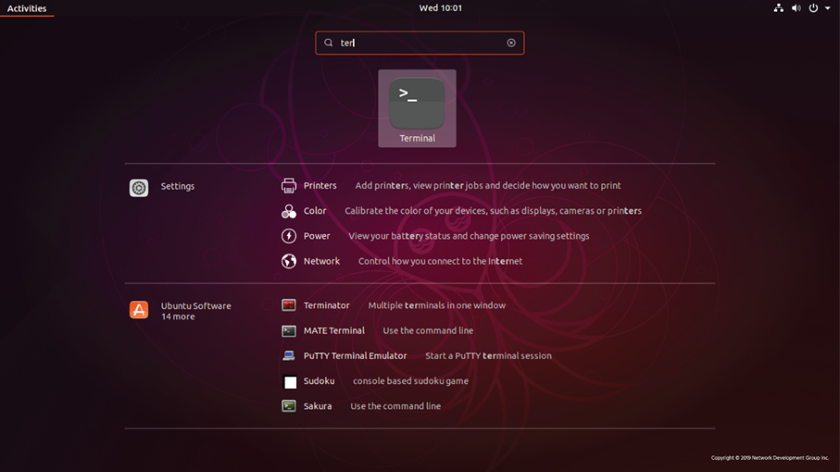
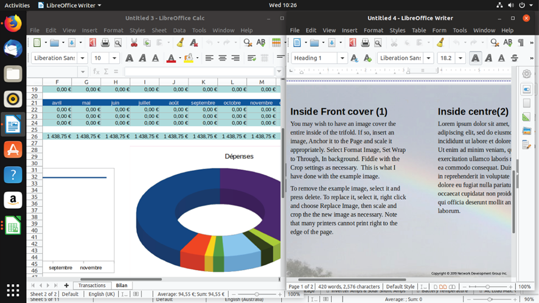
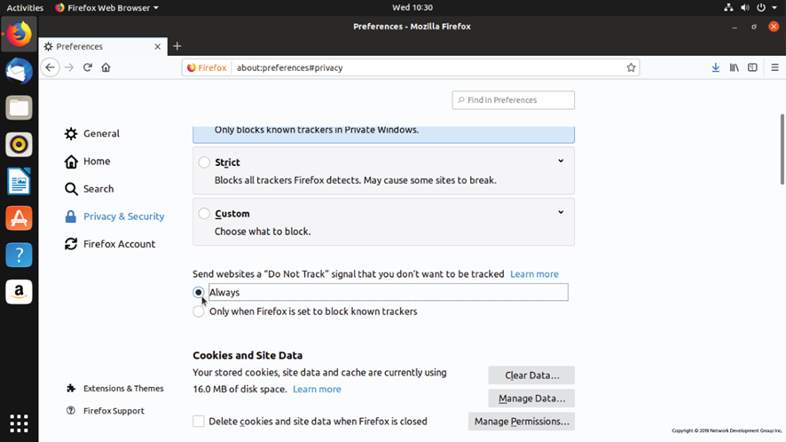
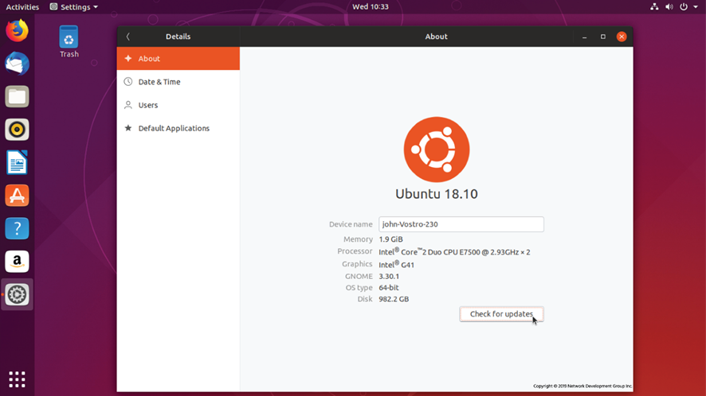
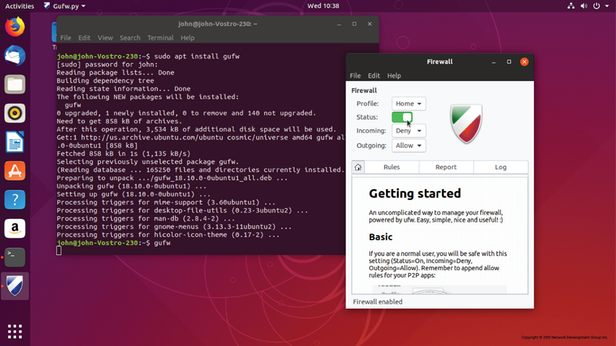

# 3. Trabajando con Linux
## 3.1 Navegando por el escritorio de Linux

Para ser un administrador de sistemas Linux, es necesario sentirse cómodo con Linux como sistema operativo de escritorio y tener competencia con las habilidades básicas de Tecnología de la Información y la Comunicación (TIC). El uso de Linux para tareas de productividad, en lugar de depender de sistemas Windows o Macintosh, acelera el aprendizaje al trabajar con herramientas de Linux a diario. Los administradores de sistemas hacen mucho más que administrar servidores; A menudo se les pide que ayuden a los usuarios con problemas de configuración, recomienden nuevo software y actualicen la documentación, entre otras tareas.

La mayoría de las distribuciones de Linux permiten a los usuarios descargar un paquete de instalación de "escritorio" que se puede cargar en una llave USB. Esta es una de las primeras cosas que deben hacer los aspirantes a administradores de sistemas; descargue una distribución principal y cárguela en una PC antigua. Este proceso es bastante sencillo y los tutoriales están disponibles en línea. El escritorio de Linux debería ser familiar para cualquiera que haya usado una PC o Macintosh con íconos para seleccionar diferentes programas y una aplicación de "configuración" para configurar cosas como cuentas de usuario, redes WiFi y dispositivos de entrada. Después de familiarizarse con la _interfaz gráfica de usuario (GUI) de Linux_, o escritorio, el siguiente paso es aprender a realizar tareas desde la línea de comandos.
### 3.1.1 Llegar a la línea de comandos

La _interfaz de línea de comandos (CLI)_ es un sistema de entrada de texto simple para ingresar cualquier cosa, desde comandos de una sola palabra hasta scripts complicados. La mayoría de los sistemas operativos tienen una CLI que proporciona una forma directa de acceder y controlar el equipo.

En los sistemas que arrancan en una GUI, hay dos formas comunes de acceder a la línea de comandos: un terminal basado en GUI y un terminal virtual:

- Un terminal GUI es un programa dentro del entorno GUI que emula una ventana de terminal. Se puede acceder a los terminales GUI a través del sistema de menús. Por ejemplo, en una máquina CentOS, puede hacer clic en **Aplicaciones** en la barra de menú, luego  **en Herramientas del**  sistema > y, finalmente, **en Terminal**. Si tiene una herramienta de búsqueda, puede buscar terminal, como se muestra aquí.

- Un terminal virtual se puede ejecutar al mismo tiempo que una GUI, pero requiere que el usuario inicie sesión a través del terminal virtual antes de poder ejecutar comandos (como lo haría antes de acceder a la interfaz GUI).

Cada distribución de escritorio de Linux es ligeramente diferente, pero el terminal de la aplicación  o **x-term** abrirá una ventana de terminal desde la GUI. Si bien existen diferencias sutiles entre los términos sesiones de _consola_ y  _de ventana de terminal, todos son iguales desde el punto de vista de los administradores y requieren el mismo conocimiento de los comandos para usar._

Las tareas ordinarias de la línea de comandos son el inicio de programas, el análisis de scripts y la edición de archivos de texto utilizados para la configuración del sistema o de la aplicación. La mayoría de los servidores arrancan directamente en un terminal, ya que una GUI puede consumir muchos recursos y, por lo general, no es necesaria para realizar operaciones basadas en el servidor.⁠​​
## 3.2 Aplicaciones

El _núcleo_ del sistema operativo es como un controlador de tráfico aéreo en un aeropuerto, y las _aplicaciones_ son los aviones bajo su control. El kernel decide qué programa obtiene qué bloques de memoria, inicia y mata aplicaciones, y se encarga de mostrar texto o gráficos en un monitor.

Las aplicaciones realizan solicitudes al kernel y, a cambio, reciben recursos, como memoria, CPU y espacio en disco. Si dos aplicaciones solicitan el mismo recurso, el kernel decide cuál lo obtiene y, en algunos casos, mata a otra aplicación para salvar el resto del sistema y evitar un bloqueo.

El kernel también abstrae algunos detalles complicados de la aplicación. Por ejemplo, la aplicación no sabe si un bloque de almacenamiento en disco está en una unidad de estado sólido, en un disco duro metálico giratorio o incluso en un recurso compartido de archivos de red. Las aplicaciones solo necesitan seguir la interfaz de programación de aplicaciones (API) del kernel y, por lo tanto, no tienen que preocuparse por los detalles de implementación. Cada aplicación se comporta como si tuviera un gran bloque de memoria en el sistema; El kernel mantiene esta ilusión remapeando bloques más pequeños de memoria, compartiendo bloques de memoria con otras aplicaciones, o incluso intercambiando bloques intactos por el disco.

El kernel también se encarga de la conmutación de aplicaciones, un proceso conocido como _multitarea_. Un sistema informático tiene un pequeño número de unidades centrales de procesamiento (CPU) y una cantidad finita de memoria. El kernel se encarga de descargar una tarea y cargar una nueva si hay más demanda que recursos disponibles. Cuando una tarea se ha ejecutado durante un período de tiempo especificado, la CPU la pausa para que se ejecute otra. Si la computadora está realizando varias tareas a la vez, el kernel está decidiendo cuándo cambiar el enfoque entre tareas. Con las tareas cambiando rápidamente, parece que la computadora está haciendo muchas cosas a la vez.

Cuando nosotros, como usuarios, pensamos en aplicaciones, tendemos a pensar en procesadores de texto, navegadores web y clientes de correo electrónico, sin embargo, hay una gran variedad de tipos de aplicaciones. El kernel no diferencia entre una aplicación orientada al usuario, un servicio de red que se comunica con una computadora remota o una tarea interna. A partir de esto, obtenemos una abstracción llamada _proceso_. Un proceso es solo una tarea que es cargada y rastreada por el kernel. Una aplicación puede incluso necesitar múltiples procesos para funcionar, por lo que el kernel se encarga de ejecutar los procesos, iniciarlos y detenerlos según lo solicitado y entregar los recursos del sistema.
### 3.2.1 Principales aplicaciones

El kernel de Linux puede ejecutar una amplia variedad de software en muchas plataformas de hardware. Una computadora puede actuar como un _servidor_, lo que significa que principalmente maneja datos en nombre de otros, o como un _escritorio_, lo que significa que un usuario interactúa con ella directamente. La máquina puede ejecutar software o utilizarse como máquina de desarrollo en el proceso de creación de software. Una máquina puede incluso adoptar múltiples roles, ya que Linux no hace distinción; Es simplemente una cuestión de configurar qué aplicaciones se ejecutan.

Una ventaja resultante es que Linux puede simular casi todos los aspectos de un entorno de producción, desde el desarrollo hasta las pruebas, pasando por la verificación en hardware a escala reducida, lo que ahorra costes y tiempo. Un administrador de Linux podría ejecutar las mismas aplicaciones de servidor en un escritorio o servidor virtual de bajo costo que son ejecutadas por grandes proveedores de servicios de Internet. Por supuesto, un ordenador de sobremesa no sería capaz de manejar el mismo volumen que un proveedor importante, pero se puede simular casi cualquier configuración sin necesidad de un hardware potente o licencias de servidor.

El software de Linux generalmente se clasifica en una de tres categorías:

- **Aplicaciones de servidor**
Software que no tiene interacción directa con el monitor y el teclado de la máquina en la que se ejecuta. Su propósito es servir información a otras computadoras, llamadas _clientes_. A veces, es posible que las aplicaciones de servidor no se comuniquen con otras computadoras, sino que solo se queden allí y procesen datos.

- **Aplicaciones de escritorio**
Navegadores web, editores de texto, reproductores de música u otras aplicaciones con las que los usuarios interactúan directamente. En muchos casos, como un navegador web, la aplicación se comunica con un servidor en el otro extremo e interpreta los datos. Este es el lado "cliente" de una aplicación cliente/servidor.

- **Herramientas**
Una categoría flexible de software que existe para facilitar la administración de sistemas informáticos. Las herramientas pueden ayudar a configurar pantallas, proporcionar un shell de Linux en el que los usuarios escriben comandos, o incluso herramientas más sofisticadas, llamadas compiladores, que convierten el código fuente en programas de aplicación que la computadora puede ejecutar.

La disponibilidad de las aplicaciones varía en función de la distribución. A menudo, los proveedores de aplicaciones eligen un subconjunto de distribuciones para admitir. Las diferentes distribuciones tienen diferentes versiones de bibliotecas de claves, y es difícil para una empresa admitir todas estas versiones diferentes. Sin embargo, algunas aplicaciones, como Firefox y LibreOffice, son ampliamente compatibles y están disponibles para todas las distribuciones principales.

La comunidad Linux ha ideado muchas soluciones creativas para aplicaciones de escritorio y servidor. Estas aplicaciones, muchas de las cuales constituyen la columna vertebral de Internet, son fundamentales para comprender y utilizar el poder de Linux.

La mayoría de las tareas informáticas se pueden realizar mediante cualquier número de aplicaciones en Linux. Hay muchos navegadores web, servidores web, servidores de bases de datos y editores de texto entre los que elegir. La evaluación del software de aplicación es una habilidad importante que debe aprender el aspirante a administrador de Linux. La determinación de los requisitos de rendimiento, estabilidad y costo son solo algunas de las consideraciones necesarias para un análisis integral.
### 3.2.2 Aplicaciones de servidor

Linux sobresale en la ejecución de aplicaciones de servidor debido a su confiabilidad y eficiencia. La capacidad de optimizar los sistemas operativos de servidor con los componentes necesarios permite a los administradores hacer más con menos, una característica que gusta tanto a las nuevas empresas como a las grandes empresas.
#### 3.2.2.1 Servidores web

Uno de los primeros usos de Linux fue para servidores web. Un servidor web aloja el contenido de las páginas web, que son vistas por un navegador web mediante el Protocolo de transferencia de **hipertexto (HTTP)** o su tipo cifrado, **HTTPS**. La página web en sí puede ser estática o dinámica. Cuando el navegador web solicita una página estática, el servidor web envía el archivo tal como aparece en el disco. En el caso de un sitio dinámico, la solicitud es enviada por el servidor web a una aplicación, que genera el contenido.

**WordPress** es un ejemplo popular. Los usuarios pueden desarrollar contenido a través de su navegador en la aplicación de WordPress, y el software lo convierte en un sitio web dinámico completamente funcional.

**Apache** es el servidor web dominante en uso hoy en día. Apache fue originalmente un proyecto independiente, pero desde entonces el grupo ha formado la **Apache Software Foundation** y mantiene más de cien proyectos de software de código abierto. **Apache HTTPD** es el demonio, o programa de aplicación de servidor, que "atiende" las solicitudes de páginas web.

Otro servidor web es **NGINX**, que tiene su sede en Rusia. Se centra en el rendimiento haciendo uso de kernels UNIX más modernos y solo hace un subconjunto de lo que Apache puede hacer. Más del 65% de los sitios web funcionan con NGINX o Apache.
#### 3.2.2.2 Servidores de nube privada

A medida que las personas, las organizaciones y las empresas comienzan a trasladar sus datos a la nube, existe una creciente demanda de software de servidor de nube privada que se pueda implementar y administrar internamente.

El  proyecto **ownCloud** fue lanzado en 2010 por Frank Karlitschek para proporcionar software para almacenar, sincronizar y compartir datos de servidores de nube privada. Está disponible en una licencia estándar de código abierto GNU AGPLv3 y en una versión empresarial que lleva una licencia comercial.

El  proyecto **Nextcloud** fue bifurcado de ownCloud en 2016 por Karlitschek y ha crecido de forma constante desde entonces. Se proporciona bajo una GNU AGPLv3 y tiene como objetivo "un proceso de desarrollo abierto y transparente".

Ambos proyectos se centran en proporcionar software de nube privada que satisfaga las necesidades de organizaciones grandes y pequeñas que requieren seguridad, privacidad y cumplimiento normativo. Si bien varios otros proyectos tienen como objetivo servir a los mismos usuarios, estos dos son, con mucho, los más grandes en términos de implementación y miembros del proyecto.
#### 3.2.2.3 Servidores de bases de datos

Las aplicaciones de servidor de bases de datos forman la columna vertebral de la mayoría de los servicios en línea. Las aplicaciones web dinámicas extraen datos de estas aplicaciones y los escriben en ellas. Por ejemplo, un programa web para realizar un seguimiento de los estudiantes en línea podría consistir en un servidor front-end que presenta un formulario web. Cuando los datos se introducen en el formulario, se escriben en una aplicación de base de datos como **MariaDB.** Cuando los profesores necesitan acceder a la información de los estudiantes, la aplicación web consulta la base de datos y devuelve los resultados a través de la aplicación web.

MariaDB es una bifurcación desarrollada por la comunidad del  sistema de gestión de bases de datos relacionales MySQL. Es solo uno de los muchos servidores de bases de datos utilizados para el desarrollo web, ya que diferentes requisitos dictan la mejor aplicación para las tareas requeridas.

Una base de datos almacena información y también permite una fácil recuperación y consulta. Algunas otras bases de datos populares son **Firebird** y **PostgreSQL.** Puede especificar las cifras de ventas sin procesar en la base de datos y, a continuación, usar un lenguaje denominado **lenguaje de consulta estructurado (SQL)** para agregar las ventas por producto y fecha para generar un informe.
#### 3.2.2.4 Servidores de correo electrónico

El correo electrónico siempre ha sido un uso generalizado para los servidores Linux. Cuando se habla de servidores de correo electrónico, siempre es útil observar las 3 tareas diferentes necesarias para recibir correo electrónico entre personas:

- **Agente de Transferencia de Correo (MTA)** El MTA (software que se utiliza para transferir mensajes electrónicos a otros sistemas) más conocido es **Sendmail**. **Postfix** es otro popular y pretende ser más sencillo y seguro que Sendmail.
- **Agente de entrega de correo (MDA)** También llamado **Local Delivery Agent**, se encarga de almacenar el correo electrónico en el buzón del usuario. Por lo general, se invoca desde el último MTA de la cadena.
- **Servidor POP/IMAP** El **Protocolo de Oficina de Correos (POP)** y  el **Protocolo de Acceso a Mensajes de Internet (IMAP)** son dos protocolos de comunicación que permiten que un cliente de correo electrónico que se ejecuta en su computadora se comunique con un servidor remoto para recoger el correo electrónico.

**Dovecot** es un servidor POP/IMAP popular debido a su facilidad de uso y bajo mantenimiento. **Cyrus IMAP** es otra opción. Algunos servidores POP/IMAP implementan su propio formato de base de datos de correo para mejorar el rendimiento e incluyen el MDA si se desea la base de datos personalizada. Las personas que utilizan formatos de archivo estándar (como todos los correos electrónicos en un archivo de texto) pueden elegir cualquier MDA.

Existen varias diferencias significativas entre el mundo del software de código cerrado y el del software de código abierto, una de ellas es la inclusión de otros proyectos como componentes de un proyecto o paquete. En el mundo del código cerrado, **Microsoft Exchange** se envía principalmente como un paquete/suite de software que incluye todos los componentes necesarios o aprobados, todos de Microsoft, por lo que hay pocas o ninguna opción para hacer selecciones individuales. En el mundo del código abierto, muchas opciones pueden incluirse modularmente o intercambiarse por componentes de paquete y, de hecho, algunos paquetes o suites de software son simplemente un conjunto bien empaquetado de componentes individuales que funcionan juntos armoniosamente.
#### 3.2.2.5 Uso compartido de archivos

Para el uso compartido de archivos centrado en Windows, **Samba** es el claro ganador. Samba permite que una máquina Linux se vea y se comporte como una máquina Windows para que pueda compartir archivos y participar en un dominio de Windows. Samba implementa los componentes del servidor, como hacer que los archivos estén disponibles para compartir y ciertos roles de servidor de Windows, y también el extremo del cliente para que una máquina Linux pueda consumir un recurso compartido de archivos de Windows.

El  proyecto **Netatalk** permite que una máquina Linux funcione como un servidor de archivos Apple Macintosh. El protocolo nativo de intercambio de archivos para UNIX/Linux se denomina Sistema de archivos de **red (NFS).** NFS suele ser parte del kernel, lo que significa que un sistema de archivos remoto se puede montar (hacer accesible) como un disco normal, lo que hace que el acceso a los archivos sea transparente para otras aplicaciones.

A medida que una red informática se vuelve más sustancial, aumenta la necesidad de un directorio. Uno de los sistemas de directorios de red más antiguos es el Sistema de Nombres de **Dominio (DNS).** Se utiliza para convertir un nombre como https://www.icann.org/ en una dirección IP como 192.0.43.7, que es un identificador único de una computadora en Internet. El DNS también contiene información global, como la dirección del MTA de un nombre de dominio determinado. Es posible que una organización desee ejecutar su propio servidor DNS para alojar sus nombres públicos y también para que sirva como directorio interno de servicios. El **Consorcio de Software de Internet** mantiene el servidor DNS más popular, llamado simplemente _bind_ por el nombre del proceso que ejecuta el servicio.

El DNS se centra principalmente en nombres de computadoras y direcciones IP y no se puede buscar fácilmente. Han surgido otros directorios para almacenar información, como cuentas de usuario y roles de seguridad. El **Protocolo ligero de acceso a directorios (LDAP)** es un sistema de directorio común que también alimenta el Directorio Activo de Microsoft. En LDAP, un objeto se almacena en un árbol, y la posición de ese objeto en el árbol se puede utilizar para derivar información sobre el objeto y lo que almacena. Por ejemplo, un administrador de Linux puede almacenarse en una rama del árbol llamada "Departamento de TI", que se encuentra debajo de una rama llamada "Operaciones". Por lo tanto, puede encontrar todo el personal técnico buscando en la rama "Departamento de TI". **OpenLDAP** es el programa dominante utilizado en la infraestructura de Linux.

Una última pieza de la infraestructura de red que se discutirá aquí se llama Protocolo de **configuración dinámica de host (DHCP).** Cuando una computadora se inicia, necesita una dirección IP para la red local para que pueda identificarse de manera única. El trabajo de DHCP es escuchar las solicitudes y asignar una dirección libre del grupo de DHCP. El Consorcio de Sistemas de Internet (conocido hasta enero de 2004 como el Consorcio de Software de Internet) también mantiene el  **servidor DHCP ISC**, que es el servidor DHCP de código abierto más común.
### 3.2.3 Aplicaciones de escritorio

El ecosistema Linux cuenta con una gran variedad de aplicaciones de escritorio. Hay juegos, aplicaciones de productividad, herramientas creativas, navegadores web y más.
#### 3.2.3.1 Correo electrónico

La Fundación Mozilla lanzó **Thunderbird**, un cliente de correo electrónico de escritorio con todas las funciones. Thunderbird se conecta a un servidor POP o IMAP, muestra el correo electrónico localmente y envía el correo electrónico a través de un servidor SMTP externo.

Otros clientes de correo electrónico notables son **Evolution** y **KMail**, que son los clientes de correo electrónico de los proyectos GNOME y KDE. La estandarización a través de POP e IMAP y formatos de correo electrónico local significa que es fácil cambiar entre clientes de correo electrónico sin perder datos.
#### 3.2.3.2 Creativo

Para los tipos creativos, están **Blender**, **GIMP (GNU Image Manipulation Program)** y **Audacity,**  que se encargan de la creación de películas en 3D, la manipulación de imágenes en 2D y la edición de audio, respectivamente. Han tenido diversos grados de éxito en los mercados profesionales. Blender se utiliza para todo, desde películas independientes hasta películas de Hollywood, por ejemplo. GIMP admite la manipulación de fotos de alta calidad, la creación de obras de arte originales, elementos de diseño gráfico y es extensible a través de secuencias de comandos en varios idiomas. Audacity es una herramienta de edición de audio gratuita y de código abierto que está disponible en múltiples sistemas operativos.
#### 3.2.3.3 Productividad

El uso de aplicaciones comunes de código abierto en presentaciones y proyectos es una forma de fortalecer las habilidades de Linux. Las aplicaciones básicas de productividad, como un procesador de textos, una hoja de cálculo y un paquete de presentación, son activos valiosos. Colectivamente se les conoce como una _suite ofimática_, principalmente debido a Microsoft Office, el jugador dominante en el mercado.

**LibreOffice** es una bifurcación de la suite de **aplicaciones OpenOffice** (a veces llamada **OpenOffice.org**). Ambos ofrecen una suite ofimática completa, que incluye herramientas que se esfuerzan por ser compatibles con Microsoft Office tanto en funciones como en formatos de archivo.

A continuación, se muestra la hoja de cálculo y el editor de documentos de LibreOffice. Tenga en cuenta que la hoja de cálculo, **LibreOffice Calc**, no se limita a filas y columnas de números. Los números pueden ser la fuente de un gráfico, y se pueden escribir fórmulas para calcular valores basados en la información, como juntar las tasas de interés y los montos de los préstamos para ayudar a comparar diferentes opciones de préstamos.

Con **LibreOffice Writer**, un documento puede contener texto, gráficos, tablas de datos y mucho más. Puede vincular documentos y hojas de cálculo, por ejemplo, para que pueda resumir los datos de forma escrita y saber que cualquier cambio en la hoja de cálculo se reflejará en el documento.

LibreOffice también puede trabajar con otros formatos de archivo, como archivos de Microsoft Office o **Adobe Portable Document Format (PDF).** Además, mediante el uso de extensiones, se puede hacer que LibreOffice se integre con el software Wiki para brindarle una poderosa solución de intranet.
#### 3.2.3.4 Navegadores web

Linux es un ciudadano de primera clase para los navegadores **Mozilla Firefox** y **Google Chrome**. Ambos son navegadores web de código abierto que son rápidos, ricos en funciones y tienen un excelente soporte para desarrolladores web. Estos paquetes son un excelente ejemplo de cómo la competencia ayuda a impulsar el desarrollo de código abierto: las mejoras realizadas en un navegador estimulan el desarrollo del otro navegador. Como resultado, Internet tiene dos excelentes navegadores que superan los límites de lo que se puede hacer en la web y funcionan en una variedad de plataformas. El uso de un navegador, aunque es algo natural para muchos, puede generar problemas de privacidad. Al comprender y modificar las opciones de configuración, uno puede limitar la cantidad de información que comparte mientras busca en la web y guarda contenido.
## 3.3 Herramientas de consola

Históricamente, el desarrollo de UNIX muestra una superposición considerable entre las habilidades de desarrollo de software y administración de sistemas. Las herramientas para la gestión de sistemas tienen características de los lenguajes informáticos, como los bucles (que permiten ejecutar comandos de forma repetida), y algunos lenguajes de programación informática se utilizan ampliamente en la automatización de las tareas de administración de sistemas. Por lo tanto, se debe considerar estas habilidades complementarias, y se requiere al menos una familiaridad básica con la programación para los administradores de sistemas competentes.
### 3.3.1 Proyectiles

En el nivel básico, los usuarios interactúan con un sistema Linux a través de un _shell,_  ya sea conectándose al sistema de forma remota o desde un teclado conectado. El trabajo del shell es aceptar comandos, como manipulaciones de archivos e iniciar aplicaciones, y pasarlos al kernel de Linux para su ejecución.  El shell de Linux proporciona un lenguaje enriquecido para iterar sobre los archivos y personalizar el entorno, todo ello sin salir del shell. Por ejemplo, es posible escribir una sola línea de comandos que encuentre archivos con contenidos que coincidan con un patrón específico, extraiga información útil del archivo y, a continuación, copie la nueva información en un nuevo archivo.

Linux ofrece una variedad de shells para elegir, que en su mayoría difieren en cómo y qué se puede personalizar, y la sintaxis del lenguaje de scripting incorporado. Las dos familias principales son la **concha Bourne** y la **concha C**. El caparazón de Bourne lleva el nombre de su creador, Stephen Bourne de Bell Labs. El shell C se llama así porque su sintaxis se basa en gran medida en el lenguaje C. Como ambas conchas se inventaron en la década de 1970, existen versiones más modernas, la **Bourne Again Shell (Bash)** y la **tcsh** (pronunciada como tee-cee-shell). Bash es el shell predeterminado en la mayoría de los sistemas, aunque tcsh también suele estar disponible.

Los programadores han tomado características favoritas de Bash y tcsh y han creado otros shells, como el **shell Korn (ksh)** y el **shell Z (zsh).** La elección de las conchas es principalmente personal; los usuarios que se sienten cómodos con Bash pueden operar de manera efectiva en la mayoría de los sistemas Linux. Otros shells pueden ofrecer características que aumentan la productividad en casos de uso específicos.
### 3.3.2 Editores de texto

La mayoría de los sistemas Linux ofrecen una selección de editores de texto que se utilizan habitualmente en la consola para editar archivos de configuración. Las dos aplicaciones principales son **Vi** (o la más moderna **Vim**) y **Emacs**. Ambas son herramientas notablemente poderosas para editar archivos de texto; Difieren en el formato de los comandos y en cómo se escriben los plugins para ellos. Los plugins pueden ser cualquier cosa, desde el resaltado de sintaxis de proyectos de software hasta calendarios integrados.

Tanto Vi como Emacs son complejos y tienen una curva de aprendizaje empinada, lo que no es útil para la edición simple de un archivo de texto pequeño. Por lo tanto, **Pico** y **Nano** están disponibles en la mayoría de los sistemas y proporcionan una edición de texto muy básica.

> El editor Nano fue desarrollado como un editor de código abierto completamente basado en Pico, ya que la licencia de Pico no es una licencia de código abierto y prohíbe realizar cambios y distribuirlo.

Si bien Nano es simple y fácil de usar, no ofrece el amplio conjunto de funciones de edición y encuadernación de teclas más avanzadas que ofrece un editor como Vi. Sin embargo, los administradores deben esforzarse por familiarizarse con Vi, ya que está disponible en casi todos los sistemas Linux existentes. Al restaurar un sistema Linux roto ejecutándolo en el modo de recuperación de la distribución, Vi puede ser una herramienta crítica, y el mejor momento para aprender Vim o cualquier editor es antes de que lo necesite desesperadamente para reparar un sistema roto.
## 3.4 Gestión de paquetes

Todos los sistemas Linux necesitan agregar, eliminar y actualizar software. En el pasado, esto significaba descargar el código fuente, configurarlo, compilarlo y copiar archivos en cada sistema que requería actualización. Afortunadamente, las distribuciones modernas usan _paquetes_, que son archivos comprimidos que agrupan una aplicación y sus _dependencias_ (o archivos necesarios), lo que simplifica enormemente la instalación al crear los directorios correctos, copiar los archivos adecuados en ellos y crear elementos necesarios como enlaces simbólicos.

Un _administrador de paquetes_ se encarga de realizar un seguimiento de qué archivos pertenecen a qué paquete e incluso de descargar actualizaciones de repositorios, generalmente un servidor remoto que comparte las actualizaciones apropiadas para una distribución. En Linux, hay muchos sistemas de gestión de paquetes de software diferentes, pero los dos más populares son los de Debian y Red Hat.
### 3.4.1 Gestión de paquetes de Debian

La distribución Debian, y sus derivados como Ubuntu y Mint, utilizan el sistema de gestión de paquetes Debian. En el corazón de la gestión de paquetes de Debian se encuentran los paquetes de software que se distribuyen como archivos que terminan en la extensión .deb.

La herramienta de nivel más bajo para administrar estos archivos es el comando dpkg. Este comando puede ser complicado para los usuarios novatos de Linux, por lo que la **herramienta avanzada** de paquetes, apt-get (un programa front-end de la herramienta dpkg), facilita la gestión de paquetes. Las herramientas de línea de comandos adicionales que sirven como front-ends para dpkg incluyen aptitude y front-ends de GUI como **Synaptic** y **Software Center**.
### 3.4.2 Gestión de paquetes RPM

La **Base de Estándares de Linux**, que es un  proyecto de **la Fundación Linux**, está diseñada para especificar (a través de un consenso) un conjunto de estándares que aumentan la compatibilidad entre los sistemas Linux conformes. De acuerdo con la Base de Estándares de Linux, el sistema de gestión de paquetes estándar es RPM.

RPM hace uso de un archivo .rpm para cada paquete de software. Este sistema es el que utilizan las distribuciones derivadas de Red Hat, incluyendo Centos y Fedora, para gestionar el software. Varias otras distribuciones que no se derivan de Red Hat, como SUSE, OpenSUSE y Arch, también utilizan RPM.

Al igual que el sistema Debian, los sistemas de gestión de paquetes RPM rastrean las dependencias entre paquetes. El seguimiento de las dependencias garantiza que, cuando se instala un paquete, el sistema también instala los paquetes que necesita para funcionar correctamente. Las dependencias también garantizan que las actualizaciones y eliminaciones de software se realicen correctamente.

La herramienta de back-end más utilizada para la administración de paquetes RPM es el comando rpm. Mientras que el comando rpm puede instalar, actualizar, consultar y eliminar paquetes, las herramientas front-end de línea de comandos como yum y up2date automatizan el proceso de resolución de problemas de dependencia.

> Un programa o aplicación back-end interactúa directamente con un programa front-end o es "llamado" por un programa intermedio. Los programas back-end no interactuarían directamente con el usuario. Básicamente, hay programas que interactúan con las personas (front-end) y programas que interactúan con otros programas (back-end).

También hay herramientas front-end basadas en GUI como **Yumex** y **Gnome PackageKit** que también facilitan la gestión de paquetes RPM.

Algunas distribuciones basadas en RPM han implementado el  **estilo de gestión de paquetes ZYpp** (o **libzypp**), principalmente openSUSE y SUSE Linux Enterprise, pero también distribuciones móviles como MeeGo, Tizen y Sailfish.

El comando zypper es la base del método ZYpp, y cuenta con comandos cortos y largos en inglés para realizar funciones, como zypper en _packagename_ que instala un paquete que incluye las dependencias necesarias.

La mayoría de los comandos asociados con la administración de paquetes requieren privilegios de root. La regla general es que si un comando afecta el estado de un paquete, se requiere acceso administrativo. En otras palabras, un usuario normal puede realizar una consulta o una búsqueda, pero para agregar, actualizar o eliminar un paquete se requiere que el comando se ejecute como usuario root.
## 3.5 Lenguajes de desarrollo

No debería sorprender que, como software construido sobre las contribuciones de los programadores, Linux tenga un excelente soporte para el desarrollo de software. Los shells están construidos para ser programables, y hay potentes editores incluidos en cada sistema. También hay muchas herramientas de desarrollo disponibles, y muchos lenguajes de programación modernos tratan a Linux como un ciudadano de primera clase.

Los lenguajes de programación de computadoras proporcionan una forma para que un programador ingrese instrucciones en un formato más legible para el ser humano, y para que esas instrucciones eventualmente se traduzcan en algo que la computadora entienda. Las lenguas se dividen en uno de dos campos: _interpretadas_ o _compiladas_. Un _lenguaje interpretado_ traduce el código escrito en código informático a medida que se ejecuta el programa, y un _lenguaje compilado_ se traduce de una sola vez.

Linux en sí fue escrito en un lenguaje compilado llamado **C**. El principal beneficio de C es que el lenguaje en sí se asigna estrechamente al código de máquina generado, de modo que un programador experto puede escribir código que sea pequeño y eficiente. Cuando la memoria de la computadora se medía en kilobytes, esto era muy importante. Incluso con los grandes tamaños de memoria actuales, C sigue siendo útil para escribir código que debe ejecutarse rápido, como un sistema operativo.

C se ha ido ampliando a lo largo de los años. Está **C++**, que añade soporte para objetos a C (un estilo diferente de programación), y **Objective C,**  que tomó otra dirección y se utiliza mucho en los productos de Apple.

El lenguaje **Java** le da un giro diferente al enfoque compilado. En lugar de compilar en código de máquina, Java primero imagina una CPU hipotética llamada **Java Virtual Machine (JVM)** y luego compila todo el código para ella. A continuación, cada ordenador host ejecuta el software de la JVM para traducir las instrucciones de la JVM (denominadas código de bytes) en instrucciones nativas.

La traducción adicional con Java puede hacer que pienses que sería lenta. Sin embargo, la JVM es relativamente simple, por lo que se puede implementar de manera rápida y confiable en cualquier cosa, desde una computadora potente hasta un dispositivo de baja potencia que se conecta a un televisor. ¡Un archivo Java compilado también se puede ejecutar en cualquier computadora que implemente la JVM!

Otra ventaja de compilar en un destino intermedio es que la JVM puede proporcionar servicios a la aplicación que normalmente no estarían disponibles en una CPU. La asignación de memoria a un programa es un problema complejo, pero está integrado en la JVM. Como resultado, los fabricantes de JVM pueden centrar sus mejoras en la JVM en su conjunto, por lo que cualquier progreso que realicen está disponible al instante para las aplicaciones.

Los lenguajes interpretados, por otro lado, se traducen a código de máquina a medida que se ejecutan. La potencia adicional de la computadora gastada en hacer esto a menudo se puede recuperar mediante el aumento de la productividad que obtiene el programador al no tener que dejar de trabajar para compilar. Los lenguajes interpretados también tienden a ofrecer más características que los lenguajes compilados, lo que significa que a menudo se necesita menos código. El intérprete de idiomas en sí suele estar escrito en otro idioma, como C, y a veces incluso en Java. Esto significa que se está ejecutando un lenguaje interpretado en la JVM, que se traduce en tiempo de ejecución en código de máquina real.

**JavaScript** es un lenguaje de programación interpretado de alto nivel que es una de las tecnologías principales de la World Wide Web. Es similar pero fundamentalmente diferente de Java, que es un lenguaje de programación completamente orientado a objetos propiedad de Oracle. JavaScript es un lenguaje de scripting multiplataforma para agregar elementos interactivos a páginas web, que se usa ampliamente en Internet. Mediante el uso de bibliotecas de JavaScript, los programadores web pueden agregar de todo, desde animaciones simples hasta aplicaciones complejas del lado del servidor para usuarios de Internet. JavaScript está en continua evolución para satisfacer las necesidades de funcionalidad y seguridad de los usuarios de Internet y es capaz de ser publicado bajo una licencia GNU GPL.

> El término _orientado a objetos_ se refiere a la programación que abstrae acciones y procesos complejos para que el usuario final solo se ocupe de las tareas básicas. Para visualizar este concepto, piense en una máquina que realiza un conjunto complejo de tareas con solo presionar un botón.

**Perl** es un lenguaje interpretado. Perl fue desarrollado originalmente para realizar manipulación de texto. A lo largo de los años, se ganó el favor de los administradores de sistemas y continúa mejorándose y utilizándose en todo, desde la automatización hasta la creación de aplicaciones web.

**PHP** es un lenguaje que se creó inicialmente para crear páginas web dinámicas. Un archivo PHP es leído por un servidor web como Apache. Las etiquetas especiales en el archivo indican que partes del código deben interpretarse como instrucciones. El servidor web reúne todas las diferentes partes del archivo y lo envía al navegador web. Las principales ventajas de PHP son que es fácil de aprender y está disponible en casi cualquier sistema. Debido a esto, muchos proyectos populares se basan en PHP. Ejemplos notables incluyen WordPress (para blogs), cactus (para monitoreo) e incluso partes de Facebook.

**Ruby** es otro lenguaje que fue influenciado por Perl y Shell, junto con muchos otros lenguajes. Hace que las tareas de programación complejas sean relativamente fáciles y, con la inclusión del marco Ruby on Rails, es una opción popular para crear aplicaciones web complejas. Ruby es también el lenguaje que impulsa muchas de las principales herramientas de automatización como **Chef** y **Puppet**, que hacen que la gestión de un gran número de sistemas Linux sea mucho más sencilla.

**Python** es otro lenguaje de scripting de uso general. Al igual que Ruby, facilita las tareas complejas y tiene un marco llamado **Django** que hace que la creación de aplicaciones web sea muy fácil. Python tiene excelentes habilidades de procesamiento estadístico y es uno de los favoritos en el mundo académico.

Un lenguaje de programación informática es solo una herramienta que hace que sea más fácil decirle a la computadora lo que quieres que haga. Una biblioteca agrupa tareas comunes en un paquete distinto que puede ser utilizado por el desarrollador. **ImageMagick** es una de esas bibliotecas que permite a los programadores manipular imágenes en código. ImageMagick también incluye algunas herramientas de línea de comandos que permiten a los programadores procesar imágenes de un shell y aprovechar las capacidades de scripting allí.

**OpenSSL** es una biblioteca criptográfica que se utiliza en todo, desde servidores web hasta la línea de comandos. Proporciona una interfaz estándar para agregar criptografía a un script Perl, por ejemplo.

En un nivel mucho más bajo se encuentra la **biblioteca C**. La biblioteca C proporciona un conjunto básico de funciones para leer y escribir en archivos y pantallas, y es utilizada tanto por aplicaciones como por otros lenguajes.
## 3.6 Seguridad

Los administradores y los usuarios de ordenadores son cada vez más conscientes de los problemas de privacidad tanto en su vida personal como profesional. Las violaciones de datos de alto perfil han aparecido en las noticias con demasiada frecuencia recientemente, y el costo de estos robos puede alcanzar los millones de dólares para las instituciones que son víctimas de ataques de piratas informáticos y ransomware. Muchas veces, la causa de estas violaciones es simplemente un error humano, como abrir un correo electrónico sospechoso o ingresar contraseñas en una página de inicio de sesión falsa.

_Las cookies_ son el mecanismo principal que utilizan los sitios web para rastrearlo. A veces, este seguimiento es bueno, como para realizar un seguimiento de lo que hay en su carrito de compras o para mantenerlo conectado cuando regresa al sitio.

A medida que navega por la web, un servidor web puede enviar la cookie, que es un pequeño fragmento de texto, junto con la página web. Su navegador almacena esta información y la envía de vuelta con cada solicitud al mismo sitio. Normalmente, las cookies solo se devuelven al sitio en el que se originaron, por lo que una cookie de example.com no se enviaría a example.org.

Sin embargo, muchos sitios tienen scripts incrustados que provienen de terceros, como un anuncio publicitario o un píxel de Google Analytics. Si tanto example.com como example.org tienen un píxel de seguimiento, como el de un anunciante, se enviará esa misma cookie al navegar por ambos sitios. De este modo, el anunciante sabrá que ha visitado tanto example.com como example.org.

Con un alcance lo suficientemente amplio, como la ubicación en sitios de redes sociales con botones "Me gusta" y demás, un sitio web puede comprender qué sitios web frecuenta y determinar sus intereses y datos demográficos.

Hay varias estrategias para lidiar con esto. Una es ignorarlo. La otra es limitar los píxeles de seguimiento que acepta, ya sea bloqueándolos por completo o borrándolos periódicamente.

Los navegadores suelen ofrecer configuraciones relacionadas con las cookies; Los usuarios pueden optar por que el navegador le diga al sitio que no rastree. Esta etiqueta voluntaria se envía en la solicitud y algunos sitios la respetarán. El navegador también se puede configurar para que nunca recuerde las cookies de terceros y elimine las cookies regulares (como las del sitio que está navegando) después de cerrarlo.

Ajustar la configuración de privacidad puede hacer que sea más anónimo en Internet, pero también puede causar problemas con algunos sitios que dependen de cookies de terceros. Si esto sucede, es posible que deba permitir explícitamente que se guarden algunas cookies.

Los navegadores también ofrecen un  _modo privado_ o _de incógnito_ en el que las cookies y los píxeles de seguimiento se eliminan al salir de la ventana. Este modo puede ser útil si desea buscar algo sin dejar que otros sitios web sepan lo que está buscando.
### 3.6.1 Problemas con las contraseñas

Una buena gestión de contraseñas es esencial para la seguridad en cualquier entorno informático. El administrador de sistemas Linux suele ser la persona responsable de establecer y aplicar políticas de contraseñas para los usuarios de todos los niveles. El usuario más privilegiado en cualquier sistema Linux es _root_; esta cuenta es el _administrador principal_  y se crea cuando se instala el sistema operativo. A menudo, los administradores desactivan el acceso a la raíz como primera línea de defensa contra la intrusión, ya que los piratas informáticos intentarán obtener acceso a la raíz para tomar el control del sistema.

Hay muchos niveles de acceso y varios medios de administración de contraseñas en un sistema Linux. Cuando se crean usuarios, se les otorgan diferentes permisos de inicio de sesión según los grupos a los que estén asignados. Por ejemplo, los administradores pueden crear y administrar usuarios, mientras que los usuarios normales no. Los servicios que se ejecutan en sistemas, como bases de datos, también pueden tener permisos de inicio de sesión con sus propias contraseñas y privilegios. Además, existen contraseñas específicas para acceder a los sistemas de forma remota a través de SSH, FTP u otros programas de gestión.

La administración de todas estas cuentas y las contraseñas que las acompañan es una parte complicada y necesaria de la función de administrador de sistemas. Las contraseñas deben ser lo suficientemente complejas como para que los hackers no las adivinen fácilmente, pero deben ser fáciles de recordar para los usuarios. Cada vez más, los usuarios y administradores recurren a  _programas de gestión de contraseñas_ para almacenar las credenciales de inicio de sesión de forma cifrada. Otra tendencia es _la autenticación de dos factores (2FA),_ una técnica en la que una contraseña se complementa con un segundo "factor", a menudo un código de acceso enviado al teléfono del usuario u otros dispositivos. Mantenerse al día con las tendencias de seguridad actuales, al tiempo que se garantiza la facilidad de acceso de los usuarios autorizados, es un desafío continuo que debe superarse.
### 3.6.2 Protegerse a sí mismo

A medida que navegas por la web, dejas una huella digital. Gran parte de esta información pasa desapercibida; Algunos de ellos se recopilan para recopilar estadísticas publicitarias y otros se pueden utilizar con fines maliciosos.

Lo más fácil que puede hacer es usar una contraseña buena y única dondequiera que vaya, especialmente en su máquina local. Una buena contraseña tiene al menos 10 caracteres y contiene una mezcla de números, letras (mayúsculas y minúsculas) y símbolos especiales. Use un _administrador de contraseñas_ como **KeePassX** para generar contraseñas, y luego solo necesita tener una contraseña de inicio de sesión para su máquina y una contraseña para abrir su archivo KeePassX.

Además, limite la información que da a los sitios solo a lo que sea necesario. Si bien dar el apellido de soltera y la fecha de nacimiento de su madre puede ayudar a desbloquear su inicio de sesión en la red social si pierde su contraseña, la misma información se puede usar para hacerse pasar por usted en su banco.

Después de eso, asegúrese de buscar actualizaciones periódicamente. El sistema se puede configurar para buscar actualizaciones de forma regular. Si hay actualizaciones relacionadas con la seguridad, es posible que se le pida que las instale inmediatamente.

Finalmente, debe proteger su computadora para que no acepte conexiones entrantes. Un _firewall_ es un dispositivo que filtra el tráfico de red, y Linux tiene uno incorporado. Si está utilizando Ubuntu, entonces el **Gufw** es una interfaz gráfica para  el **Firewall sin complicaciones (UFW) de Ubuntu**.

Bajo el capó, está utilizando **iptables**, que es el sistema de firewall incorporado. En lugar de introducir complicados comandos de iptables, se utiliza una interfaz gráfica de usuario. Si bien esta interfaz gráfica de usuario le permite crear una política efectiva para un escritorio, apenas araña la superficie de lo que iptables puede hacer.
### 3.6.3 Herramientas de privacidad

El uso de herramientas de privacidad modernas, tanto a nivel de servidor como de usuario, puede ayudar a prevenir intrusiones en el sistema y el acceso no autorizado a los datos.

La buena noticia es que Linux es, por defecto, uno de los sistemas operativos más seguros jamás creados. Muchos de los exploits que afectan a otros sistemas operativos simplemente no funcionarán en Linux debido a la arquitectura subyacente. Sin embargo, todavía hay muchas debilidades conocidas que los piratas informáticos pueden aprovechar, por lo que el administrador de sistemas proactivo es prudente implementar herramientas de privacidad que protejan a sus usuarios, así como los sistemas que utilizan.

_El cifrado_ es probablemente la herramienta de privacidad más conocida y más ampliamente utilizada en la actualidad. Los administradores implementan el cifrado con claves de autenticación en casi todos los sistemas que se comunican con el mundo exterior. Un ejemplo bien conocido es el **estándar HyperText Transfer Protocol Secure (HTTPS)** utilizado en los servidores web para garantizar que los datos transmitidos entre los usuarios y los recursos en línea no puedan ser interceptados mientras viajan por la Internet abierta.

_Las redes privadas virtuales (VPN)_ han sido utilizadas por las empresas para conectar sus servidores y empleados remotos durante muchos años. Ahora están ganando popularidad entre los usuarios comunes que buscan proteger su privacidad en línea. Funcionan creando un canal de comunicación encriptado entre dos sistemas, por lo que los datos transmitidos entre ellos son codificados por un algoritmo que solo los sistemas conocen.

El proyecto **Tor** ha estado involucrado durante mucho tiempo en la creación de herramientas de privacidad como el **navegador Tor** que funciona transmitiendo solicitudes de Internet a través de una red de servidores que evita que los sitios web y otros conozcan la identidad de la persona que realiza la solicitud.

Estas herramientas están en constante evolución y elegir cuáles son apropiadas para los usuarios y sistemas involucrados es una parte esencial del papel del administrador de sistemas.
## 3.7 La nube

Seguro que has oído hablar de la _nube_. Ya sea que estés usando Google Docs para tus tareas o almacenando música y fotos en iCloud, probablemente tengas al menos parte de tu contenido digital alojado en un servidor en la nube en algún lugar.

_La computación en la nube_ ha revolucionado la forma en que accedemos a la tecnología. A medida que la conectividad y la velocidad de Internet han aumentado, se ha vuelto más fácil trasladar los recursos informáticos a ubicaciones remotas donde se puede acceder, manipular y compartir el contenido en todo el mundo. Las organizaciones consideran cada vez más que la nube es esencial para sus negocios y operaciones. La migración de las aplicaciones y procesos de TI de una organización a los servicios en la nube, conocida como _adopción de la nube_, se está convirtiendo rápidamente en una decisión empresarial estratégica para muchos. Con la adopción de la nube aumentando significativamente en todo el mundo, la computación en la nube no es el eslogan que alguna vez fue. La computación en la nube se considera una de las principales tecnologías disruptivas de la próxima década que transformará significativamente las empresas, las economías y la vida a nivel mundial.

Físicamente, una nube puede describirse como recursos informáticos de uno o varios centros de datos externos a los que se puede acceder a través de Internet. La nube se basa en los beneficios de un centro de datos y proporciona soluciones informáticas a las organizaciones que necesitan almacenar y procesar datos, y les permite delegar la gestión de la infraestructura de TI a un tercero. Los datos y recursos que las organizaciones almacenan en la nube pueden incluir datos, servidores, almacenamiento, alojamiento de aplicaciones, análisis y una gran cantidad de otros servicios.

Un modelo de implementación en la nube proporciona una base para la forma en que se construye, administra y accede a la infraestructura en la nube. Hay cuatro modelos principales de implementación en la nube:

- **Nube pública**: Una nube pública es una infraestructura en la nube desplegada por un proveedor para ofrecer servicios en la nube al público en general y a las organizaciones a través de Internet. En el modelo de nube pública, puede haber varios inquilinos (consumidores) que compartan recursos comunes en la nube. Lo más probable es que muchos de nosotros hayamos accedido a los recursos de la nube pública en algún momento a través de proveedores como Amazon, Google y otros proveedores populares de nube pública.
- **Nube privada**: Una nube privada es una infraestructura de nube que está configurada para el uso exclusivo de una organización en particular. En comparación con una nube pública, una nube privada ofrece a las organizaciones un mayor grado de privacidad y control sobre la infraestructura, las aplicaciones y los datos de la nube. Se puede alojar en servidores gestionados por la empresa que lo está utilizando o a través de un proveedor de nube privada gestionada como Rackspace o IBM.
- **Nube comunitaria**: Una nube comunitaria es una infraestructura en la nube que está configurada para el uso exclusivo de un grupo de organizaciones con objetivos o requisitos comunes. Las organizaciones que participan en la comunidad suelen compartir el costo del servicio en la nube de la comunidad. Esta opción puede ser más cara que la nube pública; Sin embargo, puede ofrecer un mayor nivel de control y protección contra amenazas externas que una nube pública.
- **Nube híbrida**: Una nube híbrida se compone de dos o más nubes individuales, cada una de las cuales puede ser una nube privada, comunitaria o pública. Una nube híbrida puede cambiar con el tiempo a medida que las nubes componentes se unen y se van. El uso de dicha tecnología permite la portabilidad de datos y aplicaciones. También permite a las empresas aprovechar los recursos externos mientras mantienen el control de los recursos confidenciales.
### 3.7.1 Linux en la nube

Linux desempeña un papel fundamental en la computación en la nube. Impulsa el 90% de la carga de trabajo de la nube pública, la mayoría de los servidores virtuales se basan en alguna versión del kernel de Linux y Linux se usa a menudo para alojar las aplicaciones detrás de los servicios de computación en la nube. Entonces, ¿qué hace que Linux sea especialmente adecuado para habilitar la computación en la nube?

**Flexibilidad**
La computación en la nube proporciona la capacidad de aprovisionar recursos de TI rápidamente y en cualquier momento. Esta agilidad permite un rápido desarrollo y experimentación que, a su vez, facilita la innovación, que es esencial para la investigación y el desarrollo, el descubrimiento de nuevos mercados y oportunidades de ingresos, la creación de nuevos segmentos de clientes y el desarrollo de nuevos productos.

Como resultado, la computación en la nube debe compensar el hecho de que cada organización tiene un conjunto único y cambiante de requisitos de recursos.

Linux se destaca aquí porque es altamente adaptable. Para empezar, Linux es modular por diseño y se encuentra en el centro de un enorme ecosistema de aplicaciones de código abierto que proporciona infinitas opciones de configuración para adaptarse a varios sistemas y casos de uso. Además de eso, Linux escala de manera eficiente, lo que le permite ejecutar cualquier cosa, desde un pequeño sensor remoto hasta una granja de servidores completa.

**Accesibilidad**
En un entorno tradicional, se accede a los recursos de TI desde dispositivos dedicados, como una computadora de escritorio o una computadora portátil. En la computación en la nube, las aplicaciones y los datos residen de forma centralizada y se accede a ellos desde cualquier lugar a través de una red desde cualquier dispositivo, como escritorio, móvil o cliente ligero, y existe una versión de Linux para cada uno de estos dispositivos.

**Rentable**
La computación en la nube es atractiva, ya que tiene el potencial de que los consumidores reduzcan sus costos de TI. En la computación en la nube, los consumidores pueden escalar unilateral y automáticamente los recursos de TI para satisfacer la demanda de cargas de trabajo, eliminando así la sobrecarga de los recursos infrautilizados. Además, se reducen los gastos asociados con la configuración, la administración, el espacio de piso, la energía y la refrigeración de TI.

Los proveedores de la nube absorben estos costos de infraestructura, pero deben seguir siendo una alternativa de bajo costo. Elegir Linux es una de las soluciones más rentables que los proveedores pueden implementar. Linux es uno de los sistemas operativos más eficientes energéticamente, y el kernel de Linux es completamente gratuito, al igual que muchas aplicaciones asociadas, utilidades y componentes de software adicionales.

Las empresas y las organizaciones gubernamentales pueden optar por pagar por distribuciones con soporte comercial, que siguen siendo más rentables en comparación con los competidores con licencia. Las distribuciones no comerciales que admiten la computación en la nube también son una opción viable para muchas organizaciones.

Los proveedores no solo pueden transferir estos ahorros a los clientes, sino que ofrecer soluciones basadas en Linux puede ser más barato de implementar para el cliente. La configuración de Linux en sus propios sistemas elimina las costosas tarifas de licencia de usuario potencialmente asociadas con los sistemas operativos de la competencia.

**Manejabilidad**
Si bien Linux comenzó como un sistema operativo de nicho, su amplia presencia en la industria de TI ha hecho que el uso y la administración de Linux sean una habilidad necesaria para los profesionales de TI. Cada vez es más fácil para los proveedores y consumidores de la nube adquirir el talento necesario o reasignar a los miembros del equipo existentes.

La naturaleza de Linux, construido sobre el lenguaje de programación C, también se presta a herramientas de gestión automatizadas. Una parte significativa de los servidores Linux que operan en la nube son creados y administrados por programas de administración automatizados en lugar de operadores humanos. Este proceso libera a los administradores para que supervisen las operaciones informáticas en lugar de configurar y actualizar manualmente los sistemas.

**Seguridad**
Al utilizar una solución en la nube, especialmente una nube pública, una organización puede tener preocupaciones relacionadas con la privacidad, las amenazas externas y la falta de control sobre los recursos y datos de TI.

Linux puede ayudar a compensar estos problemas porque es uno de los sistemas operativos más seguros y confiables disponibles. Linux es de código abierto, lo que significa que su código fuente está disponible para que cualquiera pueda obtenerlo, revisarlo y modificarlo. Esto también significa que el código puede ser inspeccionado en busca de vulnerabilidades y problemas de compatibilidad, lo que resulta en un amplio esfuerzo de la comunidad para rectificar estos problemas y mantener la sólida reputación de Linux.

**Virtualización**
_La virtualización_ es uno de los avances más significativos que ha contribuido a la habilitación de la nube de computación.

Linux es un _sistema operativo multiusuario_, lo que significa que muchos usuarios diferentes pueden trabajar en el mismo sistema simultáneamente y, en su mayor parte, no pueden hacer cosas que perjudiquen a otros usuarios. Sin embargo, esto tiene limitaciones: los usuarios pueden acaparar espacio en disco o ocupar demasiada memoria o recursos de CPU y hacer que el sistema sea lento para todos. Compartir el sistema en modo multiusuario también requiere que todos se ejecuten como usuarios sin privilegios, por lo que permitir que cada usuario ejecute su propio servidor web, por ejemplo, es un desafío.

La virtualización es el proceso en el que una computadora física, llamada _host_, ejecuta varias copias de un sistema operativo, cada copia llamada _invitado_. Estas imágenes de invitado se pueden preconfigurar para funciones específicas para permitir una implementación rápida, a menudo automática, cuando sea necesario. El sistema anfitrión ejecuta un software llamado _hipervisor_ que cambia los recursos entre los distintos invitados, al igual que lo hace el kernel de Linux para los procesos individuales. Con los hipervisores bare metal, el hipervisor se ejecuta directamente en el hardware de la computadora en lugar de en la parte superior de un sistema operativo, lo que libera más recursos para las imágenes de los invitados.

La virtualización funciona porque los servidores pasan la mayor parte de su tiempo inactivos y no necesitan recursos físicos como un monitor y un teclado. Con software como **Workstation** y **VirtualBox** de empresas como **VMWare** y **Oracle**, ahora puede tomar una CPU potente y, al usarla para ejecutar múltiples máquinas virtuales, los administradores pueden optimizar el uso de los recursos físicos y reducir drásticamente los costos en comparación con el modelo anterior de centro de datos de una máquina y un sistema operativo. La principal limitación suele ser la memoria, sin embargo, con los avances en la tecnología de hipervisores y las CPU, es posible colocar más máquinas virtuales en un host que nunca.

En un entorno virtualizado, un host puede ejecutar docenas de sistemas operativos invitados, y con el apoyo de la propia CPU, los invitados ni siquiera saben que se están ejecutando en una máquina virtual. Cada huésped obtiene sus propios recursos virtuales y se comunica con la red por su cuenta. Ni siquiera es necesario ejecutar el mismo sistema operativo en todos los invitados, lo que reduce aún más el número de servidores físicos necesarios.

La virtualización ofrece una forma para que una empresa reduzca el uso de energía y el espacio del centro de datos en comparación con una flota equivalente de servidores físicos. Los invitados ahora son solo configuraciones de software, por lo que es fácil poner en marcha una nueva máquina para probarla y destruirla cuando su utilidad ha pasado.

Dado que es posible ejecutar varias instancias de un sistema operativo en una máquina física y conectarse a ella a través de la red, la ubicación de la máquina no importa. La computación en la nube adopta este enfoque y permite a los administradores tener máquinas virtuales en un centro de datos remoto propiedad de otra empresa y solo pagar por los recursos utilizados. Los proveedores de computación en la nube pueden aprovechar las escalas de la economía para ofrecer recursos informáticos a precios mucho más bajos que operar un centro de datos en el sitio.

**Contenedores e implementaciones bare metal**
Con el auge de las tecnologías de contenedorización, como **Docker** y **Kubernetes,**  ahora se está escribiendo software de aplicaciones que se ejecuta en un  _entorno sin servidor_. Esencialmente, los programadores están creando software que realiza una sola función de un sistema (como el procesamiento o el almacenamiento de una base de datos) que se ejecuta en un contenedor. Estos contenedores están organizados en _pods_ que se ejecutan dentro de un _nodo_ y pueden comunicarse entre sí y con el mundo exterior si es necesario. Los nodos, a su vez, están organizados y controlados por un _nodo maestro_ que proporciona servicios a cada componente dentro de la estructura. La creación de aplicaciones de esta manera desacopla cada uno de los componentes de los demás y de la sobrecarga de ejecutar un sistema operativo. Dado que cada pieza del rompecabezas puede ser destruida y recreada automáticamente por el nodo maestro, ya no necesitan ser tan robustas como el software que se ejecuta sobre un sistema operativo. Aunque estas nuevas arquitecturas de programación están evitando en muchos sentidos la necesidad de un sistema operativo tradicional, la tecnología subyacente que las hace funcionar sigue siendo Linux. Por lo tanto, trabajar en Linux será cada vez más trabajar dentro de un equipo de desarrollo que se basa en las disciplinas de programación, diseño de bases de datos, redes y administración de sistemas para crear los sistemas del futuro.