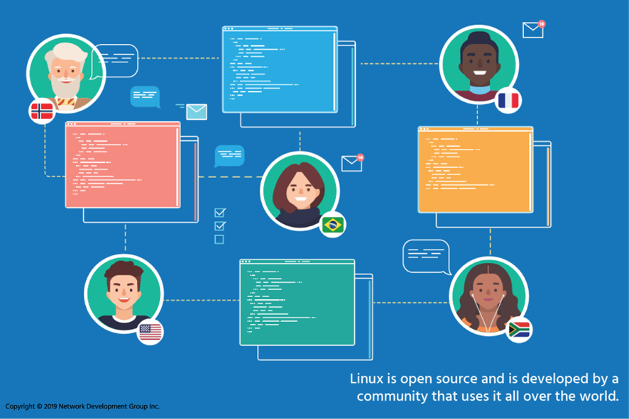

# 4. Código abierto, Software y Licenciamiento
## 4.1 Introducción

Los proyectos de software toman la forma de _código fuente_, que es un conjunto de instrucciones informáticas legibles por humanos. Dado que el código fuente no es entendido directamente por la computadora, debe ser compilado en instrucciones de máquina por un compilador. El compilador es un programa especial que reúne todos los archivos de código fuente y genera instrucciones que se pueden ejecutar en la computadora, como por ejemplo mediante el kernel de Linux.

Históricamente, el software comercial se ha vendido bajo una _licencia de código cerrado_, lo que significa que los usuarios tienen derecho a usar el código máquina, también conocido como binario o ejecutable, pero no pueden ver el código fuente. A menudo, la licencia establece explícitamente que los usuarios no pueden intentar aplicar ingeniería inversa al código máquina para averiguar qué hace.

```
El código fuente compilado en programas binarios es un método para crear programas y ejecutar instrucciones informáticas. Otro son los muchos tipos de lenguajes interpretados, como PERL, Python e incluso BASH scripting, donde el código no se compila, sino que se alimenta a un programa de interpretación, generalmente un ejecutable binario que entiende e implementa las instrucciones contenidas en el código fuente o scripts.
```

El desarrollo de Linux es muy similar al auge del _software de código abierto_. Al principio existió el shareware, programas disponibles gratuitamente en los que los usuarios no necesariamente tenían acceso al código fuente. Había muchas cosas buenas en esto, pero también era problemático porque los programas maliciosos podían disfrazarse de juegos, protectores de pantalla y utilidades de apariencia inocente.

El código abierto adopta una visión del software centrada en la fuente. La filosofía de código abierto es que los usuarios tienen derecho a obtener el código fuente del software y a ampliar y modificar los programas para su propio uso. Esto también significaba que el código podía ser inspeccionado en busca de puertas traseras, virus y spyware. Al crear una comunidad de desarrolladores y usuarios, la responsabilidad por errores, vulnerabilidades de seguridad y problemas de compatibilidad se convirtió en una responsabilidad compartida. Esta nueva comunidad global de entusiastas de la informática se vio potenciada por la creciente disponibilidad de servicios de Internet más rápidos y la World Wide Web.

Hay muchas variantes diferentes de código abierto, pero todas están de acuerdo en que los usuarios deben tener acceso al código fuente. En lo que difieren es en cómo se puede, o se debe, redistribuir los cambios.

Linux ha adoptado esta filosofía con gran éxito. Dado que Linux estaba escrito en el lenguaje de programación C, y reflejaba el diseño y la funcionalidad de los sistemas UNIX ya establecidos, naturalmente se convirtió en un foro donde las personas podían desarrollar y compartir nuevas ideas. Liberados de las limitaciones de las plataformas propietarias de hardware y software, un gran número de programadores muy hábiles han sido capaces de contribuir a las diversas distribuciones, creando un software que a menudo es más robusto, estable, adaptable y, francamente, mejor que las ofertas propietarias de código cerrado que dominaron las décadas anteriores.

Las grandes organizaciones desconfiaban comprensiblemente del uso de software construido de esta nueva manera, pero con el tiempo se dieron cuenta de que sus mejores programadores estaban trabajando en proyectos de código abierto basados en Linux en su tiempo libre. Pronto, los servidores Linux y los programas de código abierto comenzaron a superar a los costosos sistemas propietarios que ya existían. Cuando llegó el momento de actualizar el hardware obsoleto, los mismos programadores, ingenieros y administradores de sistemas que habían comenzado a trabajar en Linux como pasatiempo pudieron convencer a sus jefes de que le dieran una oportunidad a Linux. El resto es, como se suele decir, historia.

Antes del desarrollo de Linux, muchas aplicaciones corporativas y científicas se ejecutaban en sistemas UNIX propietarios. A las empresas, universidades y gobiernos que administran grandes granjas de servidores les gustó la estabilidad y la relativa facilidad de desarrollo de aplicaciones que ofrecían estas plataformas.

**UNIX** se creó inicialmente en 1969. En su cuarta edición, en 1973, había sido reescrito en el lenguaje de programación C que sigue siendo prominente hoy en día. En 1984, la Universidad de California en Berkeley lanzó 4.2BSD que introdujo TCP/IP, la especificación de red que sustenta Internet. A principios de la década de 1990, cuando comenzó el desarrollo de Linux, diferentes empresas que desarrollaban sistemas operativos UNIX se dieron cuenta de que sus sistemas debían ser compatibles y comenzaron a trabajar en la especificación X/Open que todavía se utiliza hoy en día.

A lo largo de los años, los informáticos y las organizaciones que los emplean se han dado cuenta de los beneficios de los sistemas que proporcionan herramientas familiares y formas consistentes de realizar tareas específicas. La estandarización de las interfaces de programación de aplicaciones (API) permite que los programas escritos para un sistema operativo UNIX o Linux específico se porten (conviertan) con relativa facilidad para ejecutarse en otro. Por lo tanto, mientras que los sistemas UNIX propietarios todavía están en uso en todo el mundo en entornos donde se prefieren las soluciones "certificadas", la interoperabilidad de estos sistemas junto con las computadoras Linux es valorada por la industria, la academia y los gobiernos que los utilizan.

No se puede exagerar la importancia de las organizaciones de normalización. Grupos como el **IEEE (Instituto de Ingenieros Eléctricos y Electrónicos)** y **POSIX (Portable Operating System Interface),** permiten a profesionales de diferentes empresas e instituciones colaborar en especificaciones que hacen posible el trabajo conjunto de diferentes sistemas operativos y programas. No importa si un programa es de código cerrado o abierto, simple o complejo, si está escrito según estos estándares, otros podrán usarlo y modificarlo en el futuro. Cada innovación en computación se basa en el trabajo de otros que vinieron antes. El software de código abierto es una colaboración de diferentes personas con diferentes necesidades y antecedentes, todas trabajando juntas para hacer algo mejor de lo que cualquiera de ellas podría haber hecho individualmente. Los estándares son lo que hace que esto sea posible, y las muchas organizaciones que los crean, mantienen y promueven son parte integral de la industria.


## 4.2 Licencias de código abierto

Cuando se habla de comprar software, hay tres componentes distintos:

- **Propiedad**: ¿quién es el propietario de la propiedad intelectual detrás del software?
- **Transferencia de dinero**: ¿cómo cambia de manos el dinero, si es que lo hace?
- **Licencias**: ¿qué obtienes? ¿Qué se puede hacer con el software? ¿Se puede usar en una sola computadora? ¿Se lo puedes dar a otra persona?

En la mayoría de los casos, la propiedad del software sigue siendo de la persona o empresa que lo creó. A los usuarios solo se les concede una licencia para utilizar el software; Esta es una cuestión de la ley de derechos de autor. La transferencia de dinero depende del modelo de negocio del creador. Es la licencia lo que diferencia el software de código abierto del software de código cerrado.

Dos ejemplos contrastantes servirán para empezar.

Con Microsoft Windows, Microsoft Corporation es propietaria de la propiedad intelectual. La licencia en sí, el Acuerdo de licencia de **usuario final (EULA),** es un documento legal personalizado en el que debe hacer clic, indicando su aceptación, para instalar el software. Microsoft conserva el código fuente y distribuye solo copias binarias a través de canales autorizados. Para la mayoría de los productos de consumo, se le permite instalar el software en una computadora y no se le permite hacer copias del disco que no sea para una copia de seguridad. No está permitido realizar ingeniería inversa del software. Pagas por una copia del software, que te proporciona actualizaciones menores, pero no mejoras importantes.

Linux es propiedad de Linus Torvalds. Ha colocado el código bajo una licencia llamada **GNU General Public License versión 2 (GPLv2).** Esta licencia, entre otras cosas, dice que el código fuente debe estar disponible para cualquiera que lo solicite y que cualquiera puede hacer cambios. Una advertencia a esto es que si alguien realiza cambios y los distribuye, debe poner los cambios bajo la misma licencia para que otros puedan beneficiarse. La GPLv2 también dice que a nadie se le permite cobrar por distribuir el código fuente aparte de los costos reales de hacerlo (como copiarlo a medios extraíbles).

En general, cuando alguien crea algo, también tiene el derecho de decidir cómo se usa y distribuye. **El software libre y de código abierto (FOSS)** se refiere al software en el que se ha renunciado a este derecho; cualquiera puede ver el código fuente y redistribuirlo. Linus Torvalds lo ha hecho con Linux, a pesar de que creó Linux, no puede prohibir a alguien que lo use en su ordenador porque ha renunciado a ello a través de la licencia GPLv2.

La concesión de licencias de software es una cuestión política, por lo que no debería sorprender que haya muchas opiniones diferentes. Las organizaciones han creado su propia licencia que encarna sus puntos de vista particulares, por lo que es más fácil elegir una licencia existente que crear la suya propia. Por ejemplo, universidades como el Instituto Tecnológico de Massachusetts (MIT) y la Universidad de California han creado licencias, al igual que proyectos como la Fundación Apache. Además, grupos como la Free Software Foundation han creado sus propias licencias para promover su agenda.
### 4.2.1 La Fundación para el Software Libre

Dos grupos pueden ser considerados las fuerzas más influyentes en el mundo del código abierto: la Free Software Foundation y la Open Source Initiative.

Solo unos años después del desarrollo del proyecto GNU, Richard Stallman fundó la **Free Software Foundation (FSF)** en 1985 con el objetivo de promover el _software libre_. En este contexto, la palabra "gratis" no se refiere al precio, sino a la libertad de compartir, estudiar y modificar el código fuente subyacente. Según su sitio web, la FSF cree que los usuarios deberían tener "control sobre la tecnología que usamos en nuestros hogares, escuelas y negocios".

La FSF también aboga por que las licencias de software impongan la apertura de las modificaciones. En su opinión, si alguien modifica el software libre, se le debería exigir que comparta los cambios que haya realizado cuando lo vuelva a compartir. Esta filosofía específica se llama _copyleft_. Según la FSF, "el copyleft es un método general para hacer que un programa (u otro trabajo) sea libre (en el sentido de libertad, no de "precio cero"), y requiere que todas las versiones modificadas y extendidas del programa también sean libres.

La FSF también aboga contra las patentes de software y actúa como un perro guardián para las organizaciones de estándares, hablando cuando un estándar propuesto podría violar los principios del software libre al incluir elementos como la Gestión de Derechos Digitales (DRM) que restringen lo que se puede hacer con programas compatibles.

La FSF ha desarrollado su propio conjunto de licencias que son libres para que cualquiera pueda usarlas, basadas en la **Licencia Pública General (GPL) original de GNU**. La FSF mantiene actualmente la Licencia Pública General GNU versión 2 (GPLv2) y versión 3 (GPLv3), así como las Licencias Públicas Generales Reducidas GNU versión 2 (LGPLv2) y versión 3 (LGPLv3). Estas licencias están destinadas a incluirse en el código fuente real para garantizar que todas las variantes y modificaciones futuras del programa original continúen teniendo la misma libertad de uso que el original. La licencia GPL y sus variantes son poderosas herramientas legales para promover la causa del software libre en todo el mundo. Lo que comenzó en 1983 como el deseo de un hombre de compartir y mejorar el software dejando que otros lo cambiaran, ha terminado cambiando el mundo.

```
Los cambios entre la GPLv2 y la GPLv3 se centraron en gran medida en el uso de software libre en un dispositivo de hardware cerrado, que ha sido acuñado como _Tivoización_. TiVo es una empresa que construye una grabadora de vídeo digital para televisión en su propio hardware y utiliza Linux como base para su software. Si bien TiVo liberó el código fuente de su versión de Linux según lo requerido por la GPLv2, el hardware no ejecutaría ningún binario modificado. A los ojos de la FSF, esto iba en contra del espíritu de la GPLv2, por lo que añadieron una cláusula específica a la versión 3 de la licencia. Linus Torvalds está de acuerdo con TiVo en este asunto y ha optado por quedarse con la GPLv2.
```
### 4.2.2 La Iniciativa de Código Abierto

La **Open Source Initiative (OSI)** fue fundada en 1998 por Bruce Perens y Eric Raymond. Creían que la Free Software Foundation estaba demasiado cargada políticamente y que se necesitaban licencias menos extremas, particularmente en torno a los aspectos copyleft de las licencias de la FSF. OSI cree que no solo la fuente debe estar disponible libremente, sino que también no se deben imponer restricciones en el uso del software, sin importar el uso previsto. A diferencia de la FSF, la OSI no tiene su propio conjunto de licencias. En cambio, la OSI tiene un conjunto de principios y agrega licencias a esa lista si cumplen con esos principios, llamadas licencias de código abierto. El software que se ajusta a una licencia de código abierto es, por lo tanto, _software de código abierto_.

Un tipo de licencia de código abierto es la **BSD (Berkeley Software Distribution)** y sus derivados, que son mucho más simples que la GPL. Actualmente hay dos licencias "BSD" reales aprobadas por OSI, una de 2 cláusulas y otra de 3 cláusulas. Estas licencias establecen que puedes redistribuir el código fuente y los binarios siempre que mantengas avisos de derechos de autor y no impliquen que el creador original respalde tu versión. En otras palabras, "haz lo que quieras con este software, simplemente no digas que lo escribiste". De acuerdo con la FSF, la licencia BSD original tenía un grave defecto en el sentido de que requería que los desarrolladores añadieran una cláusula que reconociera a la Universidad de California, Berkeley, en cada anuncio de software licenciado de esta manera. A medida que otros copiaron esta simple licencia, incluyeron reconocimientos para sus propias instituciones, lo que llevó a más de 75 reconocimientos de este tipo en algunos casos.

Las licencias FSF, como la GPLv2, también son licencias de código abierto. Sin embargo, muchas licencias de código abierto como BSD y MIT no contienen las disposiciones de copyleft y, por lo tanto, no son aceptables para la FSF. Estas licencias se denominan  licencias de software libre permisivas porque son permisivas en la forma en que se puede redistribuir el software. Puede tomar software con licencia BSD e incluirlo en un producto de software cerrado siempre que proporcione la atribución adecuada.

En lugar de detenerse en los puntos más finos del Código Abierto y el Software Libre, la comunidad ha comenzado a referirse a ellos colectivamente como **Software Libre y de Código Abierto (FOSS).** La palabra en español "free" puede significar "free as in lunch" (como en sin costo) o "free as in speech" (como en sin restricciones). Esta ambigüedad llevó a la inclusión de la palabra "libre" para referirse a esta última definición. Por lo tanto, terminamos con **Software Libre / Libre / de Código Abierto (FLOSS).**
### 4.2.3 Licencia Creative Commons

Las licencias de software libre están relacionadas principalmente con el software. La gente ha colocado obras como dibujos y planos bajo licencias de software libre, pero esta no era la intención.

Cuando el software se ha puesto en el dominio público, el autor ha renunciado a todos los derechos, incluidos los derechos de autor sobre la obra. En algunos países, este es el valor predeterminado cuando el trabajo lo realiza una agencia gubernamental. En algunos países, las obras protegidas por derechos de autor pasan a ser de dominio público después de que el autor ha fallecido y ha transcurrido un largo período de espera.

La  organización **Creative Commons (CC)** ha creado las Licencias Creative Commons que intentan abordar las intenciones detrás de las licencias FOSS para entidades no relacionadas con el software. Las licencias CC también se pueden utilizar para restringir el uso comercial si ese es el deseo del titular de los derechos de autor. Las licencias CC se componen del siguiente conjunto de condiciones que el creador puede aplicar a su obra:

- **Atribución (BY):** todas las licencias CC requieren que se le dé crédito al creador, sin que ello implique que el creador respalde el uso.
- **ShareAlike (SA)** - Esto permite a otros copiar, distribuir, ejecutar y modificar el trabajo, siempre que lo hagan bajo los mismos términos.
- **No comercial (NC):** permite a otros distribuir, mostrar, realizar y modificar el trabajo para cualquier propósito que no sea comercial.
- **NoDerivatives (ND)** - Esto permite que otros distribuyan, muestren y realicen solo copias originales de la obra. Deben obtener el permiso del creador para modificarlo.

Estas condiciones se combinan para crear las seis licencias principales que ofrece Creative Commons:

- **Atribución (CC BY)** – Al igual que la licencia BSD, puede utilizar el contenido de CC BY para cualquier uso, pero debe acreditar al titular de los derechos de autor.
- **Attribution ShareAlike (CC BY-SA)** – Una versión copyleft de la licencia Attribution. Las obras derivadas deben ser compartidas bajo la misma licencia, al igual que en los ideales del Software Libre.
- **Atribución NoDerivs (CC BY-ND):** puede redistribuir el contenido en las mismas condiciones que CC-BY, pero no puede cambiarlo.
- **Atribución-No comercial (CC BY-NC)** – Al igual que CC BY, pero no puede usarlo con fines comerciales.
- **Attribution-NonCommercial-ShareAlike (CC BY-NC-SA):** se basa en la licencia CC BY-NC, pero requiere que los cambios se compartan bajo la misma licencia.
- **Atribución-NoComercial-SinDerivados (CC BY-NC-ND):** está compartiendo el contenido que se utilizará con fines no comerciales, pero las personas no pueden cambiar el contenido.
- **Sin derechos reservados (CC0)** – Esta es la versión Creative Commons de dominio público.
## 4.3 Modelos de negocio de código abierto

Si todo este software es gratuito, ¿cómo puede alguien ganar dinero con él?

En primer lugar, debes entender que no hay nada en la GPL que prohíba vender software. De hecho, el derecho a vender software es parte de la licencia GPL. Una vez más, recuerde que la palabra _gratis_ se refiere a la libertad, no al precio. Se anima a las empresas que añaden valor a estos programas gratuitos a ganar todo el dinero que puedan y a invertir esos beneficios en el desarrollo de más y mejor software.

Una de las formas más sencillas de ganar dinero es vender soporte o garantía en torno al software. Empresas como Canonical, el desarrollador de Ubuntu, y Redhat se han convertido en grandes empresas mediante la creación de distribuciones y herramientas de Linux que permiten a los usuarios comerciales administrar sus empresas y ofrecer productos y servicios a sus clientes.

Muchos otros proyectos de código abierto también se han expandido a negocios importantes. En la década de 1990, Gerald Combs trabajaba en un proveedor de servicios de Internet y comenzó a escribir su propia herramienta de análisis de redes porque herramientas similares en ese momento eran costosas. Más de 600 personas han contribuido al proyecto, llamado Wireshark. Ahora a menudo se considera mejor que las ofertas comerciales y llevó a la formación de una empresa para vender productos y soporte. Al igual que muchas otras, esta empresa fue comprada por una empresa más grande que apoya su desarrollo continuo.

Empresas como Tivo han empaquetado hardware o añaden software de código cerrado adicional para venderlo junto con el software libre. Los electrodomésticos y sistemas integrados que utilizan Linux son un negocio multimillonario y abarcan todo, desde DVR domésticos hasta cámaras de seguridad y dispositivos de fitness portátiles. Muchos firewalls de consumo y dispositivos de entretenimiento siguen este modelo.

Hoy en día, tanto los grandes como los pequeños empleadores tienen individuos y, a veces, grupos enteros dedicados a trabajar en proyectos de código abierto. Las empresas de tecnología compiten por la oportunidad de influir en proyectos que darán forma al futuro de sus industrias. Otras empresas dedican recursos a los proyectos que necesitan para uso interno. A medida que se hacen más negocios con los recursos en la nube, la oportunidad para los programadores de código abierto continúa expandiéndose.

