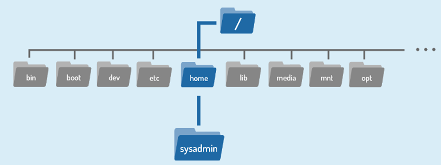

# 5. Linea de Comandos
## 5.1 Introducción

La mayoría de los sistemas operativos de consumo están diseñados para proteger al usuario de los entresijos de la CLI. La comunidad de Linux es diferente en el sentido de que celebra positivamente a la CLI por su potencia, velocidad y capacidad para realizar una amplia gama de tareas con una sola instrucción de línea de comandos.

Cuando un usuario se encuentra por primera vez con la CLI, puede resultarle difícil porque requiere memorizar una cantidad vertiginosa de comandos y sus opciones. Sin embargo, una vez que un usuario ha aprendido la estructura de cómo se usan los comandos, dónde se encuentran los archivos y directorios necesarios y cómo navegar por la jerarquía de un sistema de archivos, pueden ser inmensamente productivos. Esta capacidad proporciona un control más preciso, mayor velocidad y la capacidad de automatizar tareas más fácilmente a través de secuencias de comandos.

Además, al aprender la CLI, un usuario puede ser productivo fácilmente casi instantáneamente en CUALQUIER sabor o distribución de Linux, lo que reduce la cantidad de tiempo necesario para familiarizarse con un sistema debido a las variaciones en una GUI.


## 5.2 Shell

Una vez que un usuario ha ingresado un comando, el terminal acepta lo que el usuario ha escrito y lo pasa a un _shell_. El shell es el intérprete de línea de comandos que traduce los comandos ingresados por un usuario en acciones que debe realizar el sistema operativo. Si la salida es producida por el comando, el texto se muestra en el terminal. Si se encuentran problemas con el comando, se muestra un mensaje de error.

El entorno Linux permite el uso de muchos shells diferentes, algunos de los cuales han existido durante muchos años. El shell más utilizado para las distribuciones de Linux se llama  **shell Bash**. Bash proporciona muchas funciones avanzadas, como el historial de comandos y la edición en línea, que permite al usuario volver a ejecutar fácilmente comandos ejecutados anteriormente o una variación de ellos mediante una edición simple.

El shell Bash también tiene otras características populares, algunas de las cuales se enumeran a continuación:

- **Scripting:** La capacidad de colocar comandos en un archivo y luego interpretar (usar Bash para ejecutar el contenido de) el archivo, lo que resulta en que se ejecuten todos los comandos. Esta característica también tiene algunas características de programación, como declaraciones condicionales y la capacidad de crear funciones (también conocidas como subrutinas).
- **Alias:** La capacidad de crear apodos cortos para comandos más largos.
- **Variables:** Se utilizan para almacenar información para el shell de Bash y para el usuario. Estas variables se pueden utilizar para modificar el funcionamiento de los comandos y las funciones, así como para proporcionar información vital del sistema.

Bash tiene una extensa lista de características; Esto es solo una muestra de sus capacidades.

Cuando se ejecuta una aplicación de terminal y aparece un shell, que muestra una parte importante de la interfaz: el _símbolo del sistema_. El símbolo del sistema no solo está ahí para indicar que se pueden ejecutar comandos, sino que también transmite información útil al usuario. El mensaje es totalmente configurable y puede ser tan escaso o tan completo como sea práctico y útil.

La estructura de la solicitud puede variar de una distribución a otra, pero normalmente contiene información sobre el usuario y el sistema. A continuación, se muestra una estructura de solicitud común:

```
sysadmin@localhost:~$
```

El mensaje que se muestra contiene la siguiente información:
- **Nombre de usuario:**
		`sysadmin`@localhost:~$
- **Nombre del sistema:**
		sysadmin@`localhost`:~$
- **Directorio actual:**
		sysadmin@localhost:`~`$

El símbolo ~ se utiliza como abreviatura para el directorio de inicio del usuario. Normalmente, el directorio principal del usuario se encuentra en el directorio /home y recibe el nombre de la cuenta de usuario; Por ejemplo, /home/sysadmin.
## 5.3 Comandos

¿Qué es un comando? La respuesta más simple es que un _comando_ es un programa de software que, cuando se ejecuta en la CLI, realiza una acción en la computadora.

Para ejecutar un comando, el primer paso es escribir el nombre del comando. Haga clic en el terminal de la derecha. Escriba ls y presione **Enter**. El resultado debería parecerse al siguiente ejemplo:

```
sysadmin@localhost:~$ ls
Desktop  Documents  Downloads  Music  Pictures  Public  Templates  Videos
```

```
Por sí solo, el comando ls enumera los archivos y directorios contenidos en el directorio de trabajo actual. En este punto, no debes preocuparte demasiado por la salida del comando, sino que debes centrarte en comprender cómo formatear y ejecutar los comandos.
El comando ls se tratará con todo detalle más adelante en el curso.
```

Muchos comandos se pueden usar por sí mismos sin ninguna otra entrada. Algunos comandos requieren una entrada adicional para ejecutarse correctamente. Esta entrada adicional se presenta en dos formas: _opciones_ y _argumentos_.

El formato típico de un comando es el siguiente:

```
command [options] [arguments]
```

Las opciones se utilizan para modificar el comportamiento principal de un comando, mientras que los argumentos se utilizan para proporcionar información adicional (como un nombre de archivo o un nombre de usuario). Cada opción y argumento normalmente está separado por un espacio, aunque las opciones a menudo se pueden combinar.

```
Tenga en cuenta que Linux distingue entre mayúsculas y minúsculas. Los comandos, opciones, argumentos, variables y nombres de archivo deben introducirse exactamente como se muestran.
```

### 5.3.1 Argumentos

```
command [options] [arguments]
```

Un argumento se puede usar para especificar algo sobre lo que el comando debe actuar. Si al comando ls se le da el nombre de un directorio como argumento, enumera el contenido de ese directorio. En el siguiente ejemplo, se utiliza el directorio /etc/ppp como argumento; La salida resultante es una lista de archivos contenidos en ese directorio:

```
sysadmin@localhost:~$ ls /etc/ppp                                 
ip-down.d  ip-up.d        
```

El comando ls también acepta varios argumentos. Para enumerar el contenido de los directorios /etc/ppp y /etc/ssh, páselos como argumentos:

```
sysadmin@localhost:~$ ls /etc/ppp /etc/ssh         
/etc/ppp:                       
ip-down.d  ip-up.d                                  
/etc/ssh:                                                         
moduli               ssh_host_dsa_key.pub     ssh_host_rsa_key      sshd_configssh_config
ssh_host_ecdsa_key   ssh_host_rsa_key.pub         
ssh_host_dsa_key     ssh_host_ecdsa_key.pub   ssh_import_id  
```

### 5.3.2 Opciones

```
command [options] [arguments]
```

Las opciones se pueden usar con comandos para expandir o modificar la forma en que se comporta un comando. Por ejemplo, el uso de la opción -l del comando ls da como resultado una _lista larga_, que proporciona información adicional sobre los archivos que se enumeran, como los permisos, el tamaño del archivo y otra información:

```
sysadmin@localhost:~$ ls -l                                       
total 0
drwxr-xr-x 1 sysadmin sysadmin 0 Jan 29  20:13 Desktop             
drwxr-xr-x 1 sysadmin sysadmin 0 Jan 29  20:13 Documents           
drwxr-xr-x 1 sysadmin sysadmin 0 Jan 29  20:13 Downloads           
drwxr-xr-x 1 sysadmin sysadmin 0 Jan 29  20:13 Music               
drwxr-xr-x 1 sysadmin sysadmin 0 Jan 29  20:13 Pictures            
drwxr-xr-x 1 sysadmin sysadmin 0 Jan 29  20:13 Public               
drwxr-xr-x 1 sysadmin sysadmin 0 Jan 29  20:13 Templates           
drwxr-xr-x 1 sysadmin sysadmin 0 Jan 29  20:13 Videos  
```

```
Tenga en cuenta que, en el comando anterior, -l es una letra "L" minúscula. Una manera fácil de recordar esto es -l es un mnemotécnico (código de programación fácil de memorizar) para **_listas largas_**).
```

A menudo, el carácter se elige para que sea mnemotécnico para su propósito, como elegir la letra _l_ para _largo_ o _r_ para _invertido_. De forma predeterminada, el comando ls imprime los resultados en orden alfabético y, por lo tanto, al agregar la opción -r, imprime los resultados en orden alfabético inverso.

```
sysadmin@localhost:~$ ls -r
Videos  Templates  Public  Pictures  Music  Downloads  Documents  Desktop
```

En la mayoría de los casos, las opciones se pueden utilizar junto con otras opciones. Se pueden dar como opciones separadas, como en -l -r, o combinadas, como en -lr. La combinación de estas dos opciones daría como resultado una salida de lista larga en orden alfabético inverso:

```
sysadmin@localhost:~$ ls -lr                                                    
total 32                                                                        
drwxr-xr-x 2 sysadmin sysadmin 4096 Oct 31 20:13 Videos                         
drwxr-xr-x 2 sysadmin sysadmin 4096 Oct 31 20:13 Templates                      
drwxr-xr-x 2 sysadmin sysadmin 4096 Oct 31 20:13 Public                         
drwxr-xr-x 2 sysadmin sysadmin 4096 Oct 31 20:13 Pictures                       
drwxr-xr-x 2 sysadmin sysadmin 4096 Oct 31 20:13 Music                          
drwxr-xr-x 2 sysadmin sysadmin 4096 Oct 31 20:13 Downloads                      
drwxr-xr-x 4 sysadmin sysadmin 4096 Oct 31 20:13 Documents                      
drwxr-xr-x 2 sysadmin sysadmin 4096 Oct 31 20:13 Desktop
```

El orden de las opciones combinadas no es importante. El resultado de todos estos ejemplos sería el mismo:

```
ls -l -r
ls -rl
ls -lr
```

De forma predeterminada, la opción -l del comando ls muestra los tamaños de los archivos en bytes:

```
sysadmin@localhost:~$ ls -l /usr/bin/perl                         
-rwxr-xr-x 2 root root 10376 Feb  4  2018 /usr/bin/perl      
```

Si se agrega la opción -h, los tamaños de archivo se mostrarán en  formato _legible por humanos_:

```
sysadmin@localhost:~$ ls -lh /usr/bin/perl                        
-rwxr-xr-x 2 root root 11K Feb  4  2018 /usr/bin/perl
```

Las opciones suelen ser letras individuales; Sin embargo, a veces también son palabras o frases. Normalmente, los comandos más antiguos utilizan letras simples, mientras que los comandos más nuevos utilizan palabras completas para las opciones. Las opciones de una sola letra van precedidas de un solo guion, como la opción -h. Las opciones de palabra completa van precedidas de dos caracteres de guion. La opción -h también tiene una forma de palabra completa equivalente; la opción --human-readable.

```
sysadmin@localhost:~$ ls -l --human-readable /usr/bin/perl                        
-rwxr-xr-x 2 root root 11K Feb  4  2018 /usr/bin/perlsysadmin@localhost:~$ ls -l --human-readable /usr/bin/perl                        
-rwxr-xr-x 2 root root 11K Feb  4  2018 /usr/bin/perl
```
### 5.3.3 Historia

Cuando se ejecuta un comando en el terminal, se almacena en una lista de historial. Esto está diseñado para facilitar la ejecución del mismo comando, eliminando posteriormente la necesidad de volver a escribir todo el comando.

Al pulsar la tecla **Flecha hacia arriba ↑** se muestra el comando anterior en la línea de solicitud. El historial completo de los comandos ejecutados en la sesión actual se puede mostrar presionando **Arriba** repetidamente para retroceder en el historial de comandos que se han ejecutado. Al pulsar la tecla Intro, se vuelve a ejecutar el comando mostrado.

Cuando se encuentra el comando deseado, las  teclas **← de flecha izquierda** y  **flecha derecha →** pueden posicionar el cursor para editar. Otras teclas útiles para editar incluyen las  **teclas** Inicio**,** Fin**,** Retroceso **y** Eliminar.

Para ver la lista de historial de un terminal, utilice el comando history:

```
sysadmin@localhost:~$ date                                       
Wed Dec 12 04:28:12 UTC 2018                                   
sysadmin@localhost:~$ ls                                           
Desktop  Documents  Downloads  Music  Pictures  Public  Templates  Videos       
sysadmin@localhost:~$ cal 5 2030                                  
     May 2030                                                                  
Su Mo Tu We Th Fr Sa                                                            
          1  2  3  4                                                            
 5  6  7  8  9 10 11                                                            
12 13 14 15 16 17 18                                                            
19 20 21 22 23 24 25                                                            
26 27 28 29 30 31                                                               
sysadmin@localhost:~$ history                                   
    1  date                                                       
    2  ls                                                      
    3  cal 5 2030                                             
    4  history   
```

Si el comando deseado está en la lista que genera el comando history, se puede ejecutar escribiendo un signo de exclamación. y, a continuación, el número junto al comando, por ejemplo, para volver a ejecutar el comando cal:

```
sysadmin@localhost:~$ history                                     
    1  date                                                      
    2  ls                                                         
    3  cal 5 2030                                                 
    4  history                                                    
sysadmin@localhost:~$ !3                                        
cal 5 2030                                                        
     May 2030                                                                  
Su Mo Tu We Th Fr Sa                                                            
          1  2  3  4                                                            
 5  6  7  8  9 10 11                                                            
12 13 14 15 16 17 18                                                            
19 20 21 22 23 24 25     
```

Si al comando history se le pasa un número como argumento, genera ese número de comandos anteriores de la lista de historial. Por ejemplo, para mostrar los tres últimos comandos:

```
sysadmin@localhost:~$ history 3
    6  date                                                                     
    7  ls /home                                                                   
    8  history 3
```

 Para ejecutar el _enésimo_ comando desde la parte inferior de la lista del historial, escriba !-_n_ y presione Enter. Por ejemplo, para ejecutar el tercer comando desde la parte inferior de la lista del historial, ejecute lo siguiente:
 
```
sysadmin@localhost:~$ !-3                                                       
date                                                                            
Wed Dec 12 04:31:55 UTC 2018 
```

Para ejecutar el comando más reciente, escriba !! y presione **Enter**:

```
sysadmin@localhost:~$ date                                                      
Wed Dec 12 04:32:36 UTC 2018                                                    
sysadmin@localhost:~$ !!                                                        
date
Wed Dec 12 04:32:38 UTC 2018
```

Para ejecutar la iteración más reciente de un comando específico, escriba ! seguido del nombre del comando y presione **Enter**. Por ejemplo, para ejecutar el comando ls más reciente:

```
sysadmin@localhost:~$ !ls                                                       
ls /home                                                                        
sysadmin 
```
## 5.4 Variables

Una variable es una característica que permite al usuario o al shell almacenar datos. Estos datos se pueden utilizar para proporcionar información crítica del sistema o para cambiar el comportamiento de cómo funciona el shell de Bash (u otros comandos). A las variables se les asignan nombres y se almacenan temporalmente en la memoria. Hay dos tipos de variables utilizadas en el shell de Bash: _local_ y _environment_.
### 5.4.1 Variables locales

_Las variables locales_ o _de shell_ solo existen en el shell actual y no pueden afectar a otros comandos o aplicaciones. Cuando el usuario cierra una ventana de terminal o shell, todas las variables se pierden. A menudo se asocian con tareas basadas en el usuario y se escriben en minúsculas por convención.

Para establecer el valor de una variable, utilice la siguiente expresión de asignación. Si la variable ya existe, se modifica el valor de la variable. Si el nombre de la variable aún no existe, el shell crea una nueva variable local y establece el valor:

```
variable=value
```

En el ejemplo siguiente se crea una variable local denominada variable1 y se le asigna un valor de Something:

```
sysadmin@localhost:~$ variable1='Something'
```

El comando echo se utiliza para mostrar la salida en el terminal. Para mostrar el valor de la variable, utilice un carácter $ con signo de dólar seguido del nombre de la variable como argumento para el comando echo:El comando echo se utiliza para mostrar la salida en el terminal. Para mostrar el valor de la variable, utilice un carácter $ con signo de dólar seguido del nombre de la variable como argumento para el comando echo:

```
sysadmin@localhost:~$ echo $variable1                                   
Something
```

### 5.4.2 Variables de entorno

_Las variables de entorno_, también llamadas _variables globales_, están disponibles en todo el sistema, en todos los shells utilizados por Bash al interpretar comandos y realizar tareas. El sistema recrea automáticamente las variables de entorno cuando se abre un nuevo shell. Algunos ejemplos son las variables PATH, HOME e HISTSIZE. La variable HISTSIZE define el número de comandos anteriores que se van a almacenar en la lista del historial. El comando del ejemplo siguiente muestra el valor de la variable HISTSIZE:

```
sysadmin@localhost:~$ echo $HISTSIZE
1000
```

Para modificar el valor de una variable existente, utilice la expresión de asignación:

```
sysadmin@localhost:~$ HISTSIZE=500                                            
sysadmin@localhost:~$ echo $HISTSIZE                              
500  
```

```
Hay muchas variables disponibles para el shell de Bash, así como variables que afectan a diferentes comandos de Linux. Una discusión de todas las variables está más allá del alcance de este capítulo; sin embargo, se cubrirán más variables de shell a medida que avance este curso.
```

Cuando se ejecuta sin argumentos, el comando env genera una lista de las variables de entorno. Dado que la salida del comando env puede ser bastante larga, en los ejemplos siguientes se usa una búsqueda de texto para filtrar esa salida.

En un ejemplo anterior, la variable1 se creó como una variable local, por lo que la siguiente búsqueda en las variables de entorno no da como resultado ninguna salida:

```
sysadmin@localhost:~$ env | grep variable1       
```

```
La pipa | Pasa la salida del comando env al comando grep, que busca la salida.

Esta técnica de filtrado de texto se tratará en detalle más adelante en el curso.
```

El comando export se utiliza para convertir una variable local en una variable de entorno.

```
export variable
```

Después de exportar variable1, ahora es una variable de entorno. Ahora se encuentra en la búsqueda a través de las variables de entorno:

```
sysadmin@localhost:~$ export variable1                                  
sysadmin@localhost:~$ env | grep variable1
variable1=Something
```

El comando export también se puede utilizar para convertir una variable en una variable de entorno en el momento de su creación utilizando la expresión de asignación como argumento:

```
sysadmin@localhost:~$ export variable2='Else'                           
sysadmin@localhost:~$ env | grep variable2                             
variable2=Else
```

Para cambiar el valor de una variable de entorno, utilice la expresión de asignación:

```
sysadmin@localhost:~$ variable1=$variable1' '$variable2                
sysadmin@localhost:~$ echo $variable1                                   
Something Else
```

Las variables exportadas se pueden eliminar mediante el comando unset:

```
sysadmin@localhost:~$ unset variable2sysadmin@localhost:~$ unset variable2
```
### 5.4.3 Variable de trayecto
Una de las variables de shell de Bash más importantes que hay que entender es la variable PATH. Contiene una lista que define en qué directorios busca el shell para encontrar comandos. Si se ingresa un comando válido y el shell devuelve un error de "comando no encontrado", es porque el shell Bash no pudo localizar un comando con ese nombre en ninguno de los directorios incluidos en la ruta. El siguiente comando muestra la ruta del shell actual:

```
sysadmin@localhost:~$ echo $PATH                                        
/home/sysadmin/bin:/usr/local/sbin:/usr/local/bin:/usr/sbin:/usr/bin:/sbin:/bin:/usr/games
sysadmin@localhost:~$
```

Cada directorio de la lista está separado por dos puntos : carácter. En función del resultado anterior, la ruta de acceso contiene los siguientes directorios. El shell comprobará los directorios en el orden en que aparecen en la lista:

```
/home/sysadmin/bin
/usr/local/sbin
/usr/local/bin
/usr/sbin
/usr/bin
/sbin
/bin
/usr/games
```

```
Cada uno de estos directorios está representado por una ruta de acceso. Una ruta es una lista de directorios separados por el carácter /. Si piensa en el sistema de archivos como un mapa, las rutas son las direcciones de directorio, que incluyen instrucciones de navegación paso a paso; Se pueden utilizar para indicar la ubicación de cualquier archivo dentro del sistema de archivos. Por ejemplo, /home/sysadmin es una ruta al directorio de inicio:
```

```
Los directorios y las rutas se tratarán en detalle más adelante en el curso.
```

Si el comando no se encuentra en ningún directorio enumerado en la variable PATH, entonces el shell devuelve un error:

```
sysadmin@localhost:~$ zed                                              
-bash: zed: command not found                                           
sysadmin@localhost:~$
```

Si se instala software personalizado en el sistema, puede ser necesario modificar el PATH para facilitar la ejecución de estos comandos. Por ejemplo, lo siguiente agregará y verificará el directorio /usr/bin/custom a la variable PATH:

```
sysadmin@localhost:~$ PATH=/usr/bin/custom:$PATH                        
sysadmin@localhost:~$ echo $PATH                                       
/usr/bin/custom:/home/sysadmin/bin:/usr/local/sbin:/usr/local/bin:/usr/sbin:/usr/bin:/sbin:/bin:/usr/games                                              sysadmin@localhost:~$ PATH=/usr/bin/custom:$PATH                        
sysadmin@localhost:~$ echo $PATH                                       
/usr/bin/custom:/home/sysadmin/bin:/usr/local/sbin:/usr/local/bin:/usr/sbin:/usr/bin:/sbin:/bin:/usr/games                                              
```

```
Al actualizar la variable PATH, incluya siempre la ruta actual, para no perder el acceso a los comandos ubicados en esos directorios. Esto se puede lograr anexando $PATH al valor de la expresión de asignación. Recuerde que un nombre de variable precedido por un signo de dólar representa el valor de la variable.
```
## 5.5 Tipos de comandos
Una forma de obtener más información sobre un comando es observar de dónde proviene. El comando type se puede utilizar para determinar información sobre el tipo de comando.

```
type command
```

Hay varias fuentes diferentes de comandos dentro del shell de su CLI, incluidos comandos internos, comandos externos, alias y funciones.
### 5.5.1 Comandos internos
También llamados comandos integrados, los comandos internos están integrados en el propio shell. Un buen ejemplo es el comando cd (change directory) ya que forma parte del shell de Bash. Cuando un usuario escribe el comando cd, el shell Bash ya se está ejecutando y sabe cómo interpretarlo, sin necesidad de iniciar programas adicionales.
El comando type identifica el comando cd como un comando interno:

```
sysadmin@localhost:~$ type cd                                     
cd is a shell builtin
```

### 5.5.2 Comandos externos
Los comandos externos son ejecutables binarios almacenados en directorios en los que el shell realiza búsquedas. Si un usuario escribe el comando ls, el shell busca en los directorios que se enumeran en la variable PATH para intentar encontrar un archivo llamado ls que pueda ejecutar.
Si un comando no se comporta como se esperaba o si un comando no es accesible como debería, puede ser beneficioso saber dónde está el shell encontrando el comando o qué versión está utilizando. Sería tedioso tener que buscar manualmente en cada directorio que aparece en la variable PATH. En su lugar, utilice el comando which para mostrar la ruta completa al comando en cuestión:

```
which command
```

El comando which busca la ubicación de un comando mediante la búsqueda de la variable PATH.

```
sysadmin@localhost:~$ which ls                                       
/bin/ls                                                               
sysadmin@localhost:~$ which cal                                        
/usr/bin/cal
```

Los comandos externos también se pueden ejecutar escribiendo la ruta completa al comando. Por ejemplo, para ejecutar el comando ls:

```
sysadmin@localhost:~$ /bin/ls                                                   
Desktop  Documents  Downloads  Music  Pictures  Public  Templates  Videos
```

En el caso de los comandos externos, el comando type muestra la ubicación del comando:

```
sysadmin@localhost:~$ type cal                                      
cal is /usr/bin/cal
```

En algunos casos, la salida del comando type puede diferir significativamente de la salida del comando which:

```
sysadmin@localhost:~$ type echo                                     
echo is a shell builtin
sysadmin@localhost:~$ which echo                                        
/bin/echo
```

El uso de la opción -a del comando type muestra todas las ubicaciones que contienen el comando denominado:

```
sysadmin@localhost:~$ type -a echo                                      
echo is a shell builtin                                                
echo is /bin/echo
```
### 5.5.3 Alias
Un alias se puede utilizar para asignar comandos más largos a secuencias de teclas más cortas. Cuando el shell ve que se está ejecutando un alias, sustituye la secuencia más larga antes de proceder a interpretar los comandos.

Por ejemplo, el comando ls -l suele tener un alias de l o ll. Dado que estos comandos más pequeños son más fáciles de escribir, se vuelve más rápido ejecutar la línea de comandos ls -l.
Para determinar qué alias se establecen en el shell actual, use el comando alias:

```
sysadmin@localhost:~$ alias                                             
alias egrep='egrep --color=auto'                                       
alias fgrep='fgrep --color=auto'                                        
alias grep='grep --color=auto'                                          
alias l='ls -CF'                                                       
alias la='ls -A'                                                       
alias ll='ls -alF'                                                     
alias ls='ls --color=auto'
```

Los alias de los ejemplos anteriores se crearon mediante archivos de inicialización. Estos archivos están diseñados para que el proceso de creación de alias sea automático.
Los nuevos alias se pueden crear utilizando el siguiente formato, donde name es el nombre que se le dará al alias y command es el comando que se ejecutará cuando se ejecute el alias.

```
alias name=command
```

Por ejemplo, el comando cal 2019 muestra el calendario para el año 2019. Supongamos que termina ejecutando este comando con frecuencia. En lugar de ejecutar el comando completo cada vez, puede crear un alias llamado mycal y ejecutar el alias, como se muestra en el siguiente gráfico:

```
sysadmin@localhost:~$ alias mycal="cal 2019"                                    
sysadmin@localhost:~$ mycal                                                     
                            2019                                                
      January               February               March                        
Su Mo Tu We Th Fr Sa  Su Mo Tu We Th Fr Sa  Su Mo Tu We Th Fr Sa                
       1  2  3  4  5                  1  2                  1  2                
 6  7  8  9 10 11 12   3  4  5  6  7  8  9   3  4  5  6  7  8  9                
13 14 15 16 17 18 19  10 11 12 13 14 15 16  10 11 12 13 14 15 16                
20 21 22 23 24 25 26  17 18 19 20 21 22 23  17 18 19 20 21 22 23                
27 28 29 30 31        24 25 26 27 28        24 25 26 27 28 29 30                
                                            31
```

Los alias creados de esta manera solo persisten mientras el shell está abierto. Una vez que se cierra el shell, se pierden los nuevos alias. Además, cada shell tiene sus propios alias, por lo que los alias creados en un shell no estarán disponibles en un nuevo shell que se abra.
El comando type puede identificar alias de otros comandos:

```
sysadmin@localhost:~$ type ll                                          
ll is aliased to `ls -alF'                                              
sysadmin@localhost:~$ type -a ls                                          
ls is aliased to `ls --color=auto'
ls is /bin/ls
```

La salida de estos comandos indica que ll es un alias para ls -alF, e incluso ls es un alias para ls --color=auto.
### 5.5.4 Funciones
Las funciones también se pueden compilar utilizando comandos existentes para crear nuevos comandos o para anular comandos integrados en el shell o comandos almacenados en archivos. Los alias y las funciones normalmente se cargan desde los archivos de inicialización cuando se inicia el shell por primera vez.

Las funciones son más avanzadas que los alias y, por lo general, se utilizan en scripts de shell de Bash. Normalmente, las funciones se utilizan para ejecutar varios comandos. Para crear una función, se utiliza la siguiente sintaxis:

```
function_name () 
{
   commands
}
```
 
En el formato anterior, function_name puede ser cualquier cosa que el administrador quiera llamar a la función. Los comandos que el administrador desea ejecutar pueden reemplazar el marcador de posición de comandos. Tenga en cuenta el formato, en particular, la ubicación del paréntesis () y las llaves {}, así como la convención de usar tabulaciones para que la función sea más legible.
Las funciones son útiles ya que permiten ejecutar un conjunto de comandos de uno en uno en lugar de escribir cada comando repetidamente. En el siguiente ejemplo, se crea una función llamada my_report para ejecutar los comandos ls, date y echo.

```
sysadmin@localhost:~$ my_report () {                                            
> ls Documents                                                                  
> date                                                                          
> echo "Document directory report"                                              
> }    
```

Al crear una función, aparecerá un carácter > como solicitud para ingresar los comandos de la función. Las llaves {} se usan para que el shell sepa cuándo comienza y termina una función para salir del > solicitud.
Una vez que se crea una función, el nombre de la función se puede invocar desde el símbolo del sistema BASH para ejecutar la función:

```
sysadmin@localhost:~$ my_report                                                 
School            alpha-third.txt  hidden.txt    numbers.txt  spelling.txt      
Work              alpha.txt        letters.txt   os.csv       words             
adjectives.txt    animals.txt      linux.txt     people.csv                     
alpha-first.txt   food.txt         longfile.txt  profile.txt                    
alpha-second.txt  hello.sh         newhome.txt   red.txt                        
Wed Oct 13 06:54:04 UTC 2021                                                    
Document directory report                                                       
sysadmin@localhost:~$  
```
## 5.6 Cotización
Las comillas se utilizan en toda la administración de Linux y en la mayoría de los lenguajes de programación para que el sistema sepa que la información contenida en las comillas debe ignorarse o tratarse de una manera muy diferente a la que se trataría normalmente. Hay tres tipos de citas que tienen un significado especial para el shell Bash: comillas dobles, comillas simples y comillas inversas. Cada conjunto de comillas alerta al shell para que no trate el texto dentro de las comillas de la manera normal.
### 5.6.1 Comillas dobles
Las comillas dobles detienen el shell de interpretar algunos metacaracteres (caracteres especiales), incluidos los caracteres glob.

```
Los caracteres glob, también llamados comodines, son símbolos que tienen un significado especial para el shell; son interpretados por el propio shell antes de que intente ejecutar cualquier comando. Los caracteres glob incluyen el carácter de asterisco *, la pregunta ? marca, y los corchetes [ ], entre otros.
El globbing se tratará con mayor detalle más adelante en el curso.
```

Dentro de las comillas dobles, un asterisco es solo un asterisco, un signo de interrogación es solo un signo de interrogación, y así sucesivamente, lo cual es útil cuando desea mostrar algo en la pantalla que normalmente es un carácter especial para el shell. En el comando echo a continuación, el shell Bash no convierte el patrón glob en nombres de archivo que coincidan con el patrón:

```
sysadmin@localhost:~$ echo "The glob characters are *, ? and [ ]"      
The glob characters are *, ? and [ ]
```

Las comillas dobles todavía permiten la sustitución de comandos, la sustitución de variables y permiten algunos otros metacaracteres de shell que aún no se han discutido. La siguiente demostración muestra que el valor de la variable PATH todavía se muestra:

```
sysadmin@localhost:~$ echo "The path is $PATH"                          
The path is /usr/bin/custom:/home/sysadmin/bin:/usr/local/sbin:/usr/local/bin:/usr/sbin:/usr/bin:/sbin:/bin:/usr/games
```
### 5.6.2 Comillas simples
Las comillas simples evitan que el shell interprete los caracteres especiales, incluidos los globs, las variables, la sustitución de comandos y otros metacaracteres que aún no se han discutido.

Por ejemplo, para hacer que el carácter $ signifique simplemente un $, en lugar de que actúe como un indicador para que el shell busque el valor de una variable, ejecute el segundo comando que se muestra a continuación:

```
sysadmin@localhost:~$ echo The car costs $100                           
The car costs 00                                                        
sysadmin@localhost:~$ echo 'The car costs $100'                        
The car costs $100
```
### 5.6.3 Carácter de barra invertida
También existe una técnica alternativa para comillas simples de un solo carácter. Considere el siguiente mensaje:

```
The service costs $1 and the path is $PATH
```

Si esta oración se coloca entre comillas dobles, $1 y $PATH se consideran variables.

```
sysadmin@localhost:~$ echo "The service costs $1 and the path is $PATH"

‌⁠​​⁠​The service costs  and the path is /usr/bin/custom:/home/sysadmin/bin:/usr/local/sbin:/usr/local/bin:/usr/sbin:/usr/bin:/sbin:/bin:/usr/games
```

Si se coloca entre comillas simples, $1 y $PATH no se consideran variables.

```
sysadmin@localhost:~$ echo 'The service costs $1 and the path is $PATH' 
The service costs $1 and the path is $PATH 
```

Pero, ¿qué pasa si desea que $PATH traten como una variable y $1 no?
En este caso, use un carácter de barra diagonal inversa \ delante del carácter $ del signo de dólar para evitar que el shell lo interprete. El siguiente comando muestra el uso del carácter \:

```
sysadmin@localhost:~$ echo The service costs \$1 and the path is $PATH
The service costs $1 and the path is /usr/bin/custom:/home/sysadmin/bin:/usr/local/sbin:/usr/local/bin:/usr/sbin:/usr/bin:/sbin:/bin:/usr/games
```
### 5.6.4 Comillas inversas
Las comillas invertidas, o acentos graves, se utilizan para especificar un comando dentro de un comando, un proceso llamado sustitución de comandos. Esto permite un uso potente y sofisticado de los comandos.

Si bien puede sonar confuso, un ejemplo debería aclarar las cosas. Para comenzar, observe la salida del comando date:

```
sysadmin@localhost:~$ date                                           
Mon Nov  4 03:35:50 UTC 2018
```

Ahora, observe la salida del comando echo:

```
sysadmin@localhost:~$ echo Today is date                               
Today is date
```

En el comando anterior, la palabra fecha se trata como texto normal y el shell pasa la fecha al comando echo. Para ejecutar el comando date y que la salida de ese comando se envíe al comando echo, coloque el comando date entre dos caracteres de comillas inversas:

```
sysadmin@localhost:~$ echo Today is `date`                         
Today is Mon Nov 4 03:40:04 UTC 2018
```
## 5.7 Declaraciones de control
Las instrucciones de control le permiten usar varios comandos a la vez o ejecutar comandos adicionales, dependiendo del éxito de un comando anterior. Normalmente, estas instrucciones de control se utilizan dentro de los scripts, pero también se pueden utilizar en la línea de comandos.
### 5.7.1 Punto y coma

```
command1; command2; command3
```

El punto y coma ; se puede utilizar para ejecutar varios comandos, uno tras otro. Cada comando se ejecuta de forma independiente y consecutiva; Independientemente del resultado del primer comando, el segundo comando se ejecuta una vez que se ha completado el primero, luego el tercero y así sucesivamente.

Por ejemplo, para imprimir los meses de enero, febrero y marzo de 2030, ejecute el siguiente comando:

```
sysadmin@localhost:~$ cal 1 2030; cal 2 2030; cal 3 2030               
    January 2030                                                       
Su Mo Tu We Th Fr Sa                                                            
       1  2  3  4  5                                                            
 6  7  8  9 10 11 12                                                            
13 14 15 16 17 18 19                                                            
20 21 22 23 24 25 26                                                            
27 28 29 30 31                                                                  
                                                                                
   February 2030                                                                
Su Mo Tu We Th Fr Sa                                                            
                1  2                                                            
 3  4  5  6  7  8  9                                                            
10 11 12 13 14 15 16                                                            
17 18 19 20 21 22 23                                                            
24 25 26 27 28                                                                  
                                                                                
     March 2030                                                                 
Su Mo Tu We Th Fr Sa                                                            
                1  2                                                            
 3  4  5  6  7  8  9                                                            
10 11 12 13 14 15 16                                                            
17 18 19 20 21 22 23                                                            
24 25 26 27 28 29 30                                                            
31   
```
### 5.7.2 Ampersand doble

```bash
command1 && command2
```
El doble && actúa como un "y" lógico; si el primer comando tiene éxito, entonces el segundo comando también se ejecutará. Si se produce un error en el primer comando, el segundo comando no se ejecutará.

Para comprender mejor cómo funciona esto, considere primero el concepto de error y éxito para los comandos. Los comandos tienen éxito cuando funcionan correctamente y fallan cuando algo sale mal. Por ejemplo, considere el comando ls. El comando se ejecuta correctamente si se puede acceder al directorio especificado y falla si no lo es.

En el siguiente ejemplo, el primer comando se ejecuta correctamente porque el directorio /etc/ppp existe y es accesible, mientras que el segundo comando falla porque no hay ningún directorio /junk:
 
Para utilizar el éxito o el fracaso del comando ls junto con los comandos && execute como los siguientes. En el primer ejemplo, el comando echo se ejecuta porque el comando ls se realiza correctamente:

```
sysadmin@localhost:~$ ls /etc/ppp                  
ip-down.d  ip-up.d           
sysadmin@localhost:~$ ls /etc/junk                             
ls: cannot access /etc/junk: No such file or directory
```

En el segundo ejemplo, el comando echo no se ejecuta porque se produce un error en el comando ls:

```
sysadmin@localhost:~$ ls /etc/ppp && echo success          
ip-down.d  ip-up.d        
success  
```
### 5.7.3 Doble Pipe

```
command1 || command2
```

El doble pipe || es un "o" lógico. Dependiendo del resultado del primer comando, el segundo comando se ejecutará o se omitirá.
Con la tubería doble, si el primer comando se ejecuta correctamente, se omite el segundo comando; Si se produce un error en el primer comando, se ejecuta el segundo comando. En otras palabras, esencialmente le estás diciendo al shell: "O ejecutas este primer comando o el segundo".

En el siguiente ejemplo, el comando echo solo se ejecuta si se produce un error en el comando ls:

```
sysadmin@localhost:~$ ls /etc/ppp || echo failed                 
ip-down.d  ip-up.d              
sysadmin@localhost:~$ ls /etc/junk || echo failed                  
ls: cannot access /etc/junk: No such file or directory             
failed
```

