# 7. Sistema de Archivos
## 7.1 Introducción
En Linux, todo se considera un archivo. Los archivos se utilizan para almacenar datos como texto, gráficos y programas. Los directorios son un tipo de archivo que se utiliza para almacenar otros archivos; los usuarios de Windows y Mac OS X suelen referirse a ellos como carpetas. En cualquier caso, los directorios se utilizan para proporcionar una estructura de organización jerárquica. Sin embargo, esta estructura puede ser algo diferente según el tipo de sistema que se utilice.

Al trabajar en un sistema operativo Linux, es importante saber cómo manipular archivos y directorios. Algunas distribuciones de Linux tienen aplicaciones basadas en GUI que permiten administrar archivos, pero es ventajoso saber cómo realizar estas operaciones a través de la línea de comandos.


## 7.2 Estructura del directorio
En un sistema Windows, el _nivel superior_ de la estructura de directorios se denomina _Mi PC_. Los dispositivos físicos, como discos duros, unidades USB y unidades de red, aparecen en Mi PC y a cada uno se le asigna una letra de unidad, como C: o D:.

Las estructuras de directorios que se muestran a continuación se proporcionan solo como ejemplos. Es posible que estos directorios no estén presentes en el entorno de máquina virtual de este curso.

Una representación visual de una estructura de directorios de Windows:

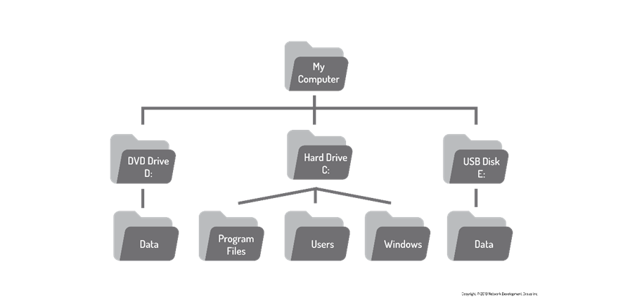

Al igual que Windows, la estructura de directorios de Linux, normalmente llamada sistema de _archivos_, también tiene un nivel superior. Sin embargo, en lugar de Mi PC, se denomina _directorio raíz_ y se simboliza mediante el carácter de barra diagonal /. Además, no hay unidades en Linux; Se puede acceder a cada dispositivo físico en un directorio, en lugar de una letra de unidad.

La siguiente imagen muestra una representación visual de un sistema de archivos típico de Linux:

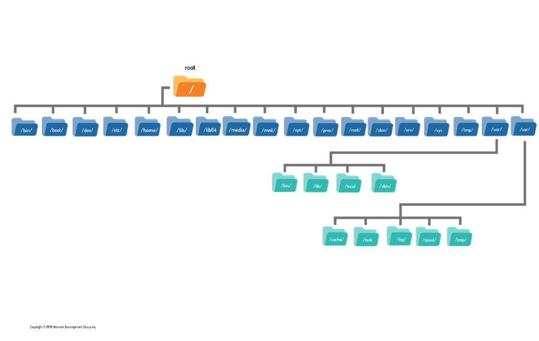

Para ver el contenido del directorio raíz, utilice el comando ls con el carácter / como argumento:

```shell
sysadmin@localhost:~$ ls /                                            
 bin    etc    lib     mnt    root  'sbin'$'\342\200\214'   tmp                 
 boot   home   lib64   opt    run    srv                    usr                 
 dev    init   media   proc   sbin   sys                    var 
```

Tenga en cuenta que hay muchos directorios con nombres descriptivos, incluido /boot, que contiene archivos para arrancar la computadora.
### 7.2.1 Directorio de inicio
El término _directorio de inicio_ a menudo confunde a los nuevos usuarios de Linux. Para empezar, en la mayoría de las distribuciones de Linux hay un directorio llamado home debajo del directorio raíz /.

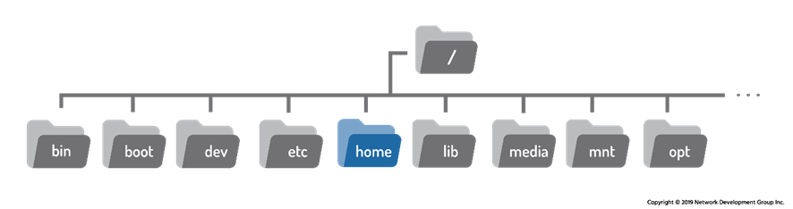

Debajo de este directorio /home hay un directorio para cada usuario en el sistema. El nombre del directorio es el mismo que el nombre del usuario, por lo que un usuario llamado sysadmin tendría un directorio principal llamado /home/sysadmin.

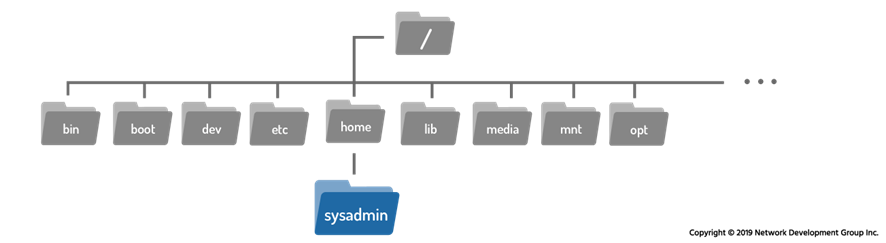

El directorio de inicio es un directorio importante. Para empezar, cuando un usuario abre un shell, debe colocarse automáticamente en su directorio de inicio, ya que normalmente es donde realiza la mayor parte de su trabajo.

Además, el directorio de inicio es uno de los pocos directorios en los que el usuario tiene control total para crear y eliminar archivos y directorios adicionales. En la mayoría de las distribuciones de Linux, los únicos usuarios que pueden acceder a los archivos de un directorio principal son el propietario y el administrador del sistema. La mayoría de los demás directorios de un sistema de archivos Linux están protegidos con _permisos de archivo_.

> Los permisos y la propiedad de los archivos se tratarán en detalle más adelante en el curso.

El directorio de inicio tiene un símbolo especial que se utiliza para representarlo; el carácter de tilde ~. Por lo tanto, si el usuario administrador del sistema ha iniciado sesión, se puede usar el carácter tilde ~ en lugar del directorio /home/sysadmin.

También es posible hacer referencia al directorio de inicio de otro usuario utilizando el carácter de tilde ~ seguido del nombre de la cuenta de usuario. Por ejemplo, ~bob sería el equivalente de /home/bob.
### 7.2.2 Directorio actual

Para determinar dónde se encuentra actualmente el usuario dentro del sistema de archivos, se puede utilizar el comando pwd (directorio de trabajo de impresión):

```shell
pwd [OPTIONS]
```

```shell
sysadmin@localhost:~$ pwd
/home/sysadmin
```

El comando pwd imprime el directorio de trabajo, que es la ubicación actual del usuario dentro del sistema de archivos. El resultado del comando anterior indica que el usuario sysadmin se encuentra actualmente en su directorio de inicio, que se muestra en el siguiente sistema de archivos:

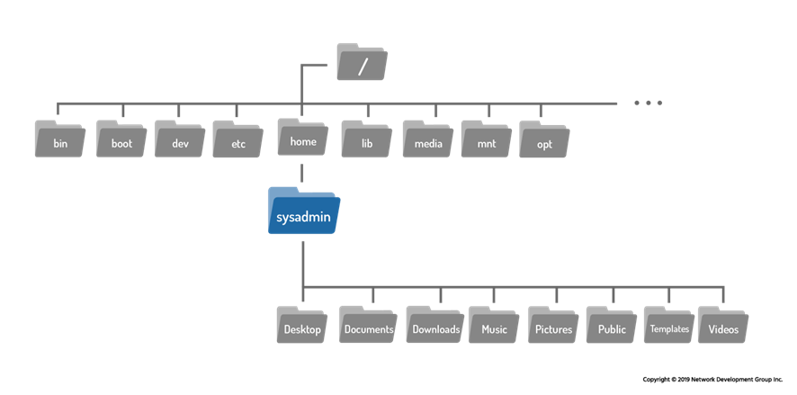
### 7.2.3 Cambiar directorios
Cuando un usuario abre un shell, normalmente comienza en su directorio de inicio. Cuando inicia una máquina virtual nueva en nuestro curso, ya sea abriendo el curso o después de usar el botón de reinicio, inicia sesión como usuario administrador del sistema y comienza en el directorio de inicio de ese usuario, resaltado en la imagen a continuación.


Para navegar por el sistema de archivos, utilice el comando cd (cambiar directorio).

```shell
cd [options] [path]
```

Hay un directorio llamado Documentos ubicado en el directorio de inicio del usuario administrador del sistema. Para pasar del directorio de inicio al directorio de documentos, utilice el nombre del directorio como argumento para el comando cd:

```shell
sysadmin@localhost:~$ cd Documents
sysadmin@localhost:~/Documents$
```

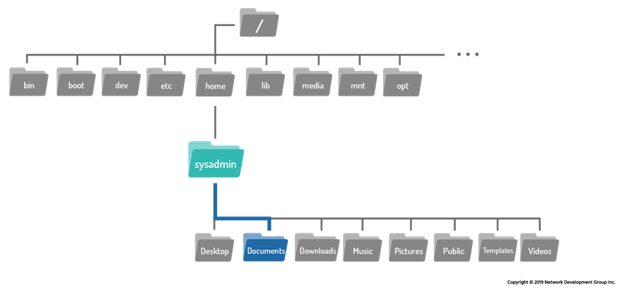

Cuando se usa sin argumentos, el comando cd llevará al usuario a su directorio de inicio.

```shell
sysadmin@localhost:~/Documents$ cd
sysadmin@localhost:~$
```

Observe que nuestras máquinas virtuales emplean un mensaje que muestra el directorio de trabajo actual, resaltado con el color azul. En el primer mensaje, el carácter de tilde ~ es equivalente a /home/sysadmin, que representa el directorio de inicio del usuario.

```shell
sysadmin@localhost:~$
```

Después de cambiar de directorio, la nueva ubicación ~/Documents también se puede confirmar en el nuevo mensaje, que se muestra nuevamente en azul.

```shell
sysadmin@localhost:~$ cd Documents
sysadmin@localhost:~/Documents$
```

> Para algunos comandos, la ausencia de noticias es una buena noticia; No hay salida si el comando cd se realiza correctamente. Si el usuario intenta cambiar a un directorio que no existe, el comando devuelve un mensaje de error:

```shell
sysadmin@localhost:~$ cd Junk
-bash: cd: Junk: No such file or directory
```
## 7.3 Rutas
El argumento del comando cd es más que el nombre de un directorio, en realidad es una ruta. Una ruta es una lista de directorios separados por el carácter /. Si piensa en el sistema de archivos como un mapa, las rutas son las direcciones de directorio, que incluyen instrucciones de navegación paso a paso; Se pueden utilizar para indicar la ubicación de cualquier archivo dentro del sistema de archivos.
Por ejemplo, /home/sysadmin es una ruta al directorio de inicio:

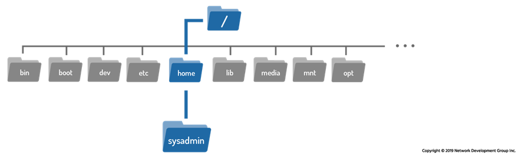
Hay dos tipos de caminos: absolutos  y _relativos_.
### 7.3.1 Trayectos absolutos
_Las rutas absolutas_ permiten al usuario especificar la ubicación exacta de un directorio. Siempre comienza en el directorio raíz y, por lo tanto, siempre comienza con el carácter /. La ruta /home/sysadmin es una ruta absoluta; Le dice al sistema que comience en el directorio raíz /, se mueva al directorio de inicio y luego al directorio sysadmin.

Si la ruta /home/sysadmin se utiliza como argumento para el comando cd, mueve al usuario al directorio de inicio para el usuario sysadmin.

```shell
sysadmin@localhost:~/Documents$ cd /home/sysadmin
```

De nuevo, si no hay salida, significa que el comando se ha realizado correctamente. Esto se puede confirmar mirando el símbolo del sistema o usando el comando pwd:

```shell
sysadmin@localhost:~$ pwd
/home/sysadmin
```
### 7.3.2 Trayectos relativos
_Las rutas relativas_ comienzan desde el directorio actual. Una ruta relativa proporciona direcciones a un archivo en relación con la ubicación actual en el sistema de archivos. No comienzan con el carácter /. En su lugar, comienzan con el nombre de un directorio. Más específicamente, las rutas relativas comienzan con el nombre de un directorio contenido en el directorio actual.

Eche otro vistazo al primer ejemplo de comando cd. El argumento es un ejemplo de la ruta relativa más simple: el nombre de un directorio dentro del directorio de trabajo actual.

```shell
sysadmin@localhost:~$ cd Documents
sysadmin@localhost:~/Documents$ 
```

Si el usuario se encuentra en el directorio Documentos, el desplazamiento al directorio Arte se puede realizar de varias maneras.

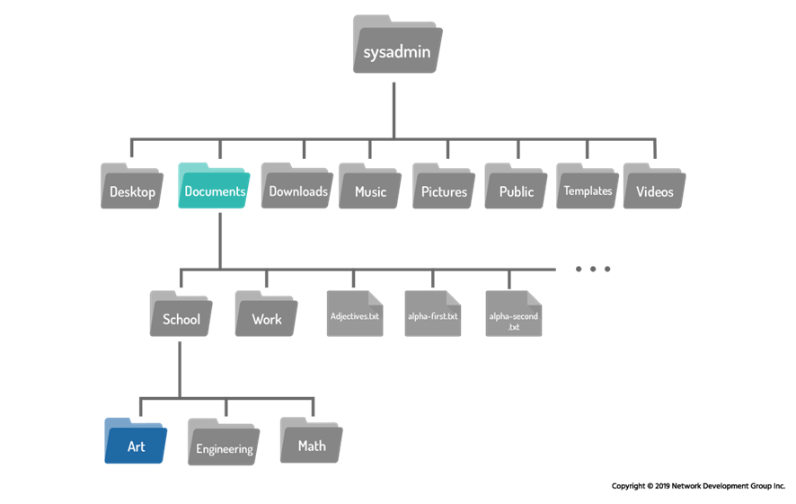
Se puede utilizar la ruta absoluta al directorio de arte:

```shell
sysadmin@localhost:~/Documents$ cd /home/sysadmin/Documents/School/Art
sysadmin@localhost:~/Documents/School/Art$ 
```

Se pueden utilizar varias rutas relativas:

```shell
sysadmin@localhost:~/Documents$ cd School
sysadmin@localhost:~/Documents/School$ cd Art
sysadmin@localhost:~/Documents/School/Art$ 
```

Sin embargo, el método más sencillo es utilizar una única ruta relativa que cubra el recorrido desde el directorio de origen hasta el de destino:

```shell
sysadmin@localhost:~/Documents$ cd School/Art
sysadmin@localhost:~/Documents/School/Art$ 
```

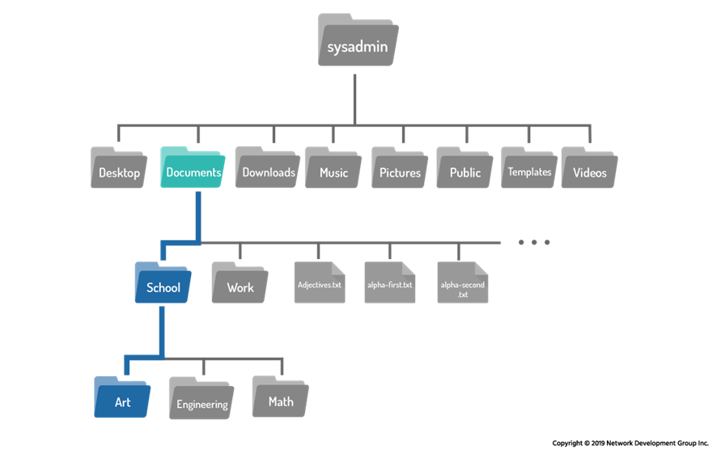

Utilice el comando pwd para confirmar el cambio:

```shell
sysadmin@localhost:~/Documents/School/Art$ pwd
/home/sysadmin/Documents/School/Art
```
### 7.3.3 Atajos
### El.. Caracteres
Independientemente del directorio en el que se encuentre el usuario, dos caracteres de punto .. siempre representan un directorio más alto en relación con el directorio actual, a veces denominado directorio principal. Para pasar del directorio de arte al directorio de la escuela:

```shell
sysadmin@localhost:~/Documents/School/Art$ cd ..
sysadmin@localhost:~/Documents/School$ 
```

El punto doble también se puede usar en rutas más largas. La siguiente ruta relativa se podría usar para pasar del directorio de la escuela al directorio de descargas (ambos resaltados en la imagen a continuación):

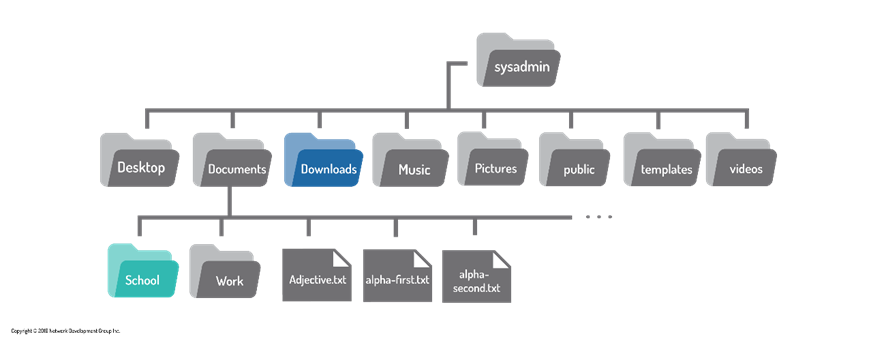

```shell
sysadmin@localhost:~/Documents/School$ cd ../../Downloads
sysadmin@localhost:~/Downloads$
```
### El. Carácter
Independientemente del directorio en el que se encuentre el usuario, el punto único. siempre representa el directorio actual. Para el cd este atajo no es muy útil, pero es útil para los comandos que se tratan en las secciones siguientes.
## 7.4 Listado de archivos en un directorio
Para los ejemplos anteriores, se proporcionaron imágenes para mostrar el diseño del sistema de archivos. En la práctica, no se proporcionan mapas como estos, y los usuarios deben confiar en lo que está disponible en la línea de comandos, lo que hace que el comando ls (lista) sea uno de los más poderosos para navegar por el sistema de archivos.

```shell
ls [OPTION]... [FILE]...
```

Este comando ls se utiliza para mostrar el contenido de un directorio y puede proporcionar información detallada sobre los archivos. De forma predeterminada, cuando se usa sin opciones ni argumentos, enumera los archivos en el directorio actual:

```shell
sysadmin@localhost:~$ ls                                               
Desktop  Documents  Downloads  Music  Pictures  Public  Templates  Videos
```

El comando ls también se puede utilizar para enumerar el contenido de cualquier directorio en el sistema de archivos. Proporcione la ruta al directorio como argumento:

```shell
sysadmin@localhost:~$ ls /var                                                   
backups  cache  lib  local  lock  log  mail  opt  run  spool  tmp 
```

> En muchas distribuciones de Linux, incluida la que se usa en nuestras máquinas virtuales, el comando ls usa color para distinguir por tipo de archivo. Por ejemplo, los directorios pueden mostrarse en azul, los archivos ejecutables pueden mostrarse en verde y los enlaces simbólicos pueden mostrarse en cian.
‌⁠
La salida coloreada no es el comportamiento predeterminado para el comando ls, sino más bien el efecto de la opción --color. El ls parece realizar este coloreado automáticamente porque hay un alias para el comando ls, por lo que se ejecuta con la opción --color.

```shell
sysadmin@localhost:~$ type ls
ls is aliased to `ls --color=auto'
```

Para evitar el uso del alias, coloque un carácter de barra invertida \ delante de su comando:

```shell
sysadmin@localhost:~$ ls
Desktop  Documents  Downloads  Music  Pictures  Public  Templates  Videos 
sysadmin@localhost:~$ \ls
Desktop  Documents  Downloads  Music  Pictures  Public  Templates  Videos
```
### 7.4.1 Listado de archivos ocultos
Cuando se utiliza el comando ls para mostrar el contenido de un directorio, no todos los archivos se muestran automáticamente. El comando ls omite los archivos ocultos de forma predeterminada. Un archivo oculto es cualquier archivo (o directorio) que comienza con un punto . carácter.

Para mostrar todos los archivos, incluidos los archivos ocultos, utilice la opción -a del comando ls:

```shell
sysadmin@localhost:~$ ls -a                                            
.             .bashrc   .selected_editor  Downloads  Public           
..            .cache    Desktop           Music      Templates         
.bash_logout  .profile  Documents         Pictures   Videos
```

¿Por qué se ocultan los archivos en primer lugar? La mayoría de los archivos ocultos son archivos de _personalización_, diseñados para personalizar el funcionamiento de Linux, su shell o programas. Por ejemplo, el archivo .bashrc en el directorio de inicio personaliza las características del shell, como la creación o modificación de variables y alias.

Estos archivos de personalización no son los que se utilizan de forma habitual, y el hecho de que se muestren dificulta la búsqueda de otros archivos.
### 7.4.2 Listado de pantalla larga
Cada archivo tiene detalles asociados llamados metadatos. Esto puede incluir información como el tamaño, la propiedad o las marcas de tiempo. Para ver esta información, utilice la opción -l del comando ls. A continuación, se utiliza como ejemplo una lista del directorio /var/log, ya que proporciona una variedad de salidas:

```shell
sysadmin@localhost:~$ ls -l /var/log/
total 900                                                                       
-rw-r--r-- 1 root   root  15322 Dec 10 21:33 alternatives.log
drwxr-xr-x 1 root   root   4096 Jul 19 06:52 apt
-rw-r----- 1 syslog adm     371 Dec 15 16:38 auth.log
-rw-r--r-- 1 root   root  35330 May 26  2018 bootstrap.log
-rw-rw---- 1 root   utmp      0 May 26  2018 btmp
-rw-r----- 1 syslog adm     197 Dec 15 16:38 cron.log
-rw-r--r-- 1 root   adm   85083 Dec 10 21:33 dmesg
-rw-r--r-- 1 root   root 351960 Jul 19 06:52 dpkg.log
-rw-r--r-- 1 root   root  32064 Dec 10 21:33 faillog
drwxr-xr-x 2 root   root   4096 Jul 19 06:51 journal
-rw-rw-r-- 1 root   utmp 292584 Dec 15 16:38 lastlog
-rw-r----- 1 syslog adm   14185 Dec 15 16:38 syslog
-rw------- 1 root   root  64128 Dec 10 21:33 tallylog
-rw-rw-r-- 1 root   utmp    384 Dec 15 16:38 wtmp
```

En el resultado anterior, cada línea muestra metadatos sobre un solo archivo. A continuación se describe cada uno de los campos de datos de la salida del comando ls -l:

**Tipo de archivo**

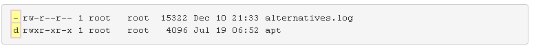

El primer carácter de cada línea indica el tipo de archivo. Los tipos de archivo son:

| Símbolo | Tipo de archivo       | Descripción                                                                                |
| ------- | --------------------- | ------------------------------------------------------------------------------------------ |
| d       | directorio            | Un archivo utilizado para almacenar otros archivos.                                        |
| -       | Archivo regular       | Incluye archivos legibles, archivos de imágenes, archivos binarios y archivos comprimidos. |
| l       | Enlace simbólico      | Apunta a otro archivo.                                                                     |
| s       | enchufe               | Permite la comunicación entre procesos.                                                    |
| p       | pipa                  | Permite la comunicación entre procesos.                                                    |
| b       | Archivo de bloque     | Se utiliza para comunicarse con el hardware.                                               |
| c       | Archivo de caracteres | Se utiliza para comunicarse con el hardware.                                               |

El primer archivo alternatives.log es un archivo normal (-), mientras que el segundo archivo apt es un directorio (d).

**Permisos**

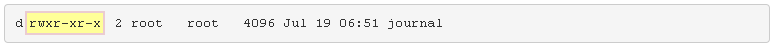

Los siguientes nueve caracteres muestran los permisos del archivo. Los permisos indican cómo determinados usuarios pueden acceder a un archivo.
Los permisos se tratarán en detalle más adelante en el curso.

**Recuento de enlaces duros**

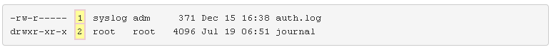

Este número indica cuántos enlaces físicos apuntan a este archivo.
Los enlaces se tratarán en detalle más adelante en el curso.

**Usuario propietario**

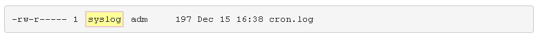

Cada archivo es propiedad de una cuenta de usuario. Esto es importante porque el propietario tiene los derechos para establecer permisos en un archivo.
La propiedad de los archivos se tratará en detalle más adelante en el curso.

**Propietario del grupo**

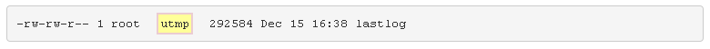

Indica a qué grupo pertenece este archivo. Esto es importante porque cualquier miembro de este grupo tiene un conjunto de permisos en el archivo.
La propiedad de los archivos se tratará en detalle más adelante en el curso.

**Tamaño del archivo**

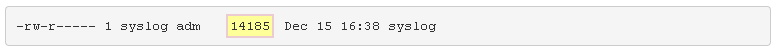

Muestra el tamaño del archivo en bytes.
En el caso de los directorios, este valor no describe el tamaño total del directorio, sino el número de bytes reservados para realizar un seguimiento de los nombres de archivo del directorio. En otras palabras, ignore este campo para los directorios.

**Timestamp**

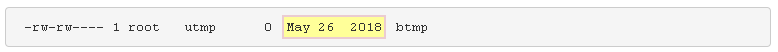

Indica la hora a la que se modificó por última vez el contenido del archivo. En el caso de los directorios, esta marca de tiempo indica la última vez que se agregó o eliminó un archivo del directorio.

**Nombre de archivo**

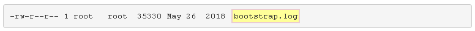

El campo final contiene el nombre del archivo o directorio.
En el caso de enlaces simbólicos, el nombre del enlace se muestra junto con una flecha y el nombre de la ruta del archivo original.

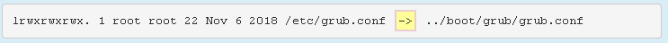

Los enlaces simbólicos se tratarán en detalle más adelante en el curso.
### 7.4.3 Tamaños legibles por humanos
La opción -l del comando ls muestra los tamaños de archivo en bytes. En el caso de los archivos de texto, un byte es 1 carácter. Para archivos más pequeños, los tamaños de bytes están bien. Sin embargo, para archivos más grandes, es difícil comprender qué tan grande es el archivo. Por ejemplo, considere la salida del siguiente comando:

```shell
ysadmin@localhost:~$ ls -l /var/log/lastlog           
-rw-rw-r-- 1 root utmp 292584 Dec 15 16:38 /var/log/lastlog
```

El tamaño del archivo es difícil de determinar en bytes. ¿292584 un archivo grande o pequeño? Parece bastante grande, pero es difícil de determinar usando bytes.

Piénsalo de esta manera: si alguien diera la distancia entre Boston y Nueva York en pulgadas, ese valor no tendría sentido. La mayoría de la gente piensa en términos de millas o kilómetros.

A veces es preferible presentar el tamaño del archivo en un tamaño más legible para el ser humano, como megabytes o gigabytes. Para lograr esto, agregue la opción -h al comando ls:

```shell
sysadmin@localhost:~$ ls -lh /var/log/lastlog             
-rw-rw-r-- 1 root utmp 286K Dec 15 16:38 /var/log/lastlog
```
**Importante:** La opción -h debe usarse con la opción -l.
### 7.4.4 Directorios de listados
Cuando se utiliza la opción -d, se refiere al directorio actual y no al contenido que contiene. Sin ninguna otra opción, es bastante insignificante. Recuerde que siempre se hace referencia al directorio actual con un solo punto . carácter:

```shell
sysadmin@localhost:~$ ls -d   
.  
```

Para usar la opción -d de una manera significativa se requiere la adición de la opción -l. En este caso, tenga en cuenta que el siguiente comando enumera los detalles del contenido en el directorio /home/sysadmin:

```shell
sysadmin@localhost:~$ ls -l        
total 32                       
drwxr-xr-x 2 sysadmin sysadmin 4096 Dec 10 21:33 Desktop
drwxr-xr-x 4 sysadmin sysadmin 4096 Dec 10 21:33 Documents
drwxr-xr-x 2 sysadmin sysadmin 4096 Dec 10 21:33 Downloads
drwxr-xr-x 2 sysadmin sysadmin 4096 Dec 10 21:33 Music
drwxr-xr-x 2 sysadmin sysadmin 4096 Dec 10 21:33 Pictures
drwxr-xr-x 2 sysadmin sysadmin 4096 Dec 10 21:33 Public
drwxr-xr-x 2 sysadmin sysadmin 4096 Dec 10 21:33 Templates
drwxr-xr-x 2 sysadmin sysadmin 4096 Dec 10 21:33 Videos
```

En comparación, el siguiente comando enumera el directorio /home/sysadmin:

```shell
sysadmin@localhost:~$ ls -ld         
drwxr-xr-x 1 sysadmin sysadmin 224 Nov  7 17:07 .
```

Observe el punto único al final de la lista larga. Esto indica que se está enumerando el directorio actual y no el contenido.
### 7.4.5 Listado recursivo
Hay ocasiones en las que desea mostrar todos los archivos de un directorio, así como todos los archivos de todos los subdirectorios de ese directorio. A esto se le llama _listado recursivo_.

Para realizar una lista recursiva, utilice la opción -R para el comando ls:

```shell
sysadmin@localhost:~$ ls -R /etc/ppp
/etc/ppp:
ip-down.d  ip-up.d         

/etc/ppp/ip-down.d:
bind9

/etc/ppp/ip-up.d:
bind9
```

Tenga en cuenta que en el ejemplo anterior, los archivos en el directorio /etc/ppp se enumeraron primero. Después de eso, se enumeró el contenido de sus subdirectorios /etc/ppp/ip-down.d y /etc/ppp/ip-up.d.

> Ten cuidado con esta opción; por ejemplo, al ejecutar el comando en el directorio raíz, se enumerarían todos los archivos del sistema de archivos, incluidos todos los archivos de cualquier dispositivo USB y DVD conectados en el sistema. Limite el uso de listados recursivos a estructuras de directorios más pequeñas.
### 7.4.6 Ordenar un listado
De forma predeterminada, el comando ls ordena los archivos alfabéticamente por nombre de archivo. A veces, puede ser útil ordenar los archivos utilizando diferentes criterios.

Para ordenar los archivos por tamaño, podemos usar la opción -S. Tenga en cuenta la diferencia en la salida de los dos comandos siguientes. Se enumeran los mismos archivos y directorios, pero en un orden diferente:

```shell
sysadmin@localhost:~$ ls /etc/ssh
moduli              ssh_host_ecdsa_key.pub    ssh_host_rsa_key      sshd_config
ssh_config          ssh_host_ed25519_key      ssh_host_rsa_key.pub
ssh_host_ecdsa_key  ssh_host_ed25519_key.pub  ssh_import_id
```

```shell
sysadmin@localhost:~$ ls -S /etc/ssh
moduli            ssh_host_ed25519_key  ssh_host_ecdsa_key.pub
sshd_config       ssh_host_rsa_key.pub  ssh_host_ed25519_key.pub
ssh_host_rsa_key  ssh_import_id
ssh_config        ssh_host_ecdsa_key
```

> La opción anterior utiliza una letra s mayúscula.

Si bien la opción -S funciona por sí sola, es más útil cuando se usa con la opción -l para que los tamaños de los archivos sean visibles. El siguiente comando enumera los archivos de mayor a menor y muestra el tamaño real del archivo.

```shell
sysadmin@localhost:~$ ls -lS /etc/ssh
total 580
-rw-r--r-- 1 root root 553122 Feb 10  2018 moduli
-rw-r--r-- 1 root root   3264 Feb 10  2018 sshd_config
-rw------- 1 root root   1679 Jul 19 06:52 ssh_host_rsa_key
-rw-r--r-- 1 root root   1580 Feb 10  2018 ssh_config
-rw------- 1 root root    411 Jul 19 06:52 ssh_host_ed25519_key
-rw-r--r-- 1 root root    399 Jul 19 06:52 ssh_host_rsa_key.pub
-rw-r--r-- 1 root root    338 Jul 19 06:52 ssh_import_id
-rw------- 1 root root    227 Jul 19 06:52 ssh_host_ecdsa_key
-rw-r--r-- 1 root root    179 Jul 19 06:52 ssh_host_ecdsa_key.pub
-rw-r--r-- 1 root root     99 Jul 19 06:52 ssh_host_ed25519_key.pub
```

También puede ser útil usar la opción -h para mostrar tamaños de archivo legibles por humanos:

```shell
sysadmin@localhost:~$ ls -lSh /etc/ssh                          
total 580K                                   
-rw-r--r-- 1 root root 541K Feb 10  2018 moduli
-rw-r--r-- 1 root root 3.2K Feb 10  2018 sshd_config
-rw------- 1 root root 1.7K Jul 19 06:52 ssh_host_rsa_key
-rw-r--r-- 1 root root 1.6K Feb 10  2018 ssh_config
-rw------- 1 root root  411 Jul 19 06:52 ssh_host_ed25519_key
-rw-r--r-- 1 root root  399 Jul 19 06:52 ssh_host_rsa_key.pub
-rw-r--r-- 1 root root  338 Jul 19 06:52 ssh_import_id
-rw------- 1 root root  227 Jul 19 06:52 ssh_host_ecdsa_key
-rw-r--r-- 1 root root  179 Jul 19 06:52 ssh_host_ecdsa_key.pub
-rw-r--r-- 1 root root   99 Jul 19 06:52 ssh_host_ed25519_key.pub
```

La opción -t ordena los archivos en función de la hora en que se modificaron. Primero enumerará los archivos modificados más recientemente. Esta opción se puede usar sola, pero de nuevo, suele ser más útil cuando se combina con la opción -l:

```shell
sysadmin@localhost:~$ ls -tl /etc/ssh        
total 580
-rw------- 1 root root    227 Jul 19 06:52 ssh_host_ecdsa_key
-rw-r--r-- 1 root root    179 Jul 19 06:52 ssh_host_ecdsa_key.pub
-rw------- 1 root root    411 Jul 19 06:52 ssh_host_ed25519_key
-rw-r--r-- 1 root root     99 Jul 19 06:52 ssh_host_ed25519_key.pub
-rw------- 1 root root   1679 Jul 19 06:52 ssh_host_rsa_key
-rw-r--r-- 1 root root    399 Jul 19 06:52 ssh_host_rsa_key.pub
-rw-r--r-- 1 root root    338 Jul 19 06:52 ssh_import_id
-rw-r--r-- 1 root root 553122 Feb 10  2018 moduli
-rw-r--r-- 1 root root   1580 Feb 10  2018 ssh_config
-rw-r--r-- 1 root root   3264 Feb 10  2018 sshd_config
```

> Es importante recordar que la fecha de modificación en los directorios representa la última vez que se agregó o eliminó un archivo del directorio.

Si los archivos de un directorio se modificaron hace muchos días o meses, puede ser más difícil saber exactamente cuándo se modificaron, ya que solo se proporciona la fecha para los archivos más antiguos. Para obtener información más detallada sobre la hora de modificación, puede utilizar la opción --full-time para mostrar la marca de tiempo completa (incluidas horas, minutos y segundos). Asumirá la opción -l automáticamente:

```shell
sysadmin@localhost:~$ ls -t --full-time /etc/ssh
total 580
-rw------- 1 root root    227 2018-07-19 06:52:16.000000000 +0000 ssh_host_ecdsa_key
-rw-r--r-- 1 root root    179 2018-07-19 06:52:16.000000000 +0000 ssh_host_ecdsa_key.pub
-rw------- 1 root root    411 2018-07-19 06:52:16.000000000 +0000 ssh_host_ed25519_key
-rw-r--r-- 1 root root     99 2018-07-19 06:52:16.000000000 +0000 ssh_host_ed25519_key.pub
-rw------- 1 root root   1679 2018-07-19 06:52:16.000000000 +0000 ssh_host_rsa_key
-rw-r--r-- 1 root root    399 2018-07-19 06:52:16.000000000 +0000 ssh_host_rsa_key.pub
-rw-r--r-- 1 root root    338 2018-07-19 06:52:16.000000000 +0000 ssh_import_id
-rw-r--r-- 1 root root 553122 2018-02-10 02:31:46.000000000 +0000 moduli
-rw-r--r-- 1 root root   1580 2018-02-10 02:31:46.000000000 +0000 ssh_config
-rw-r--r-- 1 root root   3264 2018-02-10 02:31:46.000000000 +0000 sshd_config
```

Es posible realizar una ordenación inversa utilizando la opción -r. Se puede usar solo o combinado con las opciones -S o -t. El siguiente comando ordenará los archivos por tamaño, de menor a mayor:

```shell
sysadmin@localhost:~$ ls -lrS /etc/ssh
total 580
-rw-r--r-- 1 root root     99 Jul 19 06:52 ssh_host_ed25519_key.pub
-rw-r--r-- 1 root root    179 Jul 19 06:52 ssh_host_ecdsa_key.pub
-rw------- 1 root root    227 Jul 19 06:52 ssh_host_ecdsa_key
-rw-r--r-- 1 root root    338 Jul 19 06:52 ssh_import_id
-rw-r--r-- 1 root root    399 Jul 19 06:52 ssh_host_rsa_key.pub
-rw------- 1 root root    411 Jul 19 06:52 ssh_host_ed25519_key
-rw-r--r-- 1 root root   1580 Feb 10  2018 ssh_config
-rw------- 1 root root   1679 Jul 19 06:52 ssh_host_rsa_key
-rw-r--r-- 1 root root   3264 Feb 10  2018 sshd_config
-rw-r--r-- 1 root root 553122 Feb 10  2018 moduli 
```

El siguiente comando enumerará los archivos por fecha de modificación, del más antiguo al más reciente:

```shell
sysadmin@localhost:~$ ls -lrt /etc/ssh       
total 580
-rw-r--r-- 1 root root   3264 Feb 10  2018 sshd_config
-rw-r--r-- 1 root root   1580 Feb 10  2018 ssh_config
-rw-r--r-- 1 root root 553122 Feb 10  2018 moduli
-rw-r--r-- 1 root root    338 Jul 19 06:52 ssh_import_id
-rw-r--r-- 1 root root    399 Jul 19 06:52 ssh_host_rsa_key.pub
-rw------- 1 root root   1679 Jul 19 06:52 ssh_host_rsa_key
-rw-r--r-- 1 root root     99 Jul 19 06:52 ssh_host_ed25519_key.pub
-rw------- 1 root root    411 Jul 19 06:52 ssh_host_ed25519_key
-rw-r--r-- 1 root root    179 Jul 19 06:52 ssh_host_ecdsa_key.pub
-rw------- 1 root root    227 Jul 19 06:52 ssh_host_ecdsa_key
```