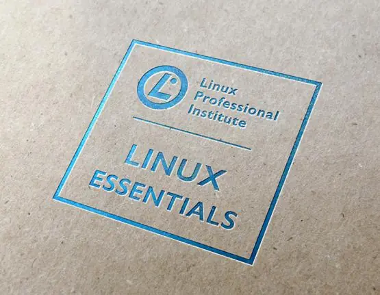

# Linux Essentials en Español 

# Capítulos

- ## [Introducción a Linux](docs/1_Introduccion_a_Linux.md)
- ## [Sistemas Operativos](docs/2_Sistema_Operativos.md)
- ## [Trabajando con Linux](docs/3_Trabajando_con_Linux.md)
- ## [Código Abierto](docs/4_Codigo_abrierto.md)
- ## [Linea de Comandos](docs/5_Linea_de_Comandos.md)
- ## [Ayuda](docs/6_Ayuda.md)
- ## [Sistema de Archivos](docs/7_Sistema_de_archivos.md)
- ## [Administrando Archivos y Directorios](docs/8_Administrando_archivos_y_directorios.md)
- ## [Archivando y Compresión](docs/9_Archivando_y_Compresion.md)
- ## [Trabajando con texto](docs/10_Trabajando_con_Texto.md)
- ## [Basic Scripting](docs/11_Scripting.md)
- ## [Comprender el Hardware de la Computadora](docs/12_Comprender_el_hardware_de_la_computadora.md)
- ## [Dónde se almacenan los datos](docs/13_Donde_se_almacenan_los_datos.md)
- ## [Configuración de Red](docs/14_Configuracion_de_red.md)
- ## [Seguridad del Sistema y del usuario](docs/15_Seguridad_del_sistema_y_del_usuario.md)
- ## [Creando Usuarios y Grupos](docs/16_Creando_usuarios_y_grupos.md)
- ## [Propiedad y permiso](docs/17_Propiedad_y_permiso.md)
- ## [Directorios y Archivos especiales](docs/18_directorios_y_archivos_especiales.md)

Cualquier ayuda siempre es buena para seguir Trabajando en mas temas de interés par todos.

